# Architecture Documentation

## System Architecture Evolution

### Current Architecture (Before This Change)

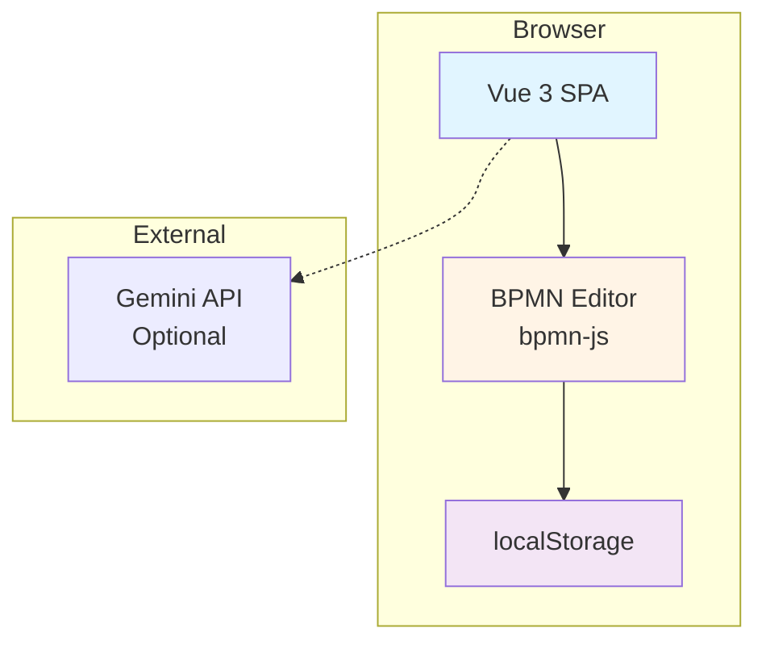

**Limitations**:
- Client-side only, no backend
- No data persistence beyond localStorage
- No user management or authentication
- Limited to technical workflow modeling
- No business context (lifecycle stages, segments, triggers)

---

### Target Architecture (After Phase 1)

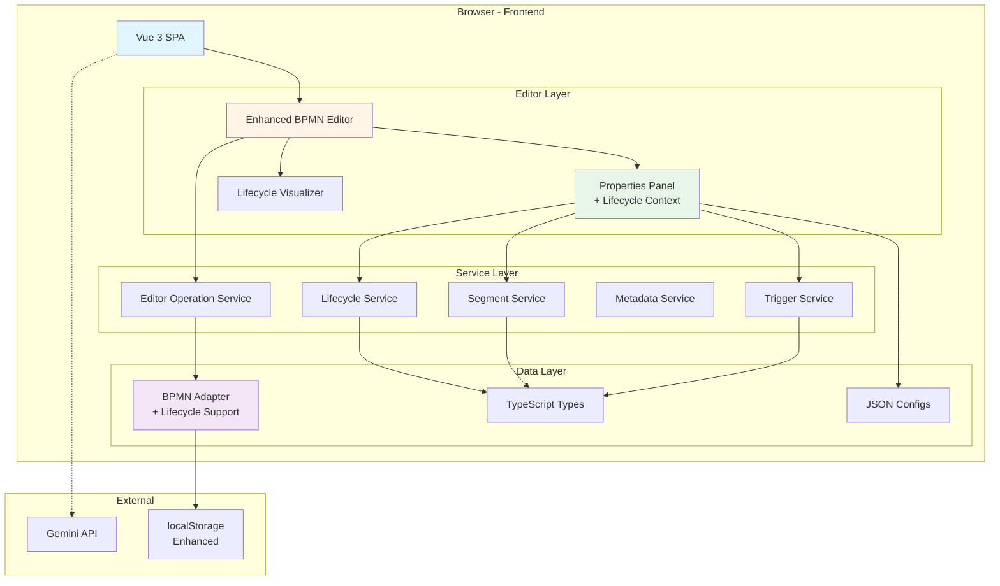

**Improvements**:
- Structured service layer for lifecycle operations
- Rich type system with lifecycle context
- Configuration-driven UI components
- Enhanced data model with business metadata
- Foundation for future backend integration

---

## Component Architecture

### Frontend Component Hierarchy

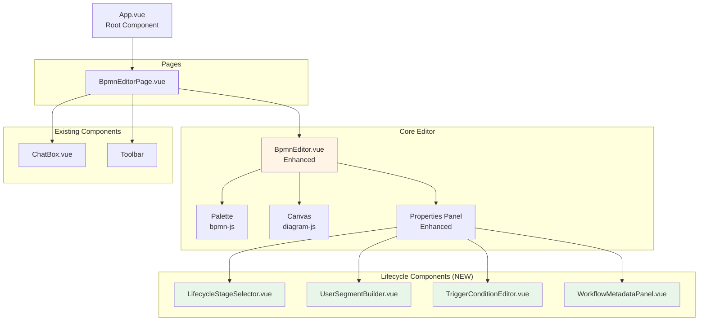

---

### Service Layer Architecture

```mermaid
graph LR
    subgraph "UI Components"
        Comp[Vue Components]
    end

    subgraph "Service Layer"
        direction TB

        LS[LifecycleService]
        SS[UserSegmentService]
        TS[TriggerService]
        MS[WorkflowMetadataService]
        EOS[EditorOperationService]

        subgraph "Existing Services"
            LLM[LLMService]
            LocalStore[LocalStorageService]
            Figma[FigmaService]
        end
    end

    subgraph "Data Access"
        Adapter[BpmnAdapter]
        Config[Config Loader]
    end

    Comp --> LS
    Comp --> SS
    Comp --> TS
    Comp --> MS
    Comp --> EOS

    LS --> Config
    SS --> Config
    TS --> Config

    EOS --> Adapter
    MS --> Adapter

    Adapter --> LocalStore

    style LS fill:#e8f5e9
    style SS fill:#e8f5e9
    style TS fill:#e8f5e9
    style MS fill:#e8f5e9
```

**Service Responsibilities**:

| Service | Responsibility | Key Methods |
|---------|---------------|-------------|
| **LifecycleService** | Manage lifecycle stages | `getStages()`, `assignStage()`, `getStageConfig()` |
| **UserSegmentService** | Manage user segments | `createSegment()`, `evaluateSegment()`, `getTemplates()` |
| **TriggerService** | Manage workflow triggers | `createTrigger()`, `validateTrigger()`, `getTriggerTypes()` |
| **WorkflowMetadataService** | Manage workflow metadata | `setMetadata()`, `getMetadata()`, `updateMetrics()` |
| **EditorOperationService** | Editor operations | `createNode()`, `createFlow()`, `updateNode()` |

---

## Data Flow Architecture

### Workflow Lifecycle Data Flow

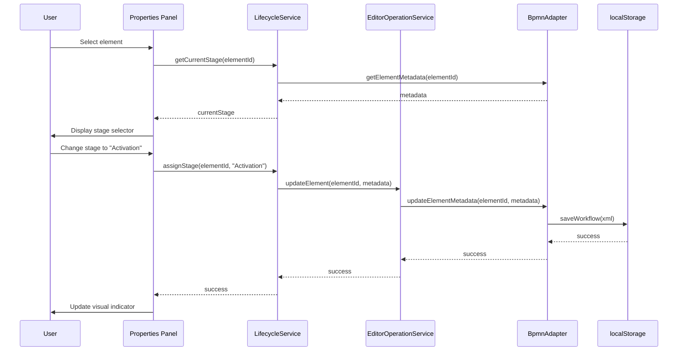

---

### Segment Evaluation Flow

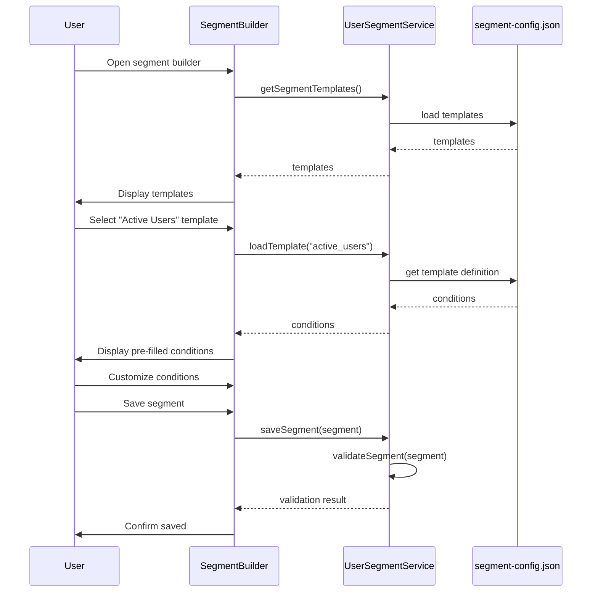

---

## Data Model Architecture

### Core Type System

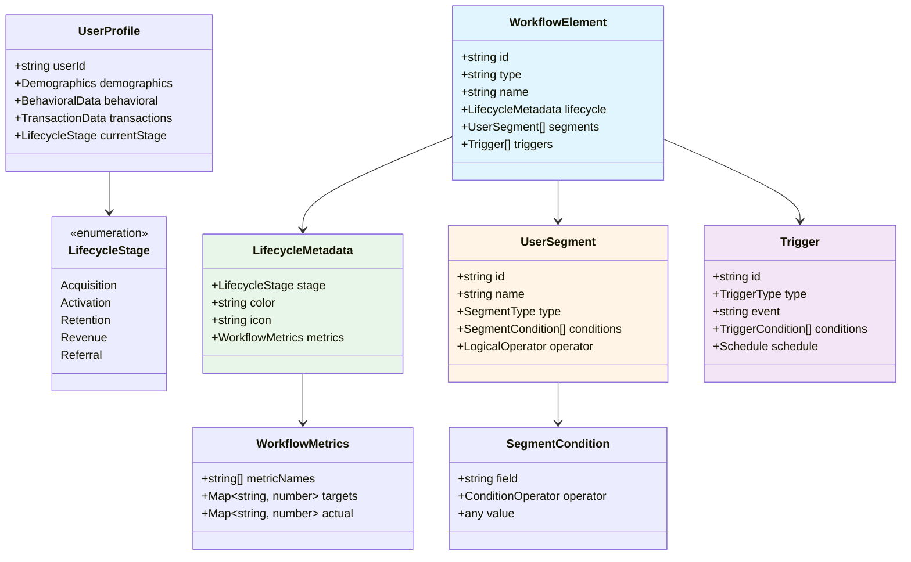

---

### XML Schema Extension

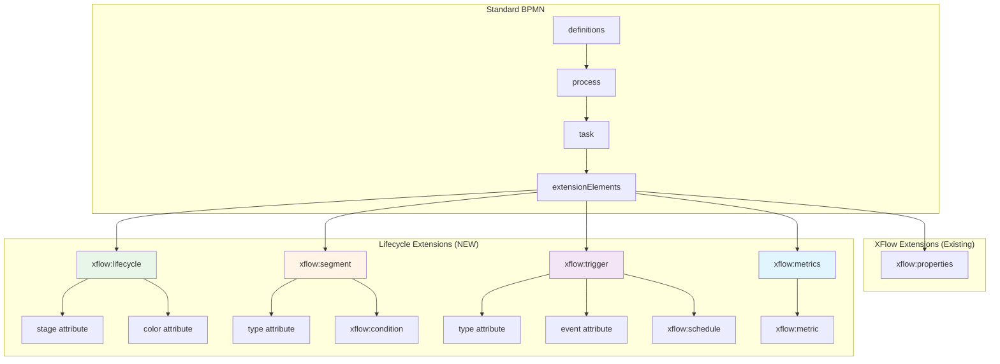

**Example XML**:
```xml
<bpmn:task id="Task_1" name="Onboarding Tutorial">
  <bpmn:extensionElements>
    <xflow:lifecycle stage="Activation" color="#4caf50" />
    <xflow:segment type="demographic">
      <xflow:condition field="age" operator="between" value="18,35" />
      <xflow:condition field="country" operator="in" value="US,CA,UK" />
    </xflow:segment>
    <xflow:trigger type="event" event="user_signup" />
    <xflow:metrics>
      <xflow:metric name="completion_rate" target="0.75" />
      <xflow:metric name="time_to_complete" target="300" unit="seconds" />
    </xflow:metrics>
  </bpmn:extensionElements>
</bpmn:task>
```

---

## Integration Architecture (Future Phases)

### Phase 2: Backend Integration

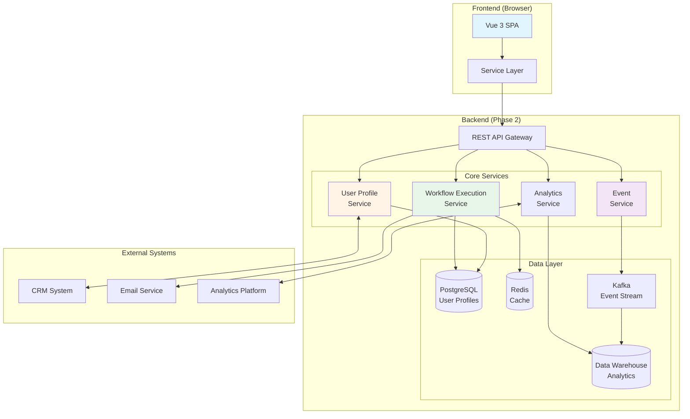

---

### Multi-Phase Roadmap

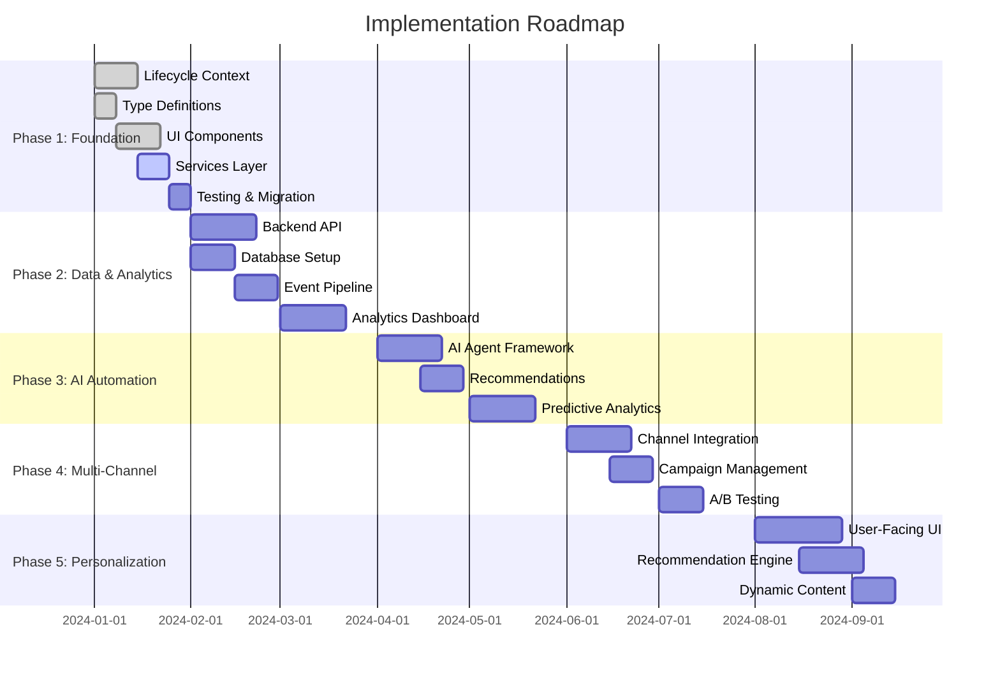

---

## Deployment Architecture (Future)

### Production Deployment (Phase 2+)

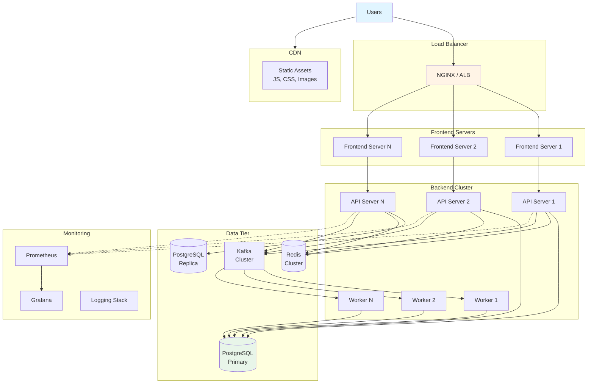

---

## Security Architecture (Phase 2+)

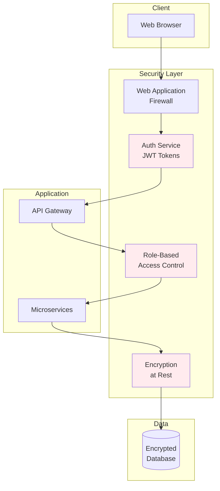

**Security Measures**:
- ✅ JWT-based authentication
- ✅ Role-based access control (Admin, Operator, Analyst)
- ✅ Data encryption at rest (AES-256)
- ✅ TLS 1.3 for data in transit
- ✅ API rate limiting
- ✅ PII data masking
- ✅ Audit logging
- ✅ GDPR compliance (consent management, right to deletion)

---

## Performance Considerations

### Scalability Targets (Phase 2+)

| Metric | Target | Strategy |
|--------|--------|----------|
| **Concurrent Users** | 10,000+ | Horizontal scaling, load balancing |
| **Workflow Executions/sec** | 1,000+ | Async processing, message queues |
| **API Response Time** | < 200ms (p95) | Caching, CDN, database optimization |
| **Event Ingestion** | 100,000/sec | Kafka streaming, batch processing |
| **Dashboard Load Time** | < 2sec | Pre-aggregation, lazy loading |
| **Workflow File Size** | < 5MB | Compression, incremental loading |

### Optimization Strategies

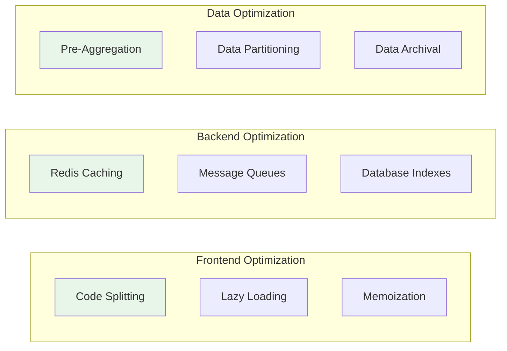

---

## Monitoring & Observability (Phase 2+)

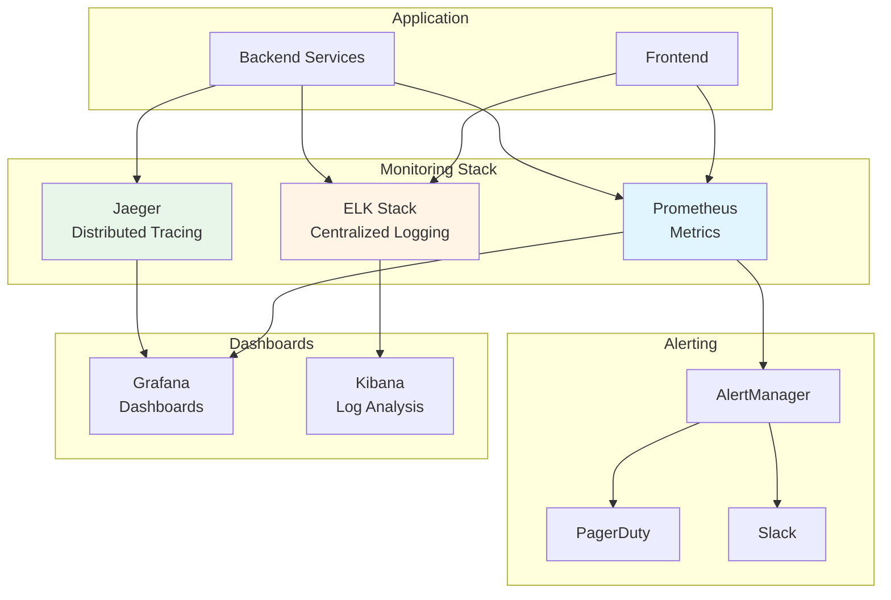

**Key Metrics to Track**:
- Application: Request rate, error rate, latency (p50/p95/p99)
- Business: Workflow executions, user conversions, lifecycle progression
- Infrastructure: CPU, memory, disk I/O, network
- User Experience: Page load time, time to interactive, Core Web Vitals

---

This architecture documentation provides a comprehensive view of the system evolution from current state through all future phases. All diagrams are in Mermaid format and can be rendered in any markdown viewer that supports Mermaid (GitHub, GitLab, VS Code, etc.).
