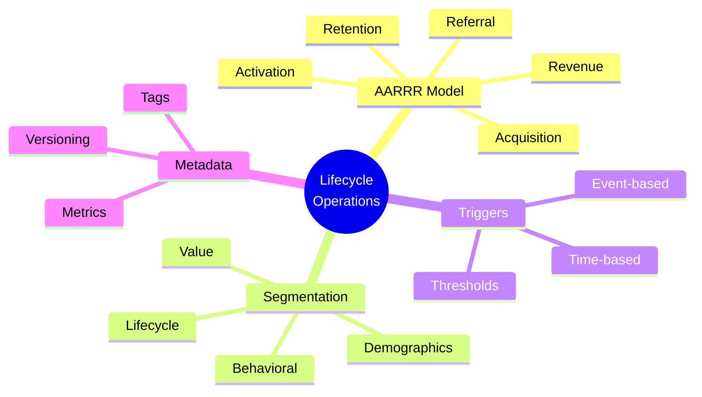
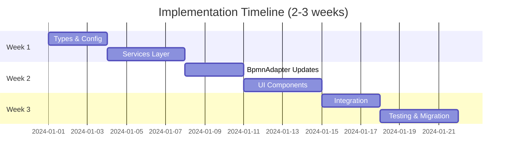

# Quick Reference Card

## 📋 Change Summary

| Property | Value |
|----------|-------|
| **Change ID** | add-lifecycle-operations-foundation |
| **Phase** | 1 of 5 |
| **Status** | ✅ Validated, Ready for Implementation |
| **Estimated Effort** | 2-3 weeks |
| **Breaking Changes** | Yes (with migration) |

---

## 🎯 Key Features



---

## 📁 Files Created (20 new files)

### Type Definitions (6 files)
- `src/types/lifecycle.ts` - AARRR stages
- `src/types/segments.ts` - User segments
- `src/types/triggers.ts` - Workflow triggers
- `src/types/metrics.ts` - Success metrics
- `src/types/userProfile.ts` - User data model
- `src/types/events.ts` - Event schema

### Configuration (3 files)
- `src/config/lifecycle-stages.json` - 5 AARRR stages
- `src/config/user-segments.json` - 10 segment templates
- `src/config/trigger-templates.json` - 8 trigger templates

### Services (4 files)
- `src/services/lifecycleService.ts`
- `src/services/userSegmentService.ts`
- `src/services/triggerService.ts`
- `src/services/workflowMetadataService.ts`

### UI Components (4 files)
- `src/components/LifecycleStageSelector.vue`
- `src/components/UserSegmentBuilder.vue`
- `src/components/TriggerConditionEditor.vue`
- `src/components/WorkflowMetadataPanel.vue`

### Documentation (3 files)
- `openspec/changes/.../ARCHITECTURE.md` (this change)
- `openspec/changes/.../IMPLEMENTATION_GUIDE.md`
- `openspec/changes/.../QUICK_REFERENCE.md`

---

## 🔧 Files Modified (8 files)

- `src/types/index.ts` - Export new types
- `src/extensions/xflow/xflowExtension.json` - Add lifecycle fields
- `src/extensions/xflow/XFlowPropertiesProvider.ts` - Lifecycle properties
- `src/extensions/xflow/XFlowRenderer.ts` - Visual indicators
- `src/extensions/xflow/BpmnAdapter/BpmnAdapter.ts` - Migration logic
- `src/extensions/xflow/BpmnAdapter/elementMapping.json` - Lifecycle metadata
- `src/components/BpmnEditor.vue` - Integrate new components
- `README.md` - Document lifecycle features

---

## 🎨 AARRR Color Scheme

| Stage | Color | Icon | Hex |
|-------|-------|------|-----|
| **Acquisition** | Blue | 🎯 | `#2196F3` |
| **Activation** | Green | ✨ | `#4CAF50` |
| **Retention** | Yellow | 🔄 | `#FFC107` |
| **Revenue** | Purple | 💰 | `#9C27B0` |
| **Referral** | Orange | 🚀 | `#FF5722` |

---

## 📊 Segment Templates

| Template | Type | Icon | Use Case |
|----------|------|------|----------|
| New Users | Lifecycle | 🆕 | Onboarding campaigns |
| Active Users | Behavioral | ⚡ | Retention workflows |
| At-Risk Users | Behavioral | ⚠️ | Win-back campaigns |
| VIP Customers | Value | 👑 | Premium offers |
| Dormant Users | Lifecycle | 😴 | Re-activation |
| Young Professionals | Demographic | 💼 | Targeted marketing |
| Mobile Users | Behavioral | 📱 | Mobile-first UX |
| Trial Users | Lifecycle | 🎫 | Conversion campaigns |
| Power Users | Behavioral | ⚙️ | Advocacy programs |
| Churned Users | Lifecycle | ❌ | Analysis |

---

## ⚡ Trigger Types

### Event-Based
- `user.signup` - New user registration
- `transaction.purchase_complete` - Purchase completed
- `milestone.reached` - User milestone
- `transaction.cart_add` - Item added to cart

### Time-Based
- **Cron**: `0 9 * * *` (Daily at 9 AM)
- **Interval**: Every N milliseconds
- **Delay**: After N time from event
- **Time Window**: Between start/end times

### Threshold-Based
- Engagement score < 40
- Days inactive > 30
- Purchase amount > 100
- Session count < 5

---

## 🔑 Key TypeScript Types

### Lifecycle
```typescript
enum LifecycleStage {
  Acquisition, Activation, Retention, Revenue, Referral
}

interface LifecycleMetadata {
  stage: LifecycleStage
  color?: string
  version: string
}
```

### Segments
```typescript
interface UserSegment {
  id: string
  name: string
  type: SegmentType
  conditions: SegmentCondition[]
  operator: LogicalOperator
}
```

### Triggers
```typescript
interface Trigger {
  id: string
  type: TriggerType
  event?: EventType
  schedule?: Schedule
  thresholds?: TriggerCondition[]
}
```

---

## 🎯 XML Schema Extension

### Before (Standard BPMN)
```xml
<bpmn:task id="Task_1" name="Onboarding">
  <bpmn:extensionElements />
</bpmn:task>
```

### After (With Lifecycle)
```xml
<bpmn:task id="Task_1" name="Onboarding">
  <bpmn:extensionElements>
    <xflow:lifecycle stage="Activation" color="#4CAF50" />
    <xflow:segment type="demographic">
      <xflow:condition field="age" operator="between" value="18,35" />
    </xflow:segment>
    <xflow:trigger type="event" event="user_signup" />
    <xflow:metrics>
      <xflow:metric name="completion_rate" target="0.75" />
    </xflow:metrics>
  </bpmn:extensionElements>
</bpmn:task>
```

---

## 🧪 Testing Checklist

### Unit Tests
- [ ] Lifecycle type definitions
- [ ] Segment service logic
- [ ] Trigger validation
- [ ] BpmnAdapter conversion

### Integration Tests
- [ ] Service layer integration
- [ ] Properties panel data flow
- [ ] Adapter with lifecycle metadata
- [ ] Component communication

### E2E Tests
- [ ] Create workflow with lifecycle stages
- [ ] Assign segments to elements
- [ ] Configure triggers
- [ ] Migrate existing workflow
- [ ] Save and reload workflow

---

## 📈 Success Metrics

### Technical
- ✅ All existing workflows load after migration
- ✅ XML size increase < 20%
- ✅ Properties panel render < 100ms
- ✅ Test coverage > 80%
- ✅ Zero TypeScript errors

### Product (Post-Launch)
- 🎯 50%+ workflows use lifecycle tagging (30 days)
- 🎯 30%+ workflows use segments (30 days)
- 🎯 < 5 support tickets/month
- 🎯 90%+ user satisfaction

---

## ⚠️ Breaking Changes & Migration

### What Breaks
1. XFlow extension format (new required fields)
2. Workflow XML schema (lifecycle namespace)

### Migration Strategy
✅ **Automatic** - BpmnAdapter migrates on load
- Assigns default stages based on element type
- No user action required
- Backward compatible

### Default Stage Mapping
| Element Type | Default Stage |
|--------------|---------------|
| StartEvent | Acquisition |
| UserTask (early) | Activation |
| UserTask (late) | Retention |
| ServiceTask | Retention |
| Gateway | Retention |
| EndEvent | Referral |

---

## 🚀 Implementation Order



---

## 🔗 Quick Links

### Documentation
- `proposal.md` - Full proposal with rationale
- `tasks.md` - 54 implementation tasks
- `design.md` - Technical design decisions
- `ARCHITECTURE.md` - System architecture diagrams
- `IMPLEMENTATION_GUIDE.md` - Step-by-step guide

### Specs
- `specs/workflow-editor/spec.md` - 7 requirements, 21 scenarios
- `specs/user-lifecycle/spec.md` - 5 requirements, 17 scenarios
- `specs/data-integration/spec.md` - 5 requirements, 18 scenarios

### Commands
```bash
# View change
npx openspec show add-lifecycle-operations-foundation

# Validate
npx openspec validate add-lifecycle-operations-foundation --strict

# Archive (after implementation)
npx openspec archive add-lifecycle-operations-foundation --yes
```

---

## 💡 Key Design Decisions

| Decision | Choice | Why |
|----------|--------|-----|
| **Namespace** | Extend XFlow | Minimize adapter changes |
| **Data Model** | TypeScript-first | Type safety, IDE support |
| **UI Config** | JSON-driven | Flexible, no code changes |
| **Migration** | Automatic | Zero user friction |
| **Properties** | Extend panel | Consistent UX |

---

## 🎓 Learning Resources

### AARRR Framework
- Acquisition: Getting users to the platform
- Activation: First-time user experience
- Retention: Ongoing engagement
- Revenue: Monetization
- Referral: Viral growth

### User Segmentation
- **Demographic**: Who they are (age, location)
- **Behavioral**: What they do (sessions, features)
- **Lifecycle**: Where they are (new, active, churned)
- **Value**: How much they're worth (LTV, purchases)

### Workflow Triggers
- **Scheduled**: Time-based execution
- **Event**: User action-based
- **Threshold**: Data condition-based
- **Manual**: Operator-initiated

---

## 📞 Support

### Getting Help
- Review `IMPLEMENTATION_GUIDE.md` for detailed steps
- Check `ARCHITECTURE.md` for system design
- Refer to `design.md` for technical decisions
- Read `tasks.md` for implementation checklist

### Common Issues
1. **TypeScript errors**: Ensure all types exported in `index.ts`
2. **XML parsing fails**: Validate XML format with BpmnAdapter tests
3. **Migration not working**: Check default stage mapping logic
4. **Properties panel blank**: Verify component registration

---

**Version**: 1.0
**Last Updated**: 2024-12-18
**Status**: ✅ Ready for Implementation
