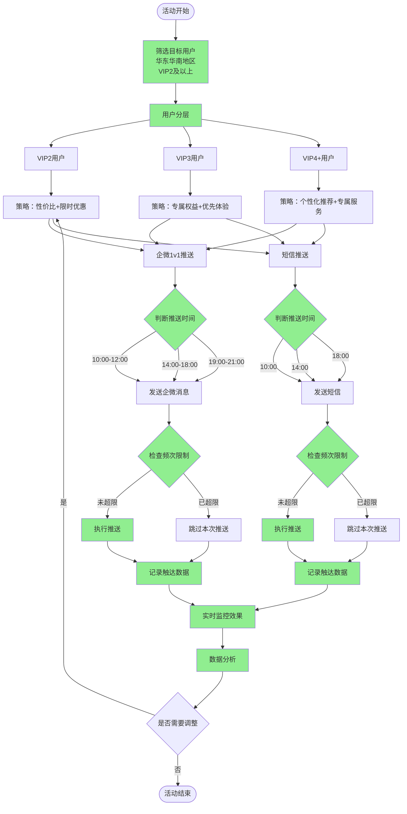
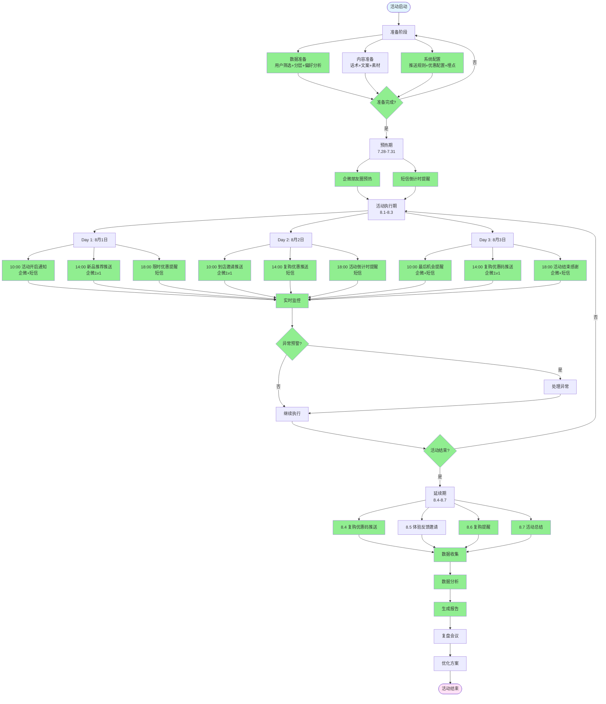

# 秋季新品发布活动策划方案
## "秋日风尚，心动上新"

---

## 一、活动基本信息

- **活动主题**：秋日风尚，心动上新
- **活动周期**：2025年8月1日 - 2025年8月3日（共3天）
- **目标用户**：华东、华南地区，VIP2及以上等级用户
- **核心目标**：
  - 提升到店率
  - 提升线上购买率
  - 提升复购意向
- **触达渠道**：企微1v1、短信

---

## 二、活动策划方案

### 2.1 活动目标

#### 2.1.1 核心指标（KPI）
- **到店率提升**：目标提升30%（对比活动前7天平均到店率）
- **线上购买率提升**：目标提升25%（对比活动前7天平均购买率）
- **复购意向提升**：目标提升20%（通过调研问卷或行为数据）

#### 2.1.2 业务目标
- 新品曝光量：覆盖目标用户群体的80%以上
- 用户参与度：企微互动率≥15%，短信点击率≥5%
- 转化漏斗：触达→到店/访问→购买，整体转化率≥8%

### 2.2 用户画像分析

#### 2.2.1 目标用户特征
- **地域**：华东地区（上海、江苏、浙江、安徽、福建、江西、山东）、华南地区（广东、广西、海南）
- **会员等级**：VIP2及以上（高价值用户）
- **用户特征**：
  - 消费能力强，对品质有要求
  - 对时尚敏感，关注新品动态
  - 有复购习惯，品牌忠诚度较高

#### 2.2.2 用户分层策略
- **VIP2用户**：重点推送新品信息，强调性价比和限时优惠
- **VIP3用户**：强调专属权益和优先体验
- **VIP4及以上用户**：提供个性化推荐和专属服务

### 2.3 活动策略

#### 2.3.1 内容策略
1. **预热期（7月28日-7月31日）**
   - 企微朋友圈预热：发布新品预告、设计师故事
   - 短信预热：发送活动倒计时提醒

2. **活动期（8月1日-8月3日）**
   - 企微1v1推送：
     - 个性化新品推荐（基于用户历史偏好）
     - 专属优惠券（限时3天有效）
     - 到店邀请（预约到店可享额外服务）
   - 短信推送：
     - 活动开启通知
     - 限时优惠提醒
     - 复购优惠码

3. **延续期（8月4日-8月7日）**
   - 企微跟进：询问体验反馈，推送复购优惠
   - 短信跟进：复购提醒和优惠码

#### 2.3.2 优惠策略
- **到店优惠**：到店即享新品9折，VIP3及以上享8.5折
- **线上优惠**：限时满减（满500减50，满1000减120）
- **复购优惠**：活动期间购买用户，7天内复购享额外8折
- **专属权益**：VIP4及以上用户享专属新品体验礼包

#### 2.3.3 触达策略
- **企微1v1**：
  - 时间：每日10:00-12:00、14:00-18:00、19:00-21:00（避开休息时间）
  - 频次：活动期间每人最多3次（避免过度打扰）
  - 内容：个性化、场景化、情感化
- **短信**：
  - 时间：每日10:00、14:00、18:00（关键时间点）
  - 频次：活动期间每人最多5条（关键节点推送）
  - 内容：简洁明了，突出优惠和行动号召

---

## 三、执行方案

### 3.1 时间节点规划

#### 3.1.1 准备期（7月20日-7月31日）
| 时间节点 | 任务内容 | 负责人 | 交付物 |
|---------|---------|--------|--------|
| 7月20日 | 活动方案确认 | 营销负责人 | 活动方案文档 |
| 7月21日 | 用户数据准备 | 数据团队 | 目标用户清单 |
| 7月22日 | 内容素材准备 | 内容团队 | 文案、图片、视频 |
| 7月23日 | 优惠策略配置 | 运营团队 | 优惠券、折扣码 |
| 7月24日 | 系统配置测试 | 技术团队 | 测试报告 |
| 7月25日 | 企微话术准备 | 客服团队 | 话术库 |
| 7月26日 | 短信模板审核 | 合规团队 | 审核通过模板 |
| 7月27日 | 全流程演练 | 全体 | 演练报告 |
| 7月28日 | 预热期启动 | 运营团队 | - |

#### 3.1.2 执行期（8月1日-8月3日）
| 日期 | 时间 | 任务 | 渠道 |
|-----|------|------|------|
| 8月1日 | 10:00 | 活动开启通知 | 企微+短信 |
| 8月1日 | 14:00 | 新品推荐推送 | 企微1v1 |
| 8月1日 | 18:00 | 限时优惠提醒 | 短信 |
| 8月2日 | 10:00 | 到店邀请推送 | 企微1v1 |
| 8月2日 | 14:00 | 复购优惠推送 | 短信 |
| 8月2日 | 18:00 | 活动倒计时提醒 | 短信 |
| 8月3日 | 10:00 | 最后机会提醒 | 企微+短信 |
| 8月3日 | 14:00 | 复购优惠码推送 | 企微1v1 |
| 8月3日 | 18:00 | 活动结束感谢 | 企微+短信 |

#### 3.1.3 延续期（8月4日-8月7日）
- 8月4日：发送复购优惠码（针对已购买用户）
- 8月5日：发送体验反馈邀请（企微1v1）
- 8月6日：发送复购提醒（短信）
- 8月7日：发送活动总结和后续优惠（企微+短信）

### 3.2 任务分工

#### 3.2.1 组织架构
- **项目负责人**：统筹协调，决策审批
- **营销团队**：活动策划、内容制作、执行监控
- **数据团队**：用户筛选、数据分析、效果评估
- **技术团队**：系统配置、自动化执行、技术支持
- **客服团队**：企微互动、用户咨询、问题处理
- **运营团队**：优惠配置、库存管理、门店协调

#### 3.2.2 执行流程
1. **数据准备阶段**
   - 数据团队：筛选目标用户（华东华南、VIP2+）
   - 数据团队：用户分层（VIP2/VIP3/VIP4+）
   - 数据团队：用户偏好分析（个性化推荐依据）

2. **内容准备阶段**
   - 营销团队：撰写企微话术（3套，针对不同VIP等级）
   - 营销团队：撰写短信文案（5条，不同时间节点）
   - 营销团队：准备视觉素材（新品图片、优惠券设计）

3. **系统配置阶段**
   - 技术团队：配置自动化推送规则
   - 技术团队：配置优惠券发放规则
   - 技术团队：配置数据埋点

4. **执行监控阶段**
   - 营销团队：实时监控推送效果
   - 客服团队：处理用户咨询和反馈
   - 数据团队：实时数据监控和预警

### 3.3 风险控制

#### 3.3.1 风险识别
- **技术风险**：系统故障、推送失败
- **内容风险**：文案违规、用户投诉
- **运营风险**：库存不足、优惠配置错误
- **数据风险**：用户数据错误、效果数据缺失

#### 3.3.2 应对措施
- **技术风险**：提前测试、备用方案、实时监控
- **内容风险**：合规审核、话术培训、快速响应
- **运营风险**：库存预警、优惠限流、人工复核
- **数据风险**：数据校验、多重备份、实时核对

---

## 四、数据分析方案

### 4.1 数据指标体系

#### 4.1.1 触达指标
- **企微触达率**：成功触达用户数 / 目标用户总数
- **短信触达率**：成功发送短信数 / 目标用户总数
- **企微打开率**：打开消息用户数 / 触达用户数
- **短信点击率**：点击链接用户数 / 发送短信数

#### 4.1.2 互动指标
- **企微回复率**：回复消息用户数 / 触达用户数
- **企微互动深度**：平均对话轮次
- **优惠券领取率**：领取优惠券用户数 / 触达用户数
- **优惠券使用率**：使用优惠券用户数 / 领取用户数

#### 4.1.3 转化指标
- **到店率**：到店用户数 / 触达用户数
- **线上访问率**：访问线上商城用户数 / 触达用户数
- **购买率**：购买用户数 / 触达用户数
- **复购率**：复购用户数 / 首次购买用户数

#### 4.1.4 业务指标
- **GMV**：活动期间总交易额
- **客单价**：平均订单金额
- **复购意向**：通过调研或行为数据评估
- **ROI**：活动投入产出比

### 4.2 数据收集方案

#### 4.2.1 数据来源
- **企微数据**：企微后台数据、CRM系统数据
- **短信数据**：短信平台数据、链接点击数据
- **交易数据**：订单系统、支付系统
- **行为数据**：用户行为埋点、门店POS系统

#### 4.2.2 数据埋点
- **企微消息**：消息发送时间、打开时间、回复时间、点击链接时间
- **短信消息**：短信发送时间、链接点击时间、落地页停留时间
- **优惠券**：领取时间、使用时间、使用订单号
- **用户行为**：到店时间、线上访问时间、加购时间、下单时间

#### 4.2.3 数据实时监控
- **实时看板**：触达率、打开率、点击率、转化率
- **预警机制**：指标异常自动预警（如触达率低于80%）
- **数据核对**：每日数据核对，确保数据准确性

### 4.3 数据分析方法

#### 4.3.1 描述性分析
- **用户画像分析**：触达用户的地域分布、VIP等级分布
- **行为路径分析**：用户从触达到购买的完整路径
- **时间分布分析**：不同时间段的触达效果和转化效果

#### 4.3.2 对比分析
- **同期对比**：与活动前7天数据对比
- **分组对比**：不同VIP等级、不同地域的对比
- **渠道对比**：企微与短信的效果对比

#### 4.3.3 归因分析
- **触达归因**：分析不同触达方式对转化的贡献
- **内容归因**：分析不同话术/文案的效果差异
- **时间归因**：分析不同时间触达的效果差异

#### 4.3.4 预测分析
- **转化预测**：基于历史数据预测最终转化率
- **复购预测**：基于用户行为预测复购概率

### 4.4 数据报告

#### 4.4.1 日报（活动期间每日）
- 触达数据：触达率、打开率、点击率
- 转化数据：到店率、购买率、GMV
- 异常预警：数据异常和问题反馈

#### 4.4.2 周报（活动结束后）
- 整体数据：活动期间所有指标汇总
- 对比分析：与活动前数据对比
- 效果评估：目标达成情况

#### 4.4.3 复盘报告（活动结束后1周）
- 完整数据分析：所有指标的深度分析
- 经验总结：成功经验和失败教训
- 优化建议：后续活动优化方向

---

## 五、复盘方案

### 5.1 复盘时间安排

- **即时复盘**：活动结束后1天内（快速总结）
- **深度复盘**：活动结束后1周内（完整数据分析）
- **总结复盘**：活动结束后2周内（形成报告和优化方案）

### 5.2 复盘维度

#### 5.2.1 目标达成复盘
- **核心指标达成情况**：
  - 到店率提升是否达到30%目标
  - 线上购买率提升是否达到25%目标
  - 复购意向提升是否达到20%目标
- **业务指标达成情况**：
  - 新品曝光量是否达到80%覆盖
  - 用户参与度是否达标
  - 转化漏斗是否达到8%转化率

#### 5.2.2 执行复盘
- **时间节点执行情况**：是否按计划执行，是否有延误
- **任务分工执行情况**：各团队是否完成职责，协作是否顺畅
- **风险控制情况**：是否出现风险，应对是否及时有效

#### 5.2.3 效果复盘
- **触达效果**：企微和短信的触达率、打开率、点击率
- **转化效果**：各环节转化率，最终购买转化率
- **用户反馈**：用户满意度、投诉情况、建议反馈

#### 5.2.4 成本效益复盘
- **投入成本**：人力成本、系统成本、优惠成本
- **产出效益**：GMV、新增用户、复购用户
- **ROI分析**：投入产出比，是否达到预期

### 5.3 复盘方法

#### 5.3.1 数据复盘
- **定量分析**：基于数据指标进行客观分析
- **对比分析**：与历史活动、同期数据对比
- **归因分析**：分析成功和失败的原因

#### 5.3.2 定性复盘
- **团队复盘会**：各团队分享执行经验和问题
- **用户调研**：通过问卷、访谈了解用户反馈
- **专家评审**：邀请专家对活动进行评审

#### 5.3.3 复盘工具
- **复盘会议**：结构化复盘会议（目标-结果-原因-改进）
- **复盘报告**：形成书面复盘报告
- **知识沉淀**：将经验教训沉淀为知识库

### 5.4 复盘输出

#### 5.4.1 复盘报告
- **执行总结**：活动执行情况总结
- **数据分析**：完整的数据分析报告
- **经验总结**：成功经验和失败教训
- **优化建议**：后续活动优化方向

#### 5.4.2 行动改进
- **立即改进**：发现的问题立即改进
- **短期优化**：1个月内可以优化的点
- **长期规划**：需要长期规划和建设的点

#### 5.4.3 知识沉淀
- **最佳实践**：形成活动执行最佳实践
- **话术库优化**：优化企微话术和短信文案
- **流程优化**：优化活动执行流程

---

## 六、流程图

### 6.1 触达策略流程图



### 6.2 营销执行流程图



---

## 七、附录

### 7.1 企微话术模板

#### VIP2用户话术
```
【秋日风尚，心动上新】
亲爱的VIP2会员，您好！

秋季新品已上线，为您精选了3款适合您的单品：
1. [产品名] - 原价XXX，活动价XXX
2. [产品名] - 原价XXX，活动价XXX
3. [产品名] - 原价XXX，活动价XXX

限时3天，到店即享9折优惠！
点击领取专属优惠券：[链接]

期待您的光临！
```

#### VIP3用户话术
```
【秋日风尚，心动上新 - 专属权益】
尊敬的VIP3会员，您好！

作为我们的VIP3会员，您享有优先体验秋季新品的专属权益：
- 新品8.5折优惠（限时3天）
- 到店专属服务
- 复购额外8折

为您推荐：[个性化推荐内容]

点击预约到店：[链接]
或直接线上购买：[链接]

感谢您的支持！
```

#### VIP4+用户话术
```
【秋日风尚，心动上新 - 尊享服务】
尊敬的VIP4会员，您好！

感谢您一直以来的支持！秋季新品已为您准备就绪：
- 专属新品体验礼包
- 个性化推荐服务
- 优先购买权益

我们的专属顾问已为您准备好推荐方案，欢迎到店体验或线上咨询。

预约专属服务：[链接]
查看新品：[链接]

期待为您服务！
```

### 7.2 短信文案模板

#### 活动开启通知
```
【品牌名】秋日风尚，心动上新！8月1-3日，VIP2及以上会员专享新品9折起，到店/线上均可。点击领取优惠券：{链接} 退订回T
```

#### 限时优惠提醒
```
【品牌名】限时优惠进行中！满500减50，满1000减120，仅限3天。立即购买：{链接} 退订回T
```

#### 到店邀请
```
【品牌名】到店即享新品9折，VIP3及以上享8.5折！预约到店可享专属服务。预约：{链接} 退订回T
```

#### 复购优惠
```
【品牌名】活动期间购买用户，7天内复购享额外8折！复购码：{code} 使用：{链接} 退订回T
```

#### 活动倒计时
```
【品牌名】活动最后1天！错过再等一年。立即抢购：{链接} 退订回T
```

### 7.3 数据监控看板指标

| 指标类别 | 指标名称 | 目标值 | 实时值 | 状态 |
|---------|---------|--------|--------|------|
| 触达指标 | 企微触达率 | ≥95% | - | - |
| 触达指标 | 短信触达率 | ≥98% | - | - |
| 触达指标 | 企微打开率 | ≥40% | - | - |
| 触达指标 | 短信点击率 | ≥5% | - | - |
| 互动指标 | 企微回复率 | ≥15% | - | - |
| 互动指标 | 优惠券领取率 | ≥30% | - | - |
| 转化指标 | 到店率 | 提升30% | - | - |
| 转化指标 | 线上购买率 | 提升25% | - | - |
| 业务指标 | GMV | - | - | - |
| 业务指标 | 客单价 | - | - | - |

---

## 八、总结

本活动策划方案围绕"秋日风尚，心动上新"主题，通过精准的用户定位、个性化的内容策略、多渠道的触达方式，旨在提升目标用户的到店率、线上购买率和复购意向。

**核心亮点**：
1. **精准定位**：华东华南地区VIP2+用户，高价值用户群体
2. **个性化策略**：基于VIP等级的分层策略，提供差异化服务
3. **多渠道触达**：企微1v1+短信，覆盖不同用户习惯
4. **数据驱动**：完整的数据指标体系和分析方案
5. **闭环管理**：从策划到执行到复盘的全流程管理

**成功关键因素**：
- 精准的用户筛选和分层
- 个性化的内容推送
- 合理的触达频次和时间
- 实时的数据监控和调整
- 完善的复盘和优化机制

通过本方案的实施，预期能够有效提升目标用户的到店率、线上购买率和复购意向，为品牌带来业务增长和用户价值提升。

概括提示词
我需要策划一场活动，活动主题是“秋日风尚， 心动上新”的秋季新品发布活动，活动周期从2025.08.01 至 2025.08.03，针对华东华南地区的用户，等级在 VIP2 及以上的用户，希望提升到店率、线上购买率和复购意向。通过企微 1v1 和短信完成触达
