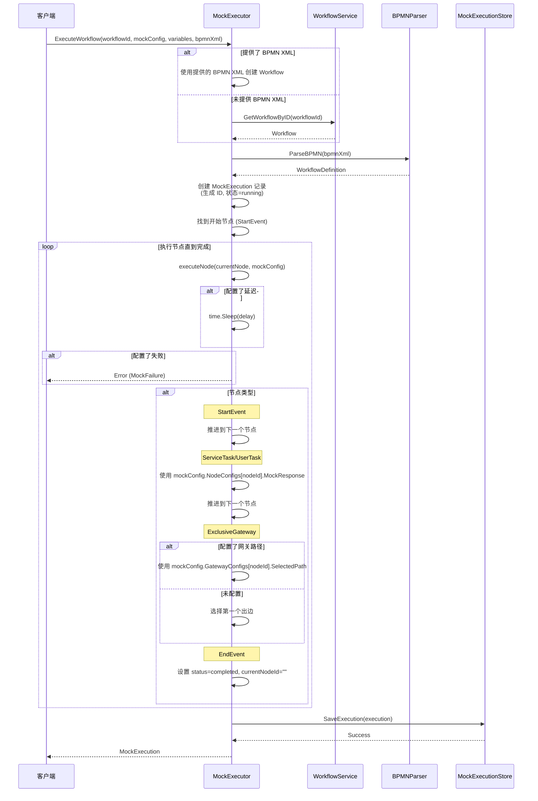
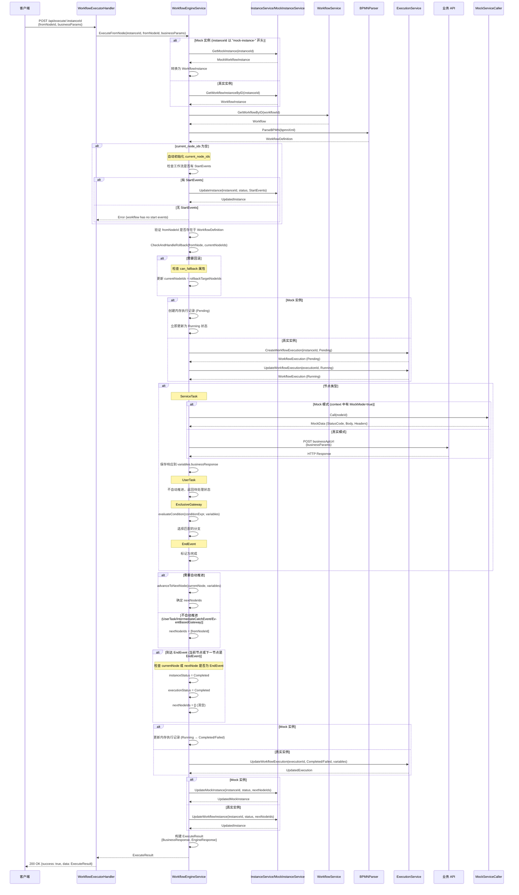

# ExecuteWorkflow 实现文档

## 概述

本文档详细说明了工作流引擎中 `ExecuteWorkflow` 功能的实现，包括 Mock 执行和真实执行两种模式。该功能负责从指定节点开始执行 BPMN 工作流，处理节点逻辑，管理执行状态，并支持回滚、断点调试等高级特性。

## 目录

- [核心组件](#核心组件)
- [两种执行模式](#两种执行模式)
- [执行流程](#执行流程)
- [数据模型](#数据模型)
- [API 接口](#api-接口)
- [回滚逻辑](#回滚逻辑)
- [错误处理](#错误处理)
- [使用示例](#使用示例)

## 核心组件

### 1. MockExecutor (`server/internal/services/mock_executor.go`)

负责 Mock 模式下的工作流执行，主要用于测试和调试。

**关键方法：**
- `ExecuteWorkflow()` - 执行完整的工作流
- `StepExecution()` - 单步执行
- `ContinueExecution()` - 继续执行直到断点或完成
- `StopExecution()` - 停止执行

### 2. WorkflowEngineService (`server/internal/services/workflow_engine.go`)

负责真实工作流的执行引擎，支持调用业务 API 和 Mock 数据。

**关键方法：**
- `ExecuteFromNode()` - 从指定节点开始执行
- `executeServiceTask()` - 执行服务任务节点
- `advanceToNextNode()` - 推进到下一个节点
- `evaluateCondition()` - 评估网关条件表达式
- `CheckAndHandleRollback()` - 检查并处理回滚逻辑

### 3. WorkflowExecutorHandler (`server/internal/handlers/workflow_executor.go`)

HTTP 请求处理器，将 REST API 请求转发给执行引擎。

**注意：** 该组件在 v1.1.0 中从 `WorkflowExecutionHandler` 重命名为 `WorkflowExecutorHandler`，以更清晰地区分执行器（Handler）和执行记录（Execution Record）的概念。

## 两种执行模式

### Mock 执行模式

**特点：**
- 不调用真实业务 API
- 使用配置的 Mock 数据
- 支持模拟延迟、失败场景
- 执行状态存储在内存中
- 适用于测试和调试

**使用场景：**
- 开发阶段的工作流测试
- 断点调试
- 性能测试
- 错误场景模拟

### 真实执行模式

**特点：**
- 调用真实业务 API
- 支持 Mock 数据和真实 API 混合模式
- 执行状态持久化到数据库
- 支持回滚和跳步检测
- 适用于生产环境

**使用场景：**
- 生产环境工作流执行
- 集成测试
- 实际业务流程处理

## 执行流程

### Mock 执行流程

#### 文本描述

```
ExecuteWorkflow()
  ├─ 1. 获取工作流定义 (从参数或数据库)
  ├─ 2. 解析 BPMN XML
  ├─ 3. 创建 Mock 执行记录
  │     ├─ 生成执行 ID
  │     ├─ 设置初始状态 (running)
  │     └─ 初始化变量
  ├─ 4. 找到开始节点
  ├─ 5. 执行节点 (executeNode)
  │     ├─ 检查 Mock 配置
  │     ├─ 模拟延迟
  │     ├─ 检查是否应该失败
  │     ├─ 根据节点类型执行逻辑
  │     │   ├─ StartEvent: 直接推进
  │     │   ├─ ServiceTask: 使用 Mock 响应
  │     │   ├─ UserTask: 使用 Mock 响应
  │     │   ├─ ExclusiveGateway: 根据配置选择分支
  │     │   └─ EndEvent: 标记为完成
  │     └─ 推进到下一个节点
  ├─ 6. 检查是否完成
  └─ 7. 保存执行状态到内存存储
```

#### 时序图



### 真实执行流程

#### 文本描述

```
ExecuteFromNode()
  ├─ 1. 获取工作流实例 (支持 Mock 实例和真实实例)
  │     ├─ 检查是否为 Mock 实例 (ID 前缀: mock-instance-)
  │     └─ 从相应的服务获取实例
  ├─ 2. 获取工作流定义
  ├─ 3. 解析 BPMN XML
  ├─ 3.5 补全 current_node_ids (如果为空)
  │     ├─ 检查 current_node_ids 是否为空
  │     ├─ 如果为空且工作流有开始节点，自动初始化为 StartEvents
  │     └─ 更新实例的 current_node_ids
  ├─ 4. 验证 fromNodeId 是否存在
  ├─ 5. 检查并处理回滚 (CheckAndHandleRollback)
  │     ├─ BoundaryEvent 回滚逻辑
  │     ├─ IntermediateCatchEvent 回滚逻辑
  │     └─ 其他节点回滚逻辑
  ├─ 6. 创建执行记录 (新执行流程)
  │     ├─ Mock 实例: 创建内存执行记录
  │     └─ 真实实例: 创建新执行记录 (Pending → Running)
  ├─ 7. 执行节点逻辑
  │     ├─ ServiceTask: 调用业务 API 或使用 Mock 数据
  │     ├─ UserTask: 返回待处理状态
  │     ├─ IntermediateCatchEvent: 等待外部事件
  │     ├─ EventBasedGateway: 等待事件分支
  │     ├─ ExclusiveGateway: 评估条件表达式
  │     └─ EndEvent: 标记为完成
  ├─ 8. 推进到下一个节点 (如果需要自动推进)
  │     ├─ 检查节点类型是否应该自动推进
  │     ├─ 对于 ExclusiveGateway: 评估条件选择分支
  │     └─ 对于其他节点: 选择第一个出边
  ├─ 9. 检查是否到达 EndEvent
  │     ├─ 如果当前节点是 EndEvent: 标记为完成
  │     └─ 如果下一个节点是 EndEvent: 标记为完成
  ├─ 10. 更新执行记录 (Running → Completed/Failed)
  ├─ 11. 更新实例状态
  └─ 12. 构建并返回执行结果
```

#### 时序图



## 数据模型

### MockExecution

Mock 执行状态模型

```go
type MockExecution struct {
    Id            string                 `json:"id"`            // 执行 ID
    WorkflowId    string                 `json:"workflowId"`    // 工作流 ID
    Status        string                 `json:"status"`        // 状态
    CurrentNodeId string                 `json:"currentNodeId"` // 当前节点 ID
    Variables     map[string]interface{} `json:"variables"`     // 变量
    ExecutedNodes []string               `json:"executedNodes"` // 已执行节点列表
    CreatedAt     time.Time              `json:"createdAt"`     // 创建时间
    UpdatedAt     time.Time              `json:"updatedAt"`     // 更新时间
}
```

**状态常量：**
- `pending` - 待处理
- `running` - 运行中
- `paused` - 已暂停
- `completed` - 已完成
- `failed` - 失败
- `stopped` - 已停止

### MockConfig

Mock 配置模型，用于控制 Mock 执行行为

```go
type MockConfig struct {
    Id             string                    `json:"id"`             // 配置 ID
    WorkflowId     string                    `json:"workflowId"`     // 工作流 ID
    Name           string                    `json:"name"`           // 配置名称
    Description    string                    `json:"description"`    // 描述
    NodeConfigs    map[string]NodeConfig     `json:"nodeConfigs"`    // 节点配置
    GatewayConfigs map[string]GatewayConfig  `json:"gatewayConfigs"` // 网关配置
    CreatedAt      time.Time                 `json:"createdAt"`      // 创建时间
    UpdatedAt      time.Time                 `json:"updatedAt"`      // 更新时间
}
```

### NodeConfig

节点级别的 Mock 配置

```go
type NodeConfig struct {
    MockResponse interface{} `json:"mockResponse"` // Mock 响应数据
    Delay        int         `json:"delay"`        // 延迟(毫秒)
    ShouldFail   bool        `json:"shouldFail"`   // 是否应该失败
    ErrorMessage string      `json:"errorMessage"` // 错误消息
}
```

### GatewayConfig

网关分支选择配置

```go
type GatewayConfig struct {
    SelectedPath string `json:"selectedPath"` // 选择的序列流 ID
}
```

### ExecuteResult

执行结果模型

```go
type ExecuteResult struct {
    BusinessResponse *BusinessResponse `json:"businessResponse,omitempty"` // 业务 API 响应
    EngineResponse   *EngineResponse   `json:"engineResponse"`            // 引擎响应
}
```

### BusinessResponse

业务 API 响应模型

```go
type BusinessResponse struct {
    StatusCode int               `json:"statusCode"` // HTTP 状态码
    Body       interface{}       `json:"body"`       // 响应体
    Headers    map[string]string `json:"headers"`    // 响应头
}
```

### EngineResponse

引擎响应模型

```go
type EngineResponse struct {
    InstanceId     string                 `json:"instanceId"`     // 实例 ID
    CurrentNodeIds []string               `json:"currentNodeIds"` // 当前节点 ID 列表
    NextNodeIds    []string               `json:"nextNodeIds"`    // 下一个节点 ID 列表
    Status         string                 `json:"status"`         // 实例状态
    ExecutionId    string                 `json:"executionId"`    // 执行 ID
    Variables      map[string]interface{} `json:"variables"`      // 变量
}
```

## API 接口

### HTTP API

#### 执行工作流

```
POST /api/execute/:workflowInstanceId
```

**路径参数：**
- `workflowInstanceId` - 工作流实例 ID (必需)

**请求体：**
```json
{
  "fromNodeId": "ServiceTask_1",
  "businessParams": {
    "param1": "value1",
    "param2": "value2"
  }
}
```

**响应示例 (成功)：**
```json
{
  "success": true,
  "data": {
    "businessResponse": {
      "statusCode": 200,
      "body": {
        "result": "success"
      },
      "headers": {
        "Content-Type": "application/json"
      }
    },
    "engineResponse": {
      "instanceId": "instance-123",
      "currentNodeIds": ["ServiceTask_2"],
      "nextNodeIds": ["ServiceTask_2"],
      "status": "running",
      "executionId": "exec-456",
      "variables": {
        "businessResponse": {
          "statusCode": 200,
          "body": {
            "result": "success"
          }
        }
      }
    }
  }
}
```

**错误响应：**

实例不存在 (404):
```json
{
  "success": false,
  "error": "WORKFLOW_INSTANCE_NOT_FOUND",
  "message": "Workflow instance not found"
}
```

节点 ID 无效 (400):
```json
{
  "success": false,
  "error": "INVALID_NODE_ID",
  "message": "Node ServiceTask_1 not found in workflow definition"
}
```

内部错误 (500):
```json
{
  "success": false,
  "error": "INTERNAL_ERROR",
  "message": "Failed to execute workflow"
}
```

### Go API

#### MockExecutor.ExecuteWorkflow

```go
func (m *MockExecutor) ExecuteWorkflow(
    ctx context.Context,
    workflowId string,
    mockConfig *models.MockConfig,
    initialVariables map[string]interface{},
    bpmnXml string,
) (*MockExecution, error)
```

**参数：**
- `ctx` - 上下文
- `workflowId` - 工作流 ID
- `mockConfig` - Mock 配置 (可选)
- `initialVariables` - 初始变量 (可选)
- `bpmnXml` - BPMN XML 字符串 (可选，如果提供则优先使用)

**返回：**
- `*MockExecution` - Mock 执行记录
- `error` - 错误信息

#### WorkflowEngineService.ExecuteFromNode

```go
func (s *WorkflowEngineService) ExecuteFromNode(
    ctx context.Context,
    instanceId string,
    fromNodeId string,
    businessParams map[string]interface{},
) (*ExecuteResult, error)
```

**参数：**
- `ctx` - 上下文
- `instanceId` - 工作流实例 ID
- `fromNodeId` - 起始节点 ID
- `businessParams` - 业务参数

**返回：**
- `*ExecuteResult` - 执行结果
- `error` - 错误信息

## 回滚逻辑

### 概述

工作流引擎支持回滚功能，允许用户从非当前节点开始执行。回滚逻辑根据节点类型和当前状态自动判断是否需要回滚。

### 回滚检查流程

```go
func CheckAndHandleRollback(
    wd *models.WorkflowDefinition,
    fromNode *models.Node,
    currentNodeIds []string,
) (*RollbackAction, error)
```

### 回滚规则

#### 1. BoundaryEvent (边界事件) 回滚规则

**规则：**
1. `attached_node_id` 不能为空
2. 如果 `attached_node_id` 在 `current_node_ids` 中，不需要回滚（正常触发边界事件）
3. 否则需要回滚到 `attached_node_id`

**示例：**
```
Current Node: ServiceTask_1
From Node: BoundaryEvent_1 (attached to ServiceTask_1)
结果: 不需要回滚（正常触发）

Current Node: ServiceTask_2
From Node: BoundaryEvent_1 (attached to ServiceTask_1)
结果: 需要回滚到 ServiceTask_1
```

#### 2. IntermediateCatchEvent (中间捕获事件) 回滚规则

**规则：**
1. 如果 `from_node_id` 在 `current_node_ids` 中，不需要回滚
2. 检查前置节点是否为 `EVENT_BASED_GATEWAY` 且在 `current_node_ids` 中，如果是则不回滚
3. 检查是否跳步骤（from_node 在 current_nodes 之后），如果是则报错
4. 否则需要回滚到 `from_node_id`

**示例：**
```
Current Node: IntermediateCatchEvent_1
From Node: IntermediateCatchEvent_1
结果: 不需要回滚（当前节点）

Current Node: EventBasedGateway_1
From Node: IntermediateCatchEvent_1 (EventBasedGateway_1 的后继)
结果: 不需要回滚（等待事件分支）

Current Node: ServiceTask_1
From Node: IntermediateCatchEvent_2 (ServiceTask_1 的后继)
结果: 错误（跳步骤）

Current Node: ServiceTask_2
From Node: ServiceTask_1
结果: 需要回滚到 ServiceTask_1
```

#### 3. 其他节点回滚规则

**规则：**
1. 如果 `from_node_id` 在 `current_node_ids` 中，不需要回滚
2. 检查是否跳步骤（from_node 在 current_nodes 之后），如果是则报错
3. 否则需要回滚到 `from_node_id`

**示例：**
```
Current Node: ServiceTask_2
From Node: ServiceTask_2
结果: 不需要回滚（当前节点）

Current Node: ServiceTask_1
From Node: ServiceTask_2 (ServiceTask_1 的后继)
结果: 错误（跳步骤）

Current Node: ServiceTask_2
From Node: ServiceTask_1
结果: 需要回滚到 ServiceTask_1
```

### can_fallback 属性

每个节点都有一个 `can_fallback` 属性（默认为 `true`），控制该节点是否允许回滚。

如果节点的 `can_fallback` 为 `false`，则无法回滚到该节点，会返回错误：
```
FALLBACK_NOT_ALLOWED: node <nodeId> does not allow fallback
```

### 跳步检测

使用 BFS (广度优先搜索) 算法检测是否跳步：

```go
func isNodeAfterCurrentNodes(
    wd *models.WorkflowDefinition,
    targetNodeId string,
    currentNodeIds []string,
) bool
```

从 `currentNodeIds` 开始向前遍历，如果能到达 `targetNodeId`，说明 `targetNodeId` 在当前节点之后（跳步）。

## 错误处理

### 错误类型

引擎定义了以下错误类型（`server/internal/models/response.go`）：

- `WORKFLOW_NOT_FOUND` - 工作流不存在
- `WORKFLOW_INSTANCE_NOT_FOUND` - 工作流实例不存在
- `INVALID_NODE_ID` - 无效的节点 ID
- `INVALID_REQUEST` - 无效的请求
- `INTERNAL_ERROR` - 内部错误
- `BOUNDARY_EVENT_NO_ATTACHMENT` - 边界事件没有附加节点
- `FALLBACK_NOT_ALLOWED` - 不允许回滚
- `SKIPPED_STEP` - 跳步错误

### 错误处理策略

#### Mock 执行错误处理

```go
// Mock 执行失败
if err != nil {
    execution.Status = MockExecutionStatusFailed
    return execution, err
}
```

#### 真实执行错误处理

```go
// ServiceTask 执行失败
if err != nil {
    s.logger.Error().Err(err).Str("nodeId", fromNodeId).Msg("Failed to execute ServiceTask")
    // 更新执行状态为失败
    s.updateExecutionStatus(ctx, execution.Id, models.ExecutionStatusFailed, err.Error())
    return nil, fmt.Errorf("failed to execute ServiceTask: %w", err)
}
```

### 日志记录

引擎使用 `zerolog` 库进行结构化日志记录：

```go
s.logger.Info().
    Str("nodeId", fromNodeId).
    Uint32("nodeType", node.Type).
    Msg("Node type does not auto-advance, staying at current node")

s.logger.Error().Err(err).
    Str("fromNodeId", fromNodeId).
    Strs("currentNodeIds", instance.CurrentNodeIds).
    Msg("Rollback check failed")
```

## 使用示例

### 示例 1: Mock 执行

```go
// 创建 MockExecutor
executor := services.NewMockExecutor(db, logger, workflowSvc)

// 准备 Mock 配置
mockConfig := &models.MockConfig{
    NodeConfigs: map[string]models.NodeConfig{
        "ServiceTask_1": {
            MockResponse: map[string]interface{}{
                "result": "success",
                "data": "mock data",
            },
            Delay: 100, // 100ms 延迟
        },
        "ServiceTask_2": {
            ShouldFail: true,
            ErrorMessage: "Simulated failure",
        },
    },
    GatewayConfigs: map[string]models.GatewayConfig{
        "Gateway_1": {
            SelectedPath: "Flow_approve", // 选择审批通过分支
        },
    },
}

// 执行工作流
execution, err := executor.ExecuteWorkflow(
    ctx,
    "Process_1",
    mockConfig,
    map[string]interface{}{"userId": "user123"},
    bpmnXml,
)

if err != nil {
    log.Printf("Execution failed: %v", err)
    return
}

log.Printf("Execution ID: %s", execution.Id)
log.Printf("Status: %s", execution.Status)
log.Printf("Current Node: %s", execution.CurrentNodeId)
log.Printf("Executed Nodes: %v", execution.ExecutedNodes)
```

### 示例 2: 真实执行

```go
// 创建执行引擎
engineSvc := services.NewWorkflowEngineService(
    db,
    logger,
    workflowSvc,
    instanceSvc,
    executionSvc,
)

// 执行工作流
result, err := engineSvc.ExecuteFromNode(
    ctx,
    "instance-123",
    "ServiceTask_1",
    map[string]interface{}{
        "orderId": "order-456",
        "amount": 100.00,
    },
)

if err != nil {
    log.Printf("Execution failed: %v", err)
    return
}

// 检查业务响应
if result.BusinessResponse != nil {
    log.Printf("Business API Status: %d", result.BusinessResponse.StatusCode)
    log.Printf("Business API Response: %v", result.BusinessResponse.Body)
}

// 检查引擎响应
log.Printf("Instance ID: %s", result.EngineResponse.InstanceId)
log.Printf("Current Nodes: %v", result.EngineResponse.CurrentNodeIds)
log.Printf("Next Nodes: %v", result.EngineResponse.NextNodeIds)
log.Printf("Status: %s", result.EngineResponse.Status)
log.Printf("Execution ID: %s", result.EngineResponse.ExecutionId)
```

### 示例 3: HTTP API 调用

```bash
# 执行工作流
curl -X POST http://localhost:8080/api/execute/instance-123 \
  -H "Content-Type: application/json" \
  -d '{
    "fromNodeId": "ServiceTask_1",
    "businessParams": {
      "orderId": "order-456",
      "amount": 100.00
    }
  }'
```

### 示例 4: 单步执行（调试）

```go
// 创建 Mock 执行
execution, err := executor.ExecuteWorkflow(ctx, "Process_1", nil, nil, bpmnXml)
if err != nil {
    log.Fatal(err)
}

// 单步执行
for execution.Status == services.MockExecutionStatusRunning {
    log.Printf("Current Node: %s", execution.CurrentNodeId)

    // 执行单步
    err = executor.StepExecution(ctx, execution, mockConfig)
    if err != nil {
        log.Printf("Step execution failed: %v", err)
        break
    }

    // 检查是否需要暂停（例如：断点）
    if shouldPauseAtNode(execution.CurrentNodeId) {
        execution.Status = services.MockExecutionStatusPaused
        log.Printf("Paused at node: %s", execution.CurrentNodeId)
        break
    }
}

log.Printf("Final Status: %s", execution.Status)
log.Printf("Executed Nodes: %v", execution.ExecutedNodes)
```

### 示例 5: 混合 Mock 模式

在真实执行中使用 Mock 数据（不调用真实 API）：

```go
// 设置 Mock 数据
mockData := map[string]*models.NodeMockData{
    "ServiceTask_1": {
        StatusCode: 200,
        Body: map[string]interface{}{
            "result": "success",
            "orderId": "order-123",
        },
        Headers: map[string]string{
            "Content-Type": "application/json",
        },
    },
}

// 创建带 Mock 配置的上下文
mockConfig := &models.MockConfig{
    NodeMockData: mockData,
}
ctx = services.WithMockConfig(context.Background(), mockConfig)
ctx = services.WithMockMode(ctx, true)

// 执行工作流（将使用 Mock 数据而不是调用真实 API）
result, err := engineSvc.ExecuteFromNode(
    ctx,
    "instance-123",
    "ServiceTask_1",
    map[string]interface{}{},
)
```

## 节点类型处理

### StartEvent

- 直接推进到下一个节点
- 不执行业务逻辑
- 记录到 `ExecutedNodes`

### ServiceTask

**Mock 模式：**
- 使用 `NodeConfig.MockResponse`
- 模拟延迟（如果配置）
- 模拟失败（如果配置）

**真实模式：**
- 调用 `Node.BusinessApiUrl`
- 发送 POST 请求
- 将响应存储到 `variables.businessResponse`
- 支持 Mock 数据模式（不调用真实 API）

### UserTask

- 不自动推进到下一个节点
- 等待用户操作
- 可以使用 Mock 响应（Mock 模式）

### ExclusiveGateway

- 评估条件表达式
- 选择第一个匹配的分支
- 如果没有条件表达式，选择默认流
- Mock 模式支持配置选择的分支

**条件评估：**
使用 `expr` 库评估条件表达式：
```go
// 示例条件表达式
"amount > 1000"
"status == 'approved'"
"userId in approvers"
```

### IntermediateCatchEvent

- 不自动推进到下一个节点
- 等待外部事件
- 支持 EventBasedGateway 后继

### EventBasedGateway

- 不自动推进到下一个节点
- 等待事件分支触发
- 后继节点通常是 IntermediateCatchEvent

### EndEvent

- 标记工作流完成
- 清空 `CurrentNodeIds` / `NextNodeIds`
- 更新实例状态为 `completed`
- 更新执行状态为 `completed`

### BoundaryEvent

- 依附于其他节点（通过 `AttachedNodeId`）
- 中断依附节点的执行
- 支持回滚到依附节点

## 最佳实践

### 1. 错误处理

总是检查执行结果：

```go
result, err := engineSvc.ExecuteFromNode(ctx, instanceId, fromNodeId, params)
if err != nil {
    // 处理错误
    log.Printf("Execution failed: %v", err)
    return
}

// 检查业务 API 响应
if result.BusinessResponse != nil && result.BusinessResponse.StatusCode != 200 {
    log.Printf("Business API returned non-200 status: %d", result.BusinessResponse.StatusCode)
}
```

### 2. 变量管理

使用结构化的变量：

```go
// 业务参数
businessParams := map[string]interface{}{
    "order": map[string]interface{}{
        "id": "order-123",
        "items": []string{"item1", "item2"},
        "total": 100.00,
    },
    "user": map[string]interface{}{
        "id": "user-456",
        "name": "John Doe",
    },
}

// 执行后访问变量
variables := result.EngineResponse.Variables
if businessResponse, ok := variables["businessResponse"]; ok {
    // 处理业务响应
}
```

### 3. Mock 配置

为常见场景创建可重用的 Mock 配置：

```go
// 成功场景
successConfig := &models.MockConfig{
    NodeConfigs: map[string]models.NodeConfig{
        "ServiceTask_Payment": {
            MockResponse: map[string]interface{}{
                "status": "success",
                "transactionId": "txn-123",
            },
        },
    },
}

// 失败场景
failureConfig := &models.MockConfig{
    NodeConfigs: map[string]models.NodeConfig{
        "ServiceTask_Payment": {
            ShouldFail: true,
            ErrorMessage: "Payment gateway timeout",
        },
    },
}
```

### 4. 日志记录

使用结构化日志：

```go
logger.Info().
    Str("instanceId", instanceId).
    Str("nodeId", fromNodeId).
    Interface("params", businessParams).
    Msg("Starting workflow execution")

logger.Error().Err(err).
    Str("instanceId", instanceId).
    Str("nodeId", fromNodeId).
    Msg("Workflow execution failed")
```

### 5. 回滚控制

谨慎使用 `can_fallback` 属性：

```xml
<!-- 允许回滚的节点（默认） -->
<bpmn:serviceTask id="ServiceTask_1" name="Process Order" />

<!-- 不允许回滚的节点（例如：支付节点） -->
<bpmn:serviceTask id="ServiceTask_Payment" name="Process Payment">
  <bpmn:extensionElements>
    <custom:canFallback>false</custom:canFallback>
  </bpmn:extensionElements>
</bpmn:serviceTask>
```

## 相关文件

### 核心实现
- `server/internal/services/mock_executor.go` - Mock 执行器
- `server/internal/services/workflow_engine.go` - 工作流引擎
- `server/internal/handlers/workflow_executor.go` - HTTP 处理器 (v1.1.0 重命名)

### 数据模型
- `server/internal/models/workflow.go` - 工作流模型
- `server/internal/models/mock_config.go` - Mock 配置模型
- `server/internal/models/response.go` - 响应模型

### 测试
- `server/internal/services/mock_executor_test.go` - Mock 执行器测试
- `server/internal/services/workflow_engine_test.go` - 工作流引擎测试
- `server/internal/handlers/workflow_executor_test.go` - HTTP 处理器测试 (v1.1.0 重命名)

### BPMN 解析
- `server/internal/parser/bpmn_parser.go` - BPMN 解析器
- `server/internal/parser/bpmn_parser_test.go` - BPMN 解析器测试

## 参考文档

- [BPMN 2.0 规范](https://www.omg.org/spec/BPMN/2.0/)
- [MOCK_IMPLEMENTATION.md](./MOCK_IMPLEMENTATION.md) - Mock 实现文档
- [TESTING_GUIDE.md](./TESTING_GUIDE.md) - 测试指南

## 版本历史

- v1.1.0 (2025-12-21) - 执行器重构和执行流程优化
  - 重命名 `WorkflowExecutionHandler` 为 `WorkflowExecutorHandler`，明确区分执行器和执行记录概念
  - 添加 `current_node_ids` 自动初始化功能：
    - 当 `current_node_ids` 为空时，自动使用工作流的 `StartEvents` 初始化
    - 如果工作流没有开始节点，返回 "workflow has no start events" 错误
  - 优化执行记录生命周期管理：
    - 移除 `getOrCreateExecution` 方法，每次执行创建新的执行记录
    - 执行记录状态流转：Pending → Running → Completed/Failed
    - 真实实例：创建 Pending 状态执行记录，立即更新为 Running
    - Mock 实例：直接创建 Running 状态的内存执行记录
  - 修复 EndEvent 处理逻辑：
    - 检查当前节点是否为 EndEvent（执行 FROM EndEvent）
    - 检查下一节点是否为 EndEvent（推进 TO EndEvent）
    - 两种情况都会标记工作流为完成状态
  - 新增测试用例：
    - TestExecuteFromNode_AutoInitializeCurrentNodeIds - 测试自动初始化功能
    - TestExecuteFromNode_NoStartEvents_ReturnsError - 测试无开始节点错误处理
    - 修复所有现有测试以匹配新的执行流程
- v1.0.0 (2025-12-21) - 初始版本
  - 支持 Mock 执行和真实执行
  - 实现回滚逻辑
  - 支持多种节点类型
  - 混合 Mock 模式

