# Mock 执行引擎实现文档

## 概述

Mock 执行引擎是工作流平台的重要组成部分，用于在不依赖真实外部服务的情况下测试和调试 BPMN 工作流。它提供了一个沙箱环境，允许开发者模拟各种执行场景、测试分支逻辑、并验证工作流的正确性。

## 核心设计理念

Mock 执行引擎采用以下核心设计理念：

1. **复用真实执行引擎** - Mock 模式通过 Context 标识，复用真实的 `WorkflowEngineService` 代码路径，确保一致性
2. **内存存储** - Mock 实例和执行状态存储在内存中，无需数据库持久化，快速且易于清理
3. **节点级配置** - 支持为每个节点配置独立的 Mock 数据、延迟、失败场景等
4. **单步执行** - 支持逐节点执行，便于调试和观察每个节点的状态变化
5. **无侵入性** - Mock 模式通过 Context 传递，不影响真实执行引擎的代码逻辑

## 系统架构

### 架构图


### 核心组件

#### 1. MockInstanceService (server/internal/services/mock_instance_service.go)

**职责**: 管理 Mock 工作流实例的生命周期

**主要功能**:
- 创建 Mock 实例（`CreateMockInstance`）
- 创建带有起始节点的 Mock 实例（`CreateMockInstanceWithStartNode`）
- 获取 Mock 实例（`GetMockInstance`）
- 更新 Mock 实例（`UpdateMockInstance`）
- 删除 Mock 实例（`DeleteMockInstance`）
- 列出所有 Mock 实例（`ListMockInstances`）

**数据模型**:
```go
type MockWorkflowInstance struct {
    Id              string                 // Mock 实例 ID
    WorkflowId      string                 // 关联的工作流 ID
    Status          string                 // 实例状态（running, completed, failed, etc.）
    CurrentNodeIds  []string               // 当前执行节点 ID 列表
    Variables       map[string]interface{} // 变量上下文
    InstanceVersion int                    // 版本号（用于乐观锁）
    CreatedAt       time.Time
    UpdatedAt       time.Time
}
```

#### 2. MockInstanceStore (server/internal/services/mock_instance_store.go)

**职责**: 提供 Mock 实例的内存存储

**主要功能**:
- 使用 `sync.RWMutex` 保证并发安全
- 提供 CRUD 操作（Create, Get, Update, Delete, List）
- 检查实例是否存在（`Exists`）

**特点**:
- 纯内存存储，无数据库依赖
- 线程安全
- 快速访问

#### 3. MockServiceCaller (server/internal/services/mock_service_caller.go)

**职责**: 处理 ServiceTask 节点的 Mock 服务调用

**主要功能**:
- 存储和管理节点级别的 Mock 数据（`MockDataStore`）
- 根据节点 ID 返回配置的 Mock 响应（`Call`）
- 批量设置 Mock 数据（`SetMockData`）
- 清除所有 Mock 数据（`ClearMockData`）

**数据模型**:
```go
type NodeMockData struct {
    StatusCode int                    // HTTP 状态码
    Body       interface{}            // 响应体
    Headers    map[string]string      // HTTP 头
}

type MockExecutionConfig struct {
    ExecutionApi       string                       // 执行 API 地址
    WorkflowInstanceId string                       // 工作流实例 ID
    FromNodeId         string                       // 起始节点 ID
    BusinessParams     map[string]interface{}       // 业务参数
    NodeMockData       map[string]*NodeMockData     // 节点 Mock 数据
}
```

**Context 支持**:
```go
// 创建带有 Mock 模式的 Context
ctx := services.WithMockMode(context.Background(), mockConfig)

// 检查是否为 Mock 模式
if services.IsMockMode(ctx) {
    // 执行 Mock 逻辑
}

// 获取 Mock 配置
config, ok := services.GetMockConfig(ctx)
```

#### 4. MockExecutor (server/internal/services/mock_executor.go)

**职责**: 执行 Mock 工作流（遗留实现，主要用于向后兼容）

**主要功能**:
- 执行完整工作流（`ExecuteWorkflow`）
- 执行单个节点（`executeNode`）
- 单步执行（`StepExecution`）
- 继续执行（`ContinueExecution`）
- 停止执行（`StopExecution`）

**注意**: 新的实现中，Mock 执行主要通过 `WorkflowEngineService` 的 Mock 模式完成，`MockExecutor` 主要用于向后兼容。

#### 5. MockHandler (server/internal/handlers/mock.go)

**职责**: 处理 Mock 相关的 HTTP 请求

**主要 API 端点**:
- `POST /api/workflows/:workflowId/mock/execute` - 执行 Mock 工作流
- `POST /api/workflows/mock/instances/:instanceId/step` - 单步执行
- `GET /api/workflows/mock/instances/:instanceId` - 获取 Mock 实例
- `POST /api/workflows/mock/instances` - 创建 Mock 实例
- `PUT /api/workflows/mock/instances/:instanceId` - 更新 Mock 实例
- `GET /api/workflows/mock/instances` - 列出所有 Mock 实例

#### 6. 前端服务 (client/src/services/mockService.ts)

**职责**: 前端与后端 Mock API 的交互层

**主要方法**:
- `executeWorkflow(workflowId, request)` - 执行 Mock 工作流
- `stepExecution(instanceId, request)` - 单步执行
- `getInstance(instanceId)` - 获取 Mock 实例
- `createConfig(workflowId, config)` - 创建 Mock 配置
- `getConfigs(workflowId)` - 获取 Mock 配置列表
- `updateConfig(configId, config)` - 更新 Mock 配置
- `deleteConfig(configId)` - 删除 Mock 配置

## 执行流程

### 1. 完整 Mock 工作流执行流程


### 2. 单步执行流程

```mermaid
sequenceDiagram
    actor User as 用户
    participant UI as 前端 UI
    participant Handler as MockHandler
    participant InstanceSvc as MockInstanceService
    participant Engine as WorkflowEngineService

    User->>UI: 点击"单步执行"
    UI->>Handler: POST /instances/{id}/step

    Handler->>InstanceSvc: GetMockInstance(instanceId)
    InstanceSvc-->>Handler: 返回 Mock 实例

    Handler->>Handler: 从 currentNodeIds<br/>获取下一个要执行的节点

    Handler->>Handler: 创建 Mock 模式 Context<br/>ctx = WithMockMode(ctx, mockConfig)

    Handler->>Engine: ExecuteFromNode(ctx, instanceId, fromNodeId)

    Note over Engine: 执行当前节点（仅一个节点）

    Engine->>InstanceSvc: UpdateMockInstance
    Note over InstanceSvc: 更新 currentNodeIds

    Engine-->>Handler: 返回 ExecuteResult

    Handler-->>UI: 返回执行结果
    UI->>UI: 更新当前节点高亮
    UI->>User: 显示执行进度
```



### 3. Mock 模式下的 ServiceTask 执行


## API 接口详解

### 1. 执行 Mock 工作流

**端点**: `POST /api/workflows/:workflowId/mock/execute`

**请求体**:
```json
{
  "startNodeId": "StartEvent_1",  // 可选，不提供则自动查找 StartEvent
  "initialVariables": {           // 可选，初始变量
    "userId": "12345",
    "amount": 1000
  },
  "nodeMockData": {               // 可选，节点级 Mock 数据
    "ServiceTask_1": {
      "statusCode": 200,
      "body": {
        "result": "success",
        "data": { "orderId": "ORDER-001" }
      },
      "headers": {
        "Content-Type": "application/json"
      }
    }
  },
  "bpmnXml": "<bpmn:definitions>...</bpmn:definitions>"  // 可选，提供则无需数据库
}
```

**响应**:
```json
{
  "success": true,
  "data": {
    "businessResponse": {
      "statusCode": 200,
      "body": { "result": "success" },
      "headers": { "Content-Type": "application/json" }
    },
    "engineResponse": {
      "instanceId": "mock-instance-1234567890",
      "currentNodeIds": ["EndEvent_1"],
      "nextNodeIds": [],
      "status": "completed",
      "executionId": "exec-1234567890",
      "variables": {
        "userId": "12345",
        "amount": 1000,
        "orderId": "ORDER-001"
      }
    }
  }
}
```

### 2. 单步执行

**端点**: `POST /api/workflows/mock/instances/:instanceId/step`

**请求体**:
```json
{
  "businessParams": {         // 可选，业务参数
    "customData": "value"
  },
  "nodeMockData": {           // 可选，节点级 Mock 数据
    "ServiceTask_2": {
      "statusCode": 200,
      "body": { "step": "completed" }
    }
  }
}
```

**响应**:
```json
{
  "success": true,
  "data": {
    "businessResponse": {
      "statusCode": 200,
      "body": { "step": "completed" }
    },
    "engineResponse": {
      "instanceId": "mock-instance-1234567890",
      "currentNodeIds": ["ServiceTask_3"],
      "nextNodeIds": ["ServiceTask_4"],
      "status": "running",
      "executionId": "exec-1234567890",
      "variables": { "customData": "value" }
    }
  }
}
```

### 3. 获取 Mock 实例

**端点**: `GET /api/workflows/mock/instances/:instanceId`

**响应**:
```json
{
  "success": true,
  "data": {
    "id": "mock-instance-1234567890",
    "workflowId": "workflow-001",
    "status": "running",
    "currentNodeIds": ["ServiceTask_2"],
    "variables": {
      "userId": "12345",
      "amount": 1000
    },
    "instanceVersion": 3,
    "createdAt": "2025-12-21T10:00:00Z",
    "updatedAt": "2025-12-21T10:01:30Z"
  }
}
```

## 数据结构

### ExecuteResult（执行结果）

```typescript
interface ExecuteResult {
  businessResponse?: {        // 业务响应（ServiceTask 返回的数据）
    statusCode: number
    body: any
    headers?: Record<string, string>
  }
  engineResponse: {           // 引擎响应（执行状态）
    instanceId: string        // 实例 ID
    currentNodeIds: string[]  // 当前节点 ID 列表
    nextNodeIds?: string[]    // 下一步可能的节点 ID 列表
    status: string            // 实例状态
    executionId: string       // 执行 ID
    variables: Record<string, any>  // 变量上下文
  }
}
```

### MockWorkflowInstance（Mock 实例）

```typescript
interface MockInstance {
  id: string                  // 实例 ID
  workflowId: string          // 工作流 ID
  status: string              // 状态（running, completed, failed, etc.）
  currentNodeIds: string[]    // 当前节点 ID 列表
  variables: Record<string, any>  // 变量上下文
  instanceVersion: number     // 版本号
  createdAt: string
  updatedAt: string
}
```

### NodeMockData（节点 Mock 数据）

```typescript
interface NodeMockData {
  statusCode: number          // HTTP 状态码
  body: any                   // 响应体（任意 JSON 数据）
  headers?: Record<string, string>  // HTTP 头
}
```

### MockConfig（Mock 配置）

```typescript
interface MockConfig {
  id?: string
  workflowId: string
  name: string                     // 配置名称
  description?: string             // 配置描述
  nodeConfigs: Record<string, NodeConfig>      // 节点配置
  gatewayConfigs: Record<string, GatewayConfig>  // 网关配置
  createdAt?: string
  updatedAt?: string
}

interface NodeConfig {
  mockResponse?: any          // Mock 响应数据
  delay?: number              // 延迟（毫秒）
  shouldFail?: boolean        // 是否应该失败
  errorMessage?: string       // 错误消息
}

interface GatewayConfig {
  selectedPath: string        // 选择的分支（SequenceFlow ID）
}
```

## 使用示例

### 示例 1: 执行简单的 Mock 工作流

```typescript
import { mockService } from '@/services/mockService'

// 执行 Mock 工作流
const result = await mockService.executeWorkflow('workflow-001', {
  initialVariables: {
    userId: '12345',
    amount: 1000
  },
  nodeMockData: {
    'CheckBalance': {
      statusCode: 200,
      body: { balance: 5000, sufficient: true }
    },
    'DeductAmount': {
      statusCode: 200,
      body: { newBalance: 4000, success: true }
    }
  }
})

console.log('执行结果:', result)
console.log('实例 ID:', result.engineResponse.instanceId)
console.log('当前节点:', result.engineResponse.currentNodeIds)
console.log('状态:', result.engineResponse.status)
```

### 示例 2: 单步调试工作流

```typescript
import { mockService } from '@/services/mockService'

// 1. 执行第一步（创建实例）
let result = await mockService.executeWorkflow('workflow-001', {
  nodeMockData: {
    'ServiceTask_1': {
      statusCode: 200,
      body: { step1: 'completed' }
    }
  }
})

const instanceId = result.engineResponse.instanceId

// 2. 单步执行下一个节点
result = await mockService.stepExecution(instanceId, {
  nodeMockData: {
    'ServiceTask_2': {
      statusCode: 200,
      body: { step2: 'completed' }
    }
  }
})

console.log('当前节点:', result.engineResponse.currentNodeIds)

// 3. 继续单步执行
result = await mockService.stepExecution(instanceId, {
  nodeMockData: {
    'ServiceTask_3': {
      statusCode: 200,
      body: { step3: 'completed' }
    }
  }
})

console.log('执行完成:', result.engineResponse.status === 'completed')
```

### 示例 3: 测试网关分支

```typescript
import { mockService } from '@/services/mockService'

// 测试不同的分支路径
const testBranches = async () => {
  // 测试路径 A（amount > 1000）
  const resultA = await mockService.executeWorkflow('workflow-001', {
    initialVariables: { amount: 1500 },
    nodeMockData: {
      'CheckAmount': {
        statusCode: 200,
        body: { amount: 1500, threshold: 1000, shouldApprove: true }
      },
      'ApprovalTask': {
        statusCode: 200,
        body: { approved: true }
      }
    }
  })

  console.log('路径 A 结果:', resultA.engineResponse.currentNodeIds)

  // 测试路径 B（amount <= 1000）
  const resultB = await mockService.executeWorkflow('workflow-001', {
    initialVariables: { amount: 500 },
    nodeMockData: {
      'CheckAmount': {
        statusCode: 200,
        body: { amount: 500, threshold: 1000, shouldApprove: false }
      },
      'AutoApprovalTask': {
        statusCode: 200,
        body: { autoApproved: true }
      }
    }
  })

  console.log('路径 B 结果:', resultB.engineResponse.currentNodeIds)
}

testBranches()
```

### 示例 4: 测试错误场景

```typescript
import { mockService } from '@/services/mockService'

// 测试服务调用失败的场景
const testErrorScenario = async () => {
  try {
    const result = await mockService.executeWorkflow('workflow-001', {
      nodeMockData: {
        'PaymentService': {
          statusCode: 500,
          body: {
            error: 'Payment gateway timeout',
            code: 'GATEWAY_TIMEOUT'
          }
        }
      }
    })

    // 检查工作流是否正确处理错误
    console.log('错误处理结果:', result)
  } catch (error) {
    console.error('执行失败:', error)
  }
}

testErrorScenario()
```

## 测试策略

### 单元测试

针对每个组件编写单元测试：

1. **MockInstanceService** 测试
   - 测试实例创建
   - 测试实例更新
   - 测试实例查询
   - 测试并发访问

2. **MockServiceCaller** 测试
   - 测试 Mock 数据设置和获取
   - 测试默认响应
   - 测试数据清除

3. **MockExecutor** 测试
   - 测试单节点执行
   - 测试完整工作流执行
   - 测试错误处理

### 集成测试

针对完整流程编写集成测试：

1. **完整执行流程测试**
   - 测试从 StartEvent 到 EndEvent 的完整流程
   - 测试变量传递
   - 测试状态更新

2. **单步执行测试**
   - 测试单步执行功能
   - 测试每个节点的状态变化
   - 测试 currentNodeIds 的更新

3. **分支测试**
   - 测试 ExclusiveGateway 的不同分支
   - 测试条件表达式求值
   - 测试多条路径

4. **错误场景测试**
   - 测试节点失败场景
   - 测试超时场景
   - 测试状态恢复

### E2E 测试

针对用户交互编写端到端测试：

1. **UI 交互测试**
   - 测试执行按钮
   - 测试单步按钮
   - 测试节点高亮
   - 测试响应数据显示

2. **调试流程测试**
   - 测试断点设置
   - 测试变量查看
   - 测试执行历史

## 最佳实践

### 1. Mock 数据设计

- **真实性**: Mock 数据应尽可能接近真实数据的结构和内容
- **多样性**: 设计多种场景的 Mock 数据（成功、失败、边界情况）
- **可维护性**: 使用配置文件管理 Mock 数据，避免硬编码

### 2. 调试策略

- **单步执行**: 对于复杂工作流，使用单步执行逐节点调试
- **变量检查**: 每一步都检查变量的变化
- **日志记录**: 启用详细日志，追踪执行路径

### 3. 测试覆盖

- **正常路径**: 测试所有正常执行路径
- **异常路径**: 测试所有错误处理路径
- **边界条件**: 测试边界值和特殊情况

### 4. 性能优化

- **内存管理**: 定期清理不再使用的 Mock 实例
- **并发控制**: 使用读写锁优化并发访问
- **缓存策略**: 缓存解析后的 BPMN 定义

## 常见问题

### Q1: Mock 实例和真实实例有什么区别？

**A**: Mock 实例存储在内存中（`MockInstanceStore`），真实实例存储在数据库中。Mock 实例主要用于测试和调试，不持久化。执行逻辑上，两者都使用相同的 `WorkflowEngineService`，只是通过 Context 中的 Mock 标识来区分。

### Q2: 如何模拟 ServiceTask 的不同响应？

**A**: 通过 `nodeMockData` 参数为每个 ServiceTask 节点配置 Mock 数据：

```javascript
{
  nodeMockData: {
    'YourServiceTaskId': {
      statusCode: 200,
      body: { /* your mock data */ },
      headers: { 'Content-Type': 'application/json' }
    }
  }
}
```

### Q3: Mock 执行支持并行网关吗？

**A**: 当前实现主要支持 ExclusiveGateway（互斥网关）。并行网关（ParallelGateway）的支持正在开发中。

### Q4: 如何清理 Mock 实例？

**A**: Mock 实例存储在内存中，可以通过以下方式清理：

1. 调用 `DeleteMockInstance` API 删除单个实例
2. 重启服务器会清空所有内存中的 Mock 实例
3. 实现定期清理任务，自动删除过期的 Mock 实例

### Q5: Mock 模式下如何调试复杂的条件表达式？

**A**: 使用单步执行模式，在每个网关节点停下来，检查 `variables` 中的值，然后根据条件表达式验证分支选择是否正确。

### Q6: 可以在 Mock 模式下模拟延迟吗？

**A**: 可以，通过 `NodeConfig` 中的 `delay` 字段配置延迟（单位：毫秒）：

```javascript
{
  nodeConfigs: {
    'ServiceTask_1': {
      mockResponse: { data: 'value' },
      delay: 1000  // 延迟 1 秒
    }
  }
}
```

## 未来计划

1. **持久化支持** - 可选的数据库持久化，支持长时间的调试会话
2. **断点功能** - 支持在特定节点设置断点，自动暂停执行
3. **回放功能** - 记录执行历史，支持回放和时间旅行调试
4. **可视化增强** - 更丰富的执行状态可视化，包括变量变化、执行路径等
5. **Mock 配置模板** - 预定义的 Mock 配置模板，快速设置常见场景
6. **并行网关支持** - 完善并行网关的 Mock 执行逻辑
7. **性能分析** - 添加性能分析工具，识别瓶颈节点
8. **自动化测试生成** - 根据 Mock 执行历史自动生成测试用例

## 参考资料

- [BPMN 2.0 规范](https://www.omg.org/spec/BPMN/2.0/)
- [工作流引擎实现文档](./backend/architecture.md)
- [测试策略文档](./TESTING_GUIDE.md)
- [OpenSpec 变更记录](../openspec/changes/iterate-mock-execution-engine/)

## 版本历史

- **v1.0.0** (2025-12-21) - 初始版本，完成 Mock 执行引擎核心功能
  - Mock 实例管理
  - Mock 模式集成到执行引擎
  - 单步执行支持
  - 节点级 Mock 数据配置
