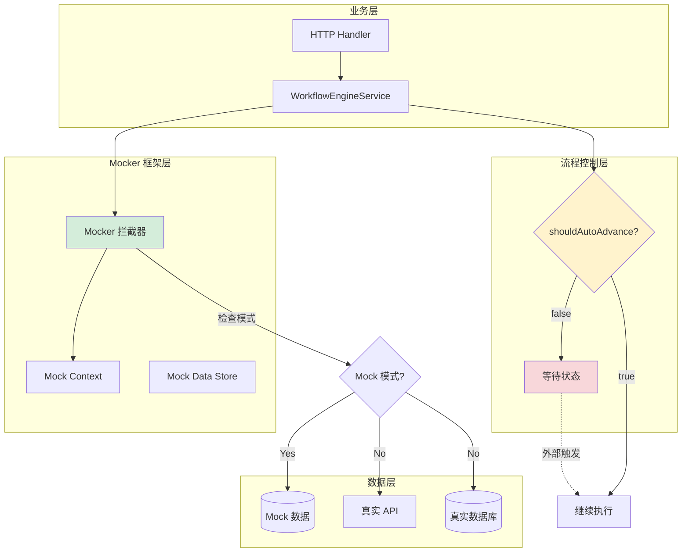

# Mock Mocker 框架设计方案（基于自然停留点）

## 核心理念

Mock 执行应该：
1. **复用真实逻辑**：使用与真实执行完全相同的业务代码
2. **数据层面 Mock**：只在数据访问层进行拦截，不修改流程控制
3. **自然停留点**：利用工作流中已有的 `shouldAutoAdvance=false` 节点作为停留点
4. **统一拦截**：通过 `mocker()` 框架方法统一处理 Mock 和真实调用

## 自然停留点说明

在 BPMN 工作流中，以下节点类型天然就是停留点（`shouldAutoAdvance=false`）：

| 节点类型 | 说明 | 真实场景触发方式 | Mock 场景触发方式 |
|---------|------|----------------|----------------|
| **UserTask** | 用户任务 | 用户在界面完成任务 | Mock 用户操作 |
| **EventBasedGateway** | 事件网关 | 等待事件到达 | Mock 事件触发 |
| **IntermediateCatchEvent** | 中间捕获事件 | 等待定时器/消息 | Mock 事件到达 |
| **ReceiveTask** | 接收任务 | 等待消息到达 | Mock 消息接收 |

这些节点在执行后会自动暂停，等待外部触发继续。Mock 模式完全复用这个机制。

---

## 架构设计



---

## 核心实现

### 1. Mocker 框架

#### 1.1 核心拦截器

```go
// server/internal/mocker/mocker.go
package mocker

import (
    "context"
    "fmt"
    "time"
)

// MockContext 键
type contextKey string

const (
    MockModeKey    contextKey = "mock_mode"
    MockSessionKey contextKey = "mock_session"
)

// MockMode 模式
type MockMode string

const (
    MockModeDisabled MockMode = "disabled" // 禁用 Mock
    MockModeEnabled  MockMode = "enabled"  // 启用 Mock
    MockModeRecord   MockMode = "record"   // 记录模式
)

// MockSession Mock 会话
type MockSession struct {
    ID            string
    InstanceID    string
    Mode          MockMode
    DataStore     *MockDataStore
    ExecutionLog  []ExecutionLogEntry
    CreatedAt     time.Time
}

// ExecutionLogEntry 执行日志
type ExecutionLogEntry struct {
    Timestamp   time.Time              `json:"timestamp"`
    Operation   string                 `json:"operation"`
    Input       interface{}            `json:"input,omitempty"`
    Output      interface{}            `json:"output,omitempty"`
    IsMocked    bool                   `json:"isMocked"`
    Error       string                 `json:"error,omitempty"`
}

// Mocker 通用拦截器
// 根据上下文决定执行真实函数还是返回 Mock 数据
func Mocker[T any](
    ctx context.Context,
    operation string,
    realFn func(context.Context) (T, error),
) (T, error) {
    var zero T

    // 获取 Mock Session
    session := GetMockSession(ctx)
    if session == nil || session.Mode == MockModeDisabled {
        // 非 Mock 模式，直接执行真实函数
        return realFn(ctx)
    }

    // 记录模式：执行真实函数并记录结果
    if session.Mode == MockModeRecord {
        result, err := realFn(ctx)
        if err == nil {
            session.DataStore.Set(operation, result)
            session.LogExecution(operation, nil, result, false, "")
        } else {
            session.LogExecution(operation, nil, nil, false, err.Error())
        }
        return result, err
    }

    // Mock 模式：尝试从 Mock 数据获取
    if session.Mode == MockModeEnabled {
        mockData, exists := session.DataStore.Get(operation)
        if exists {
            // 找到 Mock 数据
            result, ok := mockData.(T)
            if !ok {
                err := fmt.Errorf("mock data type mismatch for operation: %s", operation)
                session.LogExecution(operation, nil, nil, true, err.Error())
                return zero, err
            }

            session.LogExecution(operation, nil, result, true, "")
            return result, nil
        }

        // 未找到 Mock 数据，执行真实函数（降级策略）
        result, err := realFn(ctx)
        errMsg := ""
        if err != nil {
            errMsg = err.Error()
        }
        session.LogExecution(operation, nil, result, false, errMsg)
        return result, err
    }

    return realFn(ctx)
}

// WithMockSession 创建带有 Mock Session 的 Context
func WithMockSession(ctx context.Context, session *MockSession) context.Context {
    return context.WithValue(ctx, MockSessionKey, session)
}

// GetMockSession 从 Context 获取 Mock Session
func GetMockSession(ctx context.Context) *MockSession {
    session, ok := ctx.Value(MockSessionKey).(*MockSession)
    if !ok {
        return nil
    }
    return session
}

// IsMockMode 检查是否为 Mock 模式
func IsMockMode(ctx context.Context) bool {
    session := GetMockSession(ctx)
    return session != nil && session.Mode == MockModeEnabled
}

// LogExecution 记录执行日志
func (s *MockSession) LogExecution(operation string, input, output interface{}, isMocked bool, errMsg string) {
    s.ExecutionLog = append(s.ExecutionLog, ExecutionLogEntry{
        Timestamp: time.Now(),
        Operation: operation,
        Input:     input,
        Output:    output,
        IsMocked:  isMocked,
        Error:     errMsg,
    })
}
```

#### 1.2 Mock 数据存储

```go
// server/internal/mocker/mock_data_store.go
package mocker

import (
    "encoding/json"
    "sync"
)

// MockDataStore Mock 数据存储
type MockDataStore struct {
    data map[string]interface{}
    mu   sync.RWMutex
}

// NewMockDataStore 创建新的存储
func NewMockDataStore() *MockDataStore {
    return &MockDataStore{
        data: make(map[string]interface{}),
    }
}

// Set 设置 Mock 数据
func (s *MockDataStore) Set(key string, value interface{}) {
    s.mu.Lock()
    defer s.mu.Unlock()
    s.data[key] = value
}

// Get 获取 Mock 数据
func (s *MockDataStore) Get(key string) (interface{}, bool) {
    s.mu.RLock()
    defer s.mu.RUnlock()
    value, exists := s.data[key]
    return value, exists
}

// SetBatch 批量设置
func (s *MockDataStore) SetBatch(data map[string]interface{}) {
    s.mu.Lock()
    defer s.mu.Unlock()
    for k, v := range data {
        s.data[k] = v
    }
}

// Clear 清空数据
func (s *MockDataStore) Clear() {
    s.mu.Lock()
    defer s.mu.Unlock()
    s.data = make(map[string]interface{})
}

// LoadFromJSON 从 JSON 加载
func (s *MockDataStore) LoadFromJSON(jsonData string) error {
    s.mu.Lock()
    defer s.mu.Unlock()

    var data map[string]interface{}
    if err := json.Unmarshal([]byte(jsonData), &data); err != nil {
        return err
    }

    s.data = data
    return nil
}

// ExportToJSON 导出为 JSON
func (s *MockDataStore) ExportToJSON() (string, error) {
    s.mu.RLock()
    defer s.mu.RUnlock()

    data, err := json.MarshalIndent(s.data, "", "  ")
    if err != nil {
        return "", err
    }

    return string(data), nil
}

// GetAll 获取所有数据（用于调试）
func (s *MockDataStore) GetAll() map[string]interface{} {
    s.mu.RLock()
    defer s.mu.RUnlock()

    // 返回副本
    result := make(map[string]interface{})
    for k, v := range s.data {
        result[k] = v
    }
    return result
}
```

---

### 2. 集成到工作流引擎

#### 2.1 修改 WorkflowEngineService

```go
// server/internal/services/workflow_engine.go

// ExecuteFromNode 执行工作流（使用 Mocker 框架）
func (s *WorkflowEngineService) ExecuteFromNode(
    ctx context.Context,
    instanceId string,
    fromNodeId string,
    businessParams map[string]interface{},
) (*ExecuteResult, error) {
    // 1. 使用 Mocker 获取工作流实例
    instance, err := mocker.Mocker(ctx,
        fmt.Sprintf("GetInstance:%s", instanceId),
        func(ctx context.Context) (*models.WorkflowInstance, error) {
            // 检查是否为 Mock 实例
            session := mocker.GetMockSession(ctx)
            if session != nil && session.InstanceID == instanceId {
                // Mock 实例：从 Mock 数据获取
                if s.mockInstanceSvc.MockInstanceExists(instanceId) {
                    mockInstance, err := s.mockInstanceSvc.GetMockInstance(ctx, instanceId)
                    if err != nil {
                        return nil, err
                    }
                    // 转换为标准实例格式
                    return ConvertMockInstanceToWorkflowInstance(mockInstance), nil
                }
            }

            // 真实实例：从数据库获取
            return s.instanceSvc.GetWorkflowInstanceByID(ctx, instanceId)
        },
    )

    if err != nil {
        return nil, fmt.Errorf("failed to get instance: %w", err)
    }

    // 2. 使用 Mocker 获取工作流定义
    workflow, err := mocker.Mocker(ctx,
        fmt.Sprintf("GetWorkflow:%s", instance.WorkflowId),
        func(ctx context.Context) (*models.Workflow, error) {
            return s.workflowSvc.GetWorkflowByID(ctx, instance.WorkflowId)
        },
    )

    if err != nil {
        return nil, fmt.Errorf("failed to get workflow: %w", err)
    }

    // 3. 解析 BPMN
    wd, err := parser.ParseBPMN(workflow.BpmnXml)
    if err != nil {
        return nil, fmt.Errorf("failed to parse BPMN: %w", err)
    }

    // 4. 获取当前节点
    node, exists := wd.Nodes[fromNodeId]
    if !exists {
        return nil, fmt.Errorf("node %s not found", fromNodeId)
    }

    // 5. 执行节点
    businessResp, err := s.executeNode(ctx, wd, instance, node, businessParams)
    if err != nil {
        return nil, err
    }

    // 6. 检查是否需要自动推进
    shouldAutoAdvance := s.shouldAutoAdvance(node.Type)

    if shouldAutoAdvance {
        // 自动推进到下一个节点
        s.advanceToNextNode(ctx, wd, instance, node)
    } else {
        // 保持在当前节点（等待外部触发）
        s.logger.Info().
            Str("nodeId", node.Id).
            Str("nodeType", string(node.Type)).
            Msg("Node execution paused, waiting for external trigger")
    }

    // 7. 更新实例
    err = s.updateInstance(ctx, instance)
    if err != nil {
        return nil, err
    }

    // 8. 构造返回结果
    result := &ExecuteResult{
        BusinessResponse: businessResp,
        EngineResponse: &EngineResponse{
            InstanceId:     instance.Id,
            CurrentNodeIds: instance.CurrentNodeIds,
            NextNodeIds:    s.getNextNodeIds(wd, instance),
            Status:         instance.Status,
            ExecutionId:    fmt.Sprintf("exec-%d", time.Now().UnixNano()),
            Variables:      instance.Variables,
        },
    }

    return result, nil
}

// shouldAutoAdvance 判断节点是否应该自动推进
func (s *WorkflowEngineService) shouldAutoAdvance(nodeType parser.NodeType) bool {
    switch nodeType {
    case parser.NodeTypeStartEvent,
        parser.NodeTypeServiceTask,
        parser.NodeTypeExclusiveGateway,
        parser.NodeTypeParallelGateway,
        parser.NodeTypeScriptTask,
        parser.NodeTypeEndEvent:
        return true

    case parser.NodeTypeUserTask,
        parser.NodeTypeEventBasedGateway,
        parser.NodeTypeIntermediateCatchEvent,
        parser.NodeTypeReceiveTask:
        return false

    default:
        return true
    }
}

// executeNode 执行单个节点
func (s *WorkflowEngineService) executeNode(
    ctx context.Context,
    wd *models.WorkflowDefinition,
    instance *models.WorkflowInstance,
    node *models.Node,
    businessParams map[string]interface{},
) (*BusinessResponse, error) {
    s.logger.Info().
        Str("nodeId", node.Id).
        Str("nodeType", string(node.Type)).
        Msg("Executing node")

    switch node.Type {
    case parser.NodeTypeStartEvent:
        return s.executeStartEvent(ctx, node, instance)

    case parser.NodeTypeServiceTask:
        return s.executeServiceTask(ctx, node, instance, businessParams)

    case parser.NodeTypeUserTask:
        return s.executeUserTask(ctx, node, instance, businessParams)

    case parser.NodeTypeExclusiveGateway:
        return s.executeExclusiveGateway(ctx, wd, node, instance)

    case parser.NodeTypeEventBasedGateway:
        return s.executeEventBasedGateway(ctx, node, instance)

    case parser.NodeTypeIntermediateCatchEvent:
        return s.executeIntermediateCatchEvent(ctx, node, instance, businessParams)

    case parser.NodeTypeEndEvent:
        return s.executeEndEvent(ctx, node, instance)

    default:
        return nil, fmt.Errorf("unsupported node type: %s", node.Type)
    }
}

// executeServiceTask 执行服务任务（使用 Mocker）
func (s *WorkflowEngineService) executeServiceTask(
    ctx context.Context,
    node *models.Node,
    instance *models.WorkflowInstance,
    businessParams map[string]interface{},
) (*BusinessResponse, error) {
    // 使用 Mocker 调用服务
    response, err := mocker.Mocker(ctx,
        fmt.Sprintf("ServiceTask:%s", node.Id),
        func(ctx context.Context) (*BusinessResponse, error) {
            // 真实的 HTTP 调用
            return s.callRealService(ctx, node, instance, businessParams)
        },
    )

    if err != nil {
        return nil, err
    }

    // 更新实例变量
    if response != nil && response.Body != nil {
        instance.Variables = s.mergeVariables(instance.Variables, response.Body)
    }

    return response, nil
}

// executeUserTask 执行用户任务（使用 Mocker）
func (s *WorkflowEngineService) executeUserTask(
    ctx context.Context,
    node *models.Node,
    instance *models.WorkflowInstance,
    businessParams map[string]interface{},
) (*BusinessResponse, error) {
    // 用户任务：记录任务已创建，等待用户完成
    // 在 Mock 模式下，可以直接返回 Mock 的用户操作结果

    response, err := mocker.Mocker(ctx,
        fmt.Sprintf("UserTask:%s", node.Id),
        func(ctx context.Context) (*BusinessResponse, error) {
            // 真实场景：创建用户任务记录
            taskId := fmt.Sprintf("task-%s-%d", node.Id, time.Now().UnixNano())

            // 这里可以调用任务管理服务
            // taskService.CreateTask(taskId, node, instance)

            return &BusinessResponse{
                StatusCode: 200,
                Body: map[string]interface{}{
                    "taskId":     taskId,
                    "taskName":   node.Name,
                    "status":     "pending",
                    "assignee":   node.Config["assignee"],
                    "formFields": node.Config["formFields"],
                },
            }, nil
        },
    )

    return response, err
}

// executeIntermediateCatchEvent 执行中间捕获事件（使用 Mocker）
func (s *WorkflowEngineService) executeIntermediateCatchEvent(
    ctx context.Context,
    node *models.Node,
    instance *models.WorkflowInstance,
    businessParams map[string]interface{},
) (*BusinessResponse, error) {
    // 中间捕获事件：等待事件到达
    // 在 Mock 模式下，可以直接返回 Mock 的事件数据

    response, err := mocker.Mocker(ctx,
        fmt.Sprintf("CatchEvent:%s", node.Id),
        func(ctx context.Context) (*BusinessResponse, error) {
            // 真实场景：注册事件监听器
            eventType := node.Config["eventType"].(string)

            s.logger.Info().
                Str("nodeId", node.Id).
                Str("eventType", eventType).
                Msg("Waiting for event")

            // 这里可以注册到事件总线
            // eventBus.Subscribe(eventType, instance.Id, node.Id)

            return &BusinessResponse{
                StatusCode: 200,
                Body: map[string]interface{}{
                    "eventType": eventType,
                    "status":    "waiting",
                },
            }, nil
        },
    )

    return response, err
}

// executeEventBasedGateway 执行事件网关（使用 Mocker）
func (s *WorkflowEngineService) executeEventBasedGateway(
    ctx context.Context,
    node *models.Node,
    instance *models.WorkflowInstance,
) (*BusinessResponse, error) {
    // 事件网关：等待多个事件中的一个到达
    response, err := mocker.Mocker(ctx,
        fmt.Sprintf("EventGateway:%s", node.Id),
        func(ctx context.Context) (*BusinessResponse, error) {
            // 真实场景：注册多个事件监听
            return &BusinessResponse{
                StatusCode: 200,
                Body: map[string]interface{}{
                    "status": "waiting",
                    "events": node.Config["events"],
                },
            }, nil
        },
    )

    return response, err
}

// callRealService 调用真实服务
func (s *WorkflowEngineService) callRealService(
    ctx context.Context,
    node *models.Node,
    instance *models.WorkflowInstance,
    businessParams map[string]interface{},
) (*BusinessResponse, error) {
    apiUrl := node.Config["apiUrl"].(string)
    method := node.Config["method"].(string)

    // 构造请求体
    requestBody := s.buildRequestBody(node, instance, businessParams)
    bodyBytes, _ := json.Marshal(requestBody)

    // 发起 HTTP 请求
    req, err := http.NewRequestWithContext(ctx, method, apiUrl, bytes.NewReader(bodyBytes))
    if err != nil {
        return nil, err
    }

    req.Header.Set("Content-Type", "application/json")

    resp, err := s.httpClient.Do(req)
    if err != nil {
        return nil, err
    }
    defer resp.Body.Close()

    body, err := io.ReadAll(resp.Body)
    if err != nil {
        return nil, err
    }

    var bodyData interface{}
    json.Unmarshal(body, &bodyData)

    return &BusinessResponse{
        StatusCode: resp.StatusCode,
        Body:       bodyData,
        Headers:    convertHeaders(resp.Header),
    }, nil
}

// updateInstance 更新实例（使用 Mocker）
func (s *WorkflowEngineService) updateInstance(
    ctx context.Context,
    instance *models.WorkflowInstance,
) error {
    return mocker.Mocker(ctx,
        fmt.Sprintf("UpdateInstance:%s", instance.Id),
        func(ctx context.Context) error {
            // 检查是否为 Mock 实例
            session := mocker.GetMockSession(ctx)
            if session != nil && session.InstanceID == instance.Id {
                // Mock 实例：更新内存数据
                if s.mockInstanceSvc.MockInstanceExists(instance.Id) {
                    mockInstance := ConvertWorkflowInstanceToMockInstance(instance)
                    _, err := s.mockInstanceSvc.UpdateMockInstance(
                        ctx,
                        instance.Id,
                        instance.Status,
                        instance.CurrentNodeIds,
                        instance.Variables,
                    )
                    return err
                }
            }

            // 真实实例：更新数据库
            return s.instanceSvc.UpdateWorkflowInstance(ctx, instance)
        },
    )
}

// advanceToNextNode 推进到下一个节点
func (s *WorkflowEngineService) advanceToNextNode(
    ctx context.Context,
    wd *models.WorkflowDefinition,
    instance *models.WorkflowInstance,
    currentNode *models.Node,
) {
    if len(currentNode.OutgoingSequenceFlowIds) > 0 {
        flowId := currentNode.OutgoingSequenceFlowIds[0]
        flow, exists := wd.SequenceFlows[flowId]
        if exists {
            instance.CurrentNodeIds = []string{flow.TargetNodeId}
        }
    } else {
        // 没有出边，流程结束
        instance.CurrentNodeIds = []string{}
        instance.Status = models.InstanceStatusCompleted
    }
}
```

---

### 3. HTTP API 实现

#### 3.1 Mock Handler

```go
// server/internal/handlers/mock.go

// MockHandler 处理 Mock 请求
type MockHandler struct {
    engineService   *services.WorkflowEngineService
    mockInstanceSvc *services.MockInstanceService
    workflowSvc     *services.WorkflowService
    sessionStore    *SessionStore
    logger          *zerolog.Logger
}

// ExecuteMock 初始化 Mock 执行
func (h *MockHandler) ExecuteMock(c *gin.Context) {
    workflowId := c.Param("workflowId")

    var req struct {
        StartNodeId      string                 `json:"startNodeId,omitempty"`
        InitialVariables map[string]interface{} `json:"initialVariables,omitempty"`
        MockData         map[string]interface{} `json:"mockData,omitempty"`
        BpmnXml          string                 `json:"bpmnXml,omitempty"`
    }

    if err := c.ShouldBindJSON(&req); err != nil {
        c.JSON(http.StatusBadRequest, models.NewErrorResponse(
            models.ErrInvalidRequest,
            err.Error(),
        ))
        return
    }

    // 1. 保存 BPMN XML（如果提供）
    if req.BpmnXml != "" {
        workflow := &models.Workflow{
            Id:      workflowId,
            Name:    workflowId,
            BpmnXml: req.BpmnXml,
        }
        h.workflowSvc.SetWorkflowInMemory(workflow)
    }

    // 2. 查找起始节点（如果未提供）
    if req.StartNodeId == "" {
        workflow, err := h.workflowSvc.GetWorkflowByID(c.Request.Context(), workflowId)
        if err != nil {
            c.JSON(http.StatusNotFound, models.NewErrorResponse(
                models.ErrInvalidRequest,
                "Workflow not found",
            ))
            return
        }

        wd, err := parser.ParseBPMN(workflow.BpmnXml)
        if err != nil {
            c.JSON(http.StatusInternalServerError, models.NewErrorResponse(
                models.ErrInternalError,
                "Failed to parse BPMN",
            ))
            return
        }

        if len(wd.StartEvents) == 0 {
            c.JSON(http.StatusBadRequest, models.NewErrorResponse(
                models.ErrInvalidRequest,
                "No start event found",
            ))
            return
        }

        req.StartNodeId = wd.StartEvents[0]
    }

    // 3. 创建 Mock 实例
    mockInstance, err := h.mockInstanceSvc.CreateMockInstanceWithStartNode(
        c.Request.Context(),
        workflowId,
        req.StartNodeId,
        req.InitialVariables,
    )

    if err != nil {
        c.JSON(http.StatusInternalServerError, models.NewErrorResponse(
            models.ErrInternalError,
            err.Error(),
        ))
        return
    }

    // 4. 创建 Mock Session
    session := &mocker.MockSession{
        ID:           fmt.Sprintf("session-%d", time.Now().UnixNano()),
        InstanceID:   mockInstance.Id,
        Mode:         mocker.MockModeEnabled,
        DataStore:    mocker.NewMockDataStore(),
        ExecutionLog: []mocker.ExecutionLogEntry{},
        CreatedAt:    time.Now(),
    }

    // 5. 加载 Mock 数据
    if req.MockData != nil {
        session.DataStore.SetBatch(req.MockData)
    }

    // 6. 保存 Session
    h.sessionStore.Set(session.ID, session)

    // 7. 返回初始状态（不执行）
    c.JSON(http.StatusOK, models.NewSuccessResponse(map[string]interface{}{
        "sessionId":      session.ID,
        "instanceId":     mockInstance.Id,
        "workflowId":     workflowId,
        "status":         mockInstance.Status,
        "currentNodeIds": mockInstance.CurrentNodeIds,
        "variables":      mockInstance.Variables,
    }))
}

// TriggerNode 触发节点继续执行（用于停留点）
func (h *MockHandler) TriggerNode(c *gin.Context) {
    instanceId := c.Param("instanceId")
    sessionId := c.Query("sessionId")

    var req struct {
        NodeId         string                 `json:"nodeId"`         // 要触发的节点 ID
        BusinessParams map[string]interface{} `json:"businessParams"` // 业务参数（如用户任务的表单数据）
    }

    if err := c.ShouldBindJSON(&req); err != nil {
        c.JSON(http.StatusBadRequest, models.NewErrorResponse(
            models.ErrInvalidRequest,
            err.Error(),
        ))
        return
    }

    // 1. 获取 Session
    session, err := h.sessionStore.Get(sessionId)
    if err != nil {
        c.JSON(http.StatusNotFound, models.NewErrorResponse(
            models.ErrInvalidRequest,
            "Session not found",
        ))
        return
    }

    // 2. 创建带有 Session 的 Context
    ctx := mocker.WithMockSession(c.Request.Context(), session)

    // 3. 执行节点
    result, err := h.engineService.ExecuteFromNode(
        ctx,
        instanceId,
        req.NodeId,
        req.BusinessParams,
    )

    if err != nil {
        c.JSON(http.StatusInternalServerError, models.NewErrorResponse(
            models.ErrInternalError,
            err.Error(),
        ))
        return
    }

    // 4. 保存更新后的 Session
    h.sessionStore.Set(sessionId, session)

    // 5. 返回结果
    c.JSON(http.StatusOK, models.NewSuccessResponse(map[string]interface{}{
        "result":       result,
        "executionLog": session.ExecutionLog,
    }))
}

// GetMockSession 获取 Mock Session 信息
func (h *MockHandler) GetMockSession(c *gin.Context) {
    sessionId := c.Param("sessionId")

    session, err := h.sessionStore.Get(sessionId)
    if err != nil {
        c.JSON(http.StatusNotFound, models.NewErrorResponse(
            models.ErrInvalidRequest,
            "Session not found",
        ))
        return
    }

    c.JSON(http.StatusOK, models.NewSuccessResponse(session))
}

// GetExecutionLog 获取执行日志
func (h *MockHandler) GetExecutionLog(c *gin.Context) {
    sessionId := c.Param("sessionId")

    session, err := h.sessionStore.Get(sessionId)
    if err != nil {
        c.JSON(http.StatusNotFound, models.NewErrorResponse(
            models.ErrInvalidRequest,
            "Session not found",
        ))
        return
    }

    c.JSON(http.StatusOK, models.NewSuccessResponse(session.ExecutionLog))
}

// ResetMockExecution 重置 Mock 执行
func (h *MockHandler) ResetMockExecution(c *gin.Context) {
    sessionId := c.Param("sessionId")

    session, err := h.sessionStore.Get(sessionId)
    if err != nil {
        c.JSON(http.StatusNotFound, models.NewErrorResponse(
            models.ErrInvalidRequest,
            "Session not found",
        ))
        return
    }

    // 删除 Mock 实例
    h.mockInstanceSvc.DeleteMockInstance(c.Request.Context(), session.InstanceID)

    // 删除 Session
    h.sessionStore.Delete(sessionId)

    c.JSON(http.StatusOK, models.NewSuccessResponse(map[string]interface{}{
        "message": "Mock execution reset successfully",
    }))
}

// SessionStore Session 存储（简化版，生产环境应使用 Redis）
type SessionStore struct {
    sessions map[string]*mocker.MockSession
    mu       sync.RWMutex
}

func NewSessionStore() *SessionStore {
    return &SessionStore{
        sessions: make(map[string]*mocker.MockSession),
    }
}

func (s *SessionStore) Set(id string, session *mocker.MockSession) {
    s.mu.Lock()
    defer s.mu.Unlock()
    s.sessions[id] = session
}

func (s *SessionStore) Get(id string) (*mocker.MockSession, error) {
    s.mu.RLock()
    defer s.mu.RUnlock()

    session, exists := s.sessions[id]
    if !exists {
        return nil, fmt.Errorf("session not found")
    }

    return session, nil
}

func (s *SessionStore) Delete(id string) {
    s.mu.Lock()
    defer s.mu.Unlock()
    delete(s.sessions, id)
}
```

#### 3.2 路由配置

```go
// server/internal/routes/routes.go

func SetupRoutes(router *gin.Engine, deps *Dependencies) {
    api := router.Group("/api")
    {
        // Mock 执行路由
        mock := api.Group("/mock")
        {
            // 初始化 Mock 执行
            mock.POST("/workflows/:workflowId/execute", deps.MockHandler.ExecuteMock)

            // 触发节点继续执行（用于停留点）
            mock.POST("/instances/:instanceId/trigger", deps.MockHandler.TriggerNode)

            // 获取 Session 信息
            mock.GET("/sessions/:sessionId", deps.MockHandler.GetMockSession)

            // 获取执行日志
            mock.GET("/sessions/:sessionId/log", deps.MockHandler.GetExecutionLog)

            // 重置执行
            mock.POST("/sessions/:sessionId/reset", deps.MockHandler.ResetMockExecution)
        }
    }
}
```

---

### 4. 前端集成

#### 4.1 Mock Service

```typescript
// client/src/services/mockService.ts

export interface MockSession {
  sessionId: string
  instanceId: string
  workflowId: string
  status: string
  currentNodeIds: string[]
  variables: Record<string, any>
}

export interface TriggerNodeRequest {
  nodeId: string
  businessParams?: Record<string, any>
}

export interface TriggerNodeResult {
  result: ExecuteResult
  executionLog: ExecutionLogEntry[]
}

export interface ExecutionLogEntry {
  timestamp: string
  operation: string
  input?: any
  output?: any
  isMocked: boolean
  error?: string
}

export class MockService {
  private baseUrl = '/api/mock'

  /**
   * 初始化 Mock 执行
   */
  async initializeMock(
    workflowId: string,
    mockData: Record<string, any>,
    initialVariables?: Record<string, any>,
    bpmnXml?: string
  ): Promise<MockSession> {
    const response = await fetch(`${this.baseUrl}/workflows/${workflowId}/execute`, {
      method: 'POST',
      headers: { 'Content-Type': 'application/json' },
      body: JSON.stringify({
        mockData,
        initialVariables,
        bpmnXml
      })
    })

    if (!response.ok) {
      throw new Error('Failed to initialize mock execution')
    }

    const result = await response.json()
    return result.data
  }

  /**
   * 触发节点继续执行
   */
  async triggerNode(
    sessionId: string,
    instanceId: string,
    request: TriggerNodeRequest
  ): Promise<TriggerNodeResult> {
    const response = await fetch(
      `${this.baseUrl}/instances/${instanceId}/trigger?sessionId=${sessionId}`,
      {
        method: 'POST',
        headers: { 'Content-Type': 'application/json' },
        body: JSON.stringify(request)
      }
    )

    if (!response.ok) {
      throw new Error('Failed to trigger node')
    }

    const result = await response.json()
    return result.data
  }

  /**
   * 获取 Session 信息
   */
  async getSession(sessionId: string): Promise<MockSession> {
    const response = await fetch(`${this.baseUrl}/sessions/${sessionId}`)

    if (!response.ok) {
      throw new Error('Failed to get session')
    }

    const result = await response.json()
    return result.data
  }

  /**
   * 获取执行日志
   */
  async getExecutionLog(sessionId: string): Promise<ExecutionLogEntry[]> {
    const response = await fetch(`${this.baseUrl}/sessions/${sessionId}/log`)

    if (!response.ok) {
      throw new Error('Failed to get execution log')
    }

    const result = await response.json()
    return result.data
  }

  /**
   * 重置执行
   */
  async resetExecution(sessionId: string): Promise<void> {
    await fetch(`${this.baseUrl}/sessions/${sessionId}/reset`, {
      method: 'POST'
    })
  }
}

export const mockService = new MockService()
```

#### 4.2 Mock Control Panel

```vue
<!-- client/src/components/MockControlPanel.vue -->
<template>
  <div class="mock-control-panel">
    <!-- Session 信息 -->
    <div class="session-info" v-if="session">
      <h3>Mock Session</h3>
      <div class="info-grid">
        <div class="info-item">
          <label>Session ID:</label>
          <span class="value">{{ session.sessionId }}</span>
        </div>
        <div class="info-item">
          <label>Instance ID:</label>
          <span class="value">{{ session.instanceId }}</span>
        </div>
        <div class="info-item">
          <label>Status:</label>
          <span class="status-badge" :class="session.status">
            {{ session.status }}
          </span>
        </div>
        <div class="info-item">
          <label>Current Nodes:</label>
          <div class="node-chips">
            <span
              v-for="nodeId in session.currentNodeIds"
              :key="nodeId"
              class="node-chip"
            >
              {{ nodeId }}
            </span>
          </div>
        </div>
      </div>
    </div>

    <!-- Mock 数据配置 -->
    <div class="mock-config-section">
      <h3>Mock 数据配置</h3>
      <div class="config-editor">
        <textarea
          v-model="mockDataJson"
          placeholder="输入 Mock 数据配置 (JSON 格式)"
          :disabled="!!session"
          rows="12"
        />
        <div class="config-help">
          <details>
            <summary>配置示例</summary>
            <pre>{{ exampleConfig }}</pre>
          </details>
        </div>
      </div>
    </div>

    <!-- 控制按钮 -->
    <div class="control-buttons">
      <button
        class="btn btn-primary"
        @click="startMock"
        :disabled="!!session"
      >
        <span class="icon">🚀</span>
        初始化 Mock 执行
      </button>

      <button
        class="btn btn-success"
        @click="triggerCurrentNode"
        :disabled="!canTrigger"
      >
        <span class="icon">▶️</span>
        触发下一步
      </button>

      <button
        class="btn btn-info"
        @click="showLogPanel = !showLogPanel"
        :disabled="!session"
      >
        <span class="icon">📋</span>
        {{ showLogPanel ? '隐藏' : '查看' }}日志
      </button>

      <button
        class="btn btn-warning"
        @click="resetMock"
        :disabled="!session"
      >
        <span class="icon">🔄</span>
        重置
      </button>
    </div>

    <!-- 当前节点信息 -->
    <div class="current-node-info" v-if="currentNodeInfo">
      <h3>当前节点: {{ currentNodeInfo.nodeId }}</h3>
      <div class="node-details">
        <div class="detail-item">
          <label>节点类型:</label>
          <span class="node-type-badge" :class="currentNodeInfo.nodeType">
            {{ currentNodeInfo.nodeType }}
          </span>
        </div>
        <div class="detail-item">
          <label>是否自动推进:</label>
          <span :class="currentNodeInfo.autoAdvance ? 'auto' : 'manual'">
            {{ currentNodeInfo.autoAdvance ? '是' : '否 (需手动触发)' }}
          </span>
        </div>
      </div>

      <!-- 如果是 UserTask，显示表单 -->
      <div v-if="currentNodeInfo.nodeType === 'userTask'" class="user-task-form">
        <h4>用户任务表单</h4>
        <div class="form-fields">
          <div
            v-for="field in currentNodeInfo.formFields"
            :key="field.name"
            class="form-field"
          >
            <label>{{ field.label }}:</label>
            <input
              v-model="userTaskData[field.name]"
              :type="field.type"
              :placeholder="field.placeholder"
            />
          </div>
        </div>
        <button class="btn btn-success" @click="completeUserTask">
          完成任务
        </button>
      </div>

      <!-- 如果是 EventBasedGateway，显示事件选择 -->
      <div v-if="currentNodeInfo.nodeType === 'eventBasedGateway'" class="event-selection">
        <h4>选择触发事件</h4>
        <div class="event-options">
          <button
            v-for="event in currentNodeInfo.events"
            :key="event.id"
            class="btn btn-outline"
            @click="triggerEvent(event)"
          >
            {{ event.name }}
          </button>
        </div>
      </div>
    </div>

    <!-- 执行日志面板 -->
    <div class="execution-log-panel" v-if="showLogPanel">
      <h3>执行日志</h3>
      <div class="log-container">
        <div
          v-for="(entry, index) in executionLog"
          :key="index"
          class="log-entry"
          :class="{ mocked: entry.isMocked, error: entry.error }"
        >
          <div class="log-header">
            <span class="log-time">{{ formatTime(entry.timestamp) }}</span>
            <span class="log-operation">{{ entry.operation }}</span>
            <span class="log-badge" :class="{ mocked: entry.isMocked }">
              {{ entry.isMocked ? 'MOCKED' : 'REAL' }}
            </span>
          </div>
          <div class="log-body" v-if="entry.output || entry.error">
            <div v-if="entry.error" class="log-error">
              ❌ {{ entry.error }}
            </div>
            <div v-else class="log-output">
              <pre>{{ JSON.stringify(entry.output, null, 2) }}</pre>
            </div>
          </div>
        </div>
      </div>
    </div>
  </div>
</template>

<script setup lang="ts">
import { ref, computed } from 'vue'
import { mockService, type MockSession } from '@/services/mockService'
import { useWorkflowStore } from '@/stores/workflow'

const workflowStore = useWorkflowStore()

const session = ref<MockSession | null>(null)
const executionLog = ref<ExecutionLogEntry[]>([])
const showLogPanel = ref(false)
const currentNodeInfo = ref<any>(null)
const userTaskData = ref<Record<string, any>>({})

const mockDataJson = ref(`{
  "ServiceTask:CheckBalance": {
    "statusCode": 200,
    "body": {
      "balance": 5000,
      "sufficient": true
    }
  },
  "ServiceTask:DeductAmount": {
    "statusCode": 200,
    "body": {
      "newBalance": 4000,
      "success": true
    }
  },
  "UserTask:ApprovalTask": {
    "statusCode": 200,
    "body": {
      "taskId": "task-001",
      "approved": true,
      "approver": "manager@company.com"
    }
  },
  "CatchEvent:PaymentCompleted": {
    "statusCode": 200,
    "body": {
      "paymentId": "pay-12345",
      "status": "completed",
      "amount": 1000
    }
  }
}`)

const exampleConfig = `{
  "ServiceTask:节点ID": {
    "statusCode": 200,
    "body": { "your": "data" }
  },
  "UserTask:节点ID": {
    "statusCode": 200,
    "body": { "approved": true }
  }
}`

const canTrigger = computed(() => {
  return session.value &&
         session.value.status !== 'completed' &&
         session.value.currentNodeIds.length > 0
})

async function startMock() {
  try {
    const mockData = JSON.parse(mockDataJson.value)
    const workflowId = workflowStore.currentWorkflow?.id

    if (!workflowId) {
      alert('请先选择一个工作流')
      return
    }

    session.value = await mockService.initializeMock(
      workflowId,
      mockData,
      { userId: '123', amount: 1000 },
      workflowStore.currentWorkflow?.bpmnXml
    )

    // 高亮起始节点
    highlightNodes(session.value.currentNodeIds)

    // 加载当前节点信息
    await loadCurrentNodeInfo()
  } catch (error: any) {
    console.error('Failed to start mock:', error)
    alert('启动失败: ' + error.message)
  }
}

async function triggerCurrentNode() {
  if (!session.value || session.value.currentNodeIds.length === 0) return

  const nodeId = session.value.currentNodeIds[0]

  try {
    const result = await mockService.triggerNode(
      session.value.sessionId,
      session.value.instanceId,
      { nodeId }
    )

    // 更新 session
    const updatedSession = await mockService.getSession(session.value.sessionId)
    session.value = updatedSession

    // 更新日志
    executionLog.value = result.executionLog

    // 高亮新的当前节点
    highlightNodes(session.value.currentNodeIds)

    // 加载新节点信息
    await loadCurrentNodeInfo()

    // 显示结果
    showExecutionResult(result.result)
  } catch (error: any) {
    console.error('Failed to trigger node:', error)
    alert('触发失败: ' + error.message)
  }
}

async function completeUserTask() {
  if (!session.value || !currentNodeInfo.value) return

  const nodeId = currentNodeInfo.value.nodeId

  try {
    const result = await mockService.triggerNode(
      session.value.sessionId,
      session.value.instanceId,
      {
        nodeId,
        businessParams: userTaskData.value
      }
    )

    // 更新状态
    const updatedSession = await mockService.getSession(session.value.sessionId)
    session.value = updatedSession
    executionLog.value = result.executionLog

    // 清空表单
    userTaskData.value = {}

    highlightNodes(session.value.currentNodeIds)
    await loadCurrentNodeInfo()
  } catch (error: any) {
    console.error('Failed to complete user task:', error)
    alert('完成任务失败: ' + error.message)
  }
}

async function triggerEvent(event: any) {
  if (!session.value || !currentNodeInfo.value) return

  const nodeId = currentNodeInfo.value.nodeId

  try {
    const result = await mockService.triggerNode(
      session.value.sessionId,
      session.value.instanceId,
      {
        nodeId,
        businessParams: {
          eventId: event.id,
          eventName: event.name,
          eventData: event.data
        }
      }
    )

    const updatedSession = await mockService.getSession(session.value.sessionId)
    session.value = updatedSession
    executionLog.value = result.executionLog

    highlightNodes(session.value.currentNodeIds)
    await loadCurrentNodeInfo()
  } catch (error: any) {
    console.error('Failed to trigger event:', error)
    alert('触发事件失败: ' + error.message)
  }
}

async function resetMock() {
  if (!session.value) return

  try {
    await mockService.resetExecution(session.value.sessionId)
    session.value = null
    executionLog.value = []
    currentNodeInfo.value = null
    userTaskData.value = {}
    clearHighlights()
  } catch (error: any) {
    console.error('Failed to reset:', error)
  }
}

async function loadCurrentNodeInfo() {
  if (!session.value || session.value.currentNodeIds.length === 0) {
    currentNodeInfo.value = null
    return
  }

  const nodeId = session.value.currentNodeIds[0]
  // 从 BPMN 定义中获取节点信息
  const nodeData = workflowStore.getNodeData(nodeId)

  currentNodeInfo.value = {
    nodeId,
    nodeType: nodeData?.type,
    autoAdvance: shouldAutoAdvance(nodeData?.type),
    formFields: nodeData?.config?.formFields || [],
    events: nodeData?.config?.events || []
  }
}

function shouldAutoAdvance(nodeType: string): boolean {
  const manualTypes = ['userTask', 'eventBasedGateway', 'intermediateCatchEvent', 'receiveTask']
  return !manualTypes.includes(nodeType)
}

function formatTime(timestamp: string): string {
  return new Date(timestamp).toLocaleTimeString('zh-CN')
}

function highlightNodes(nodeIds: string[]) {
  workflowStore.highlightNodes(nodeIds)
}

function clearHighlights() {
  workflowStore.clearHighlights()
}

function showExecutionResult(result: any) {
  console.log('Execution result:', result)
  // 可以显示一个结果弹窗
}
</script>

<style scoped>
.mock-control-panel {
  padding: 20px;
  background: #f8f9fa;
  border-radius: 8px;
  max-width: 1200px;
}

.session-info {
  background: white;
  padding: 16px;
  border-radius: 6px;
  margin-bottom: 20px;
  box-shadow: 0 2px 4px rgba(0,0,0,0.1);
}

.session-info h3 {
  margin: 0 0 12px 0;
  font-size: 16px;
  color: #333;
}

.info-grid {
  display: grid;
  grid-template-columns: repeat(auto-fit, minmax(250px, 1fr));
  gap: 12px;
}

.info-item {
  display: flex;
  flex-direction: column;
  gap: 4px;
}

.info-item label {
  font-size: 12px;
  color: #666;
  font-weight: 600;
}

.info-item .value {
  font-family: monospace;
  font-size: 13px;
  color: #333;
}

.status-badge {
  display: inline-block;
  padding: 4px 8px;
  border-radius: 4px;
  font-size: 12px;
  font-weight: 600;
}

.status-badge.ready {
  background: #fff3cd;
  color: #856404;
}

.status-badge.running {
  background: #d1ecf1;
  color: #0c5460;
}

.status-badge.completed {
  background: #d4edda;
  color: #155724;
}

.node-chips {
  display: flex;
  gap: 6px;
  flex-wrap: wrap;
}

.node-chip {
  background: #007bff;
  color: white;
  padding: 4px 8px;
  border-radius: 4px;
  font-size: 12px;
  font-family: monospace;
}

.mock-config-section {
  background: white;
  padding: 16px;
  border-radius: 6px;
  margin-bottom: 20px;
  box-shadow: 0 2px 4px rgba(0,0,0,0.1);
}

.mock-config-section h3 {
  margin: 0 0 12px 0;
  font-size: 16px;
}

.config-editor textarea {
  width: 100%;
  font-family: 'Monaco', 'Menlo', monospace;
  font-size: 13px;
  padding: 12px;
  border: 1px solid #ddd;
  border-radius: 4px;
  resize: vertical;
}

.config-editor textarea:disabled {
  background: #f5f5f5;
  cursor: not-allowed;
}

.config-help {
  margin-top: 8px;
}

.config-help summary {
  cursor: pointer;
  font-size: 13px;
  color: #007bff;
}

.config-help pre {
  margin-top: 8px;
  background: #f5f5f5;
  padding: 8px;
  border-radius: 4px;
  font-size: 12px;
  overflow-x: auto;
}

.control-buttons {
  display: flex;
  gap: 10px;
  margin-bottom: 20px;
  flex-wrap: wrap;
}

.btn {
  display: flex;
  align-items: center;
  gap: 6px;
  padding: 10px 16px;
  border: none;
  border-radius: 6px;
  font-size: 14px;
  font-weight: 500;
  cursor: pointer;
  transition: all 0.2s;
}

.btn:hover:not(:disabled) {
  transform: translateY(-1px);
  box-shadow: 0 4px 8px rgba(0,0,0,0.15);
}

.btn:disabled {
  opacity: 0.5;
  cursor: not-allowed;
}

.btn-primary {
  background: #007bff;
  color: white;
}

.btn-success {
  background: #28a745;
  color: white;
}

.btn-info {
  background: #17a2b8;
  color: white;
}

.btn-warning {
  background: #ffc107;
  color: #333;
}

.btn-outline {
  background: white;
  border: 1px solid #007bff;
  color: #007bff;
}

.current-node-info {
  background: white;
  padding: 16px;
  border-radius: 6px;
  margin-bottom: 20px;
  box-shadow: 0 2px 4px rgba(0,0,0,0.1);
}

.current-node-info h3 {
  margin: 0 0 12px 0;
  font-size: 16px;
}

.node-details {
  display: flex;
  gap: 20px;
  margin-bottom: 16px;
}

.detail-item {
  display: flex;
  align-items: center;
  gap: 8px;
}

.node-type-badge {
  padding: 4px 8px;
  border-radius: 4px;
  font-size: 12px;
  font-weight: 600;
  background: #6c757d;
  color: white;
}

.node-type-badge.userTask {
  background: #ffc107;
  color: #333;
}

.node-type-badge.eventBasedGateway {
  background: #17a2b8;
}

.auto {
  color: #28a745;
  font-weight: 600;
}

.manual {
  color: #dc3545;
  font-weight: 600;
}

.user-task-form,
.event-selection {
  margin-top: 16px;
  padding-top: 16px;
  border-top: 1px solid #eee;
}

.form-fields {
  display: flex;
  flex-direction: column;
  gap: 12px;
  margin-bottom: 12px;
}

.form-field {
  display: flex;
  flex-direction: column;
  gap: 4px;
}

.form-field label {
  font-size: 13px;
  font-weight: 600;
  color: #333;
}

.form-field input {
  padding: 8px;
  border: 1px solid #ddd;
  border-radius: 4px;
  font-size: 14px;
}

.event-options {
  display: flex;
  gap: 10px;
  flex-wrap: wrap;
}

.execution-log-panel {
  background: white;
  padding: 16px;
  border-radius: 6px;
  box-shadow: 0 2px 4px rgba(0,0,0,0.1);
}

.execution-log-panel h3 {
  margin: 0 0 12px 0;
  font-size: 16px;
}

.log-container {
  max-height: 400px;
  overflow-y: auto;
}

.log-entry {
  padding: 12px;
  margin-bottom: 8px;
  border-left: 3px solid #007bff;
  background: #f8f9fa;
  border-radius: 4px;
}

.log-entry.mocked {
  border-left-color: #28a745;
}

.log-entry.error {
  border-left-color: #dc3545;
  background: #ffe6e6;
}

.log-header {
  display: flex;
  align-items: center;
  gap: 12px;
  margin-bottom: 8px;
}

.log-time {
  font-size: 12px;
  color: #666;
  font-family: monospace;
}

.log-operation {
  font-size: 13px;
  font-weight: 600;
  color: #333;
  flex: 1;
}

.log-badge {
  font-size: 11px;
  padding: 2px 6px;
  border-radius: 3px;
  background: #007bff;
  color: white;
}

.log-badge.mocked {
  background: #28a745;
}

.log-body {
  font-size: 12px;
}

.log-error {
  color: #dc3545;
  font-weight: 600;
}

.log-output pre {
  margin: 0;
  font-family: monospace;
  font-size: 12px;
  background: white;
  padding: 8px;
  border-radius: 4px;
  overflow-x: auto;
}
</style>
```

---

## 使用流程示例

### 场景：包含 UserTask 的审批流程

```
StartEvent → CheckBalance (ServiceTask) → ApprovalTask (UserTask) → DeductAmount (ServiceTask) → EndEvent
```

#### 1. 初始化 Mock 执行

```json
POST /api/mock/workflows/approval-workflow/execute

{
  "mockData": {
    "ServiceTask:CheckBalance": {
      "statusCode": 200,
      "body": { "balance": 5000, "sufficient": true }
    },
    "UserTask:ApprovalTask": {
      "statusCode": 200,
      "body": { "approved": true, "approver": "manager@company.com" }
    },
    "ServiceTask:DeductAmount": {
      "statusCode": 200,
      "body": { "newBalance": 4000, "success": true }
    }
  },
  "initialVariables": {
    "userId": "123",
    "amount": 1000
  }
}

Response:
{
  "sessionId": "session-1234567890",
  "instanceId": "mock-instance-1234567890",
  "status": "running",
  "currentNodeIds": ["StartEvent_1"]
}
```

#### 2. 执行 StartEvent（自动推进到 CheckBalance）

```json
POST /api/mock/instances/mock-instance-1234567890/trigger?sessionId=session-1234567890

{
  "nodeId": "StartEvent_1"
}

Response:
{
  "result": {
    "businessResponse": { /* CheckBalance 的 Mock 响应 */ },
    "engineResponse": {
      "currentNodeIds": ["ServiceTask:CheckBalance"]
    }
  }
}
```

#### 3. 执行 CheckBalance（自动推进到 ApprovalTask）

```json
POST /api/mock/instances/mock-instance-1234567890/trigger?sessionId=session-1234567890

{
  "nodeId": "ServiceTask:CheckBalance"
}

Response:
{
  "result": {
    "engineResponse": {
      "currentNodeIds": ["UserTask:ApprovalTask"]  // 停留在 UserTask
    }
  }
}
```

#### 4. 完成 UserTask（手动触发，提供表单数据）

```json
POST /api/mock/instances/mock-instance-1234567890/trigger?sessionId=session-1234567890

{
  "nodeId": "UserTask:ApprovalTask",
  "businessParams": {
    "approved": true,
    "comment": "Approved by manager",
    "approver": "manager@company.com"
  }
}

Response:
{
  "result": {
    "engineResponse": {
      "currentNodeIds": ["ServiceTask:DeductAmount"]  // 推进到下一节点
    }
  }
}
```

#### 5. 执行 DeductAmount（自动推进到 EndEvent）

```json
POST /api/mock/instances/mock-instance-1234567890/trigger?sessionId=session-1234567890

{
  "nodeId": "ServiceTask:DeductAmount"
}

Response:
{
  "result": {
    "engineResponse": {
      "currentNodeIds": [],
      "status": "completed"
    }
  }
}
```

---

## 核心优势

### 1. 完全复用真实逻辑
✅ Mock 执行和真实执行使用**完全相同的代码路径**
✅ `shouldAutoAdvance` 机制自然生效，无需额外配置
✅ 业务逻辑零修改，只在数据层拦截

### 2. 自然的停留点
✅ UserTask、EventBasedGateway 等节点天然就是停留点
✅ 自动推进和手动触发完全由节点类型决定
✅ 符合 BPMN 规范，行为一致

### 3. 最小侵入
✅ 只需在关键数据访问点加 `mocker.Mocker()` 包装
✅ 不修改流程控制逻辑
✅ 可以逐步迁移

### 4. 强大的调试能力
✅ 完整的执行日志
✅ 区分 Mock 调用和真实调用
✅ 支持记录模式，自动生成 Mock 数据

### 5. 灵活的触发机制
✅ 前端完全控制执行节奏
✅ 可以为 UserTask 提供表单数据
✅ 可以为事件节点模拟事件触发

---

## 实施计划

### Phase 1: 核心框架（2天）
- [ ] 实现 Mocker 拦截器
- [ ] 实现 MockDataStore
- [ ] 单元测试

### Phase 2: 引擎集成（3天）
- [ ] 修改 WorkflowEngineService
- [ ] 集成 Mocker 到各个节点类型
- [ ] 确保 shouldAutoAdvance 正确工作

### Phase 3: HTTP API（2天）
- [ ] 实现 Mock Handler
- [ ] Session 管理
- [ ] 路由配置

### Phase 4: 前端集成（3天）
- [ ] 更新 Mock Service
- [ ] 实现新的 Mock Control Panel
- [ ] 支持不同节点类型的交互（UserTask 表单、事件触发等）

**总计：约 10 天**

---

这个方案完全符合你的需求：
1. ✅ 复用真实执行逻辑
2. ✅ 只在数据层 Mock
3. ✅ 利用 `shouldAutoAdvance` 机制作为自然停留点
4. ✅ 统一的 mocker() 框架
5. ✅ 最小侵入性
