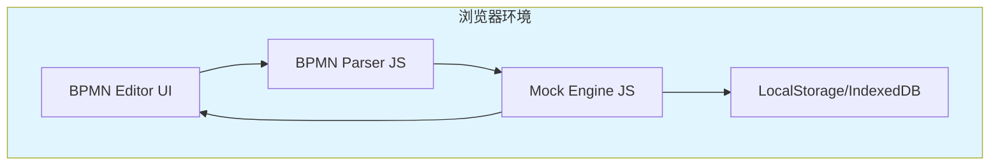
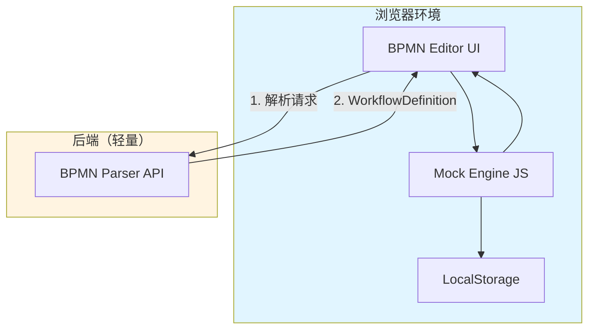
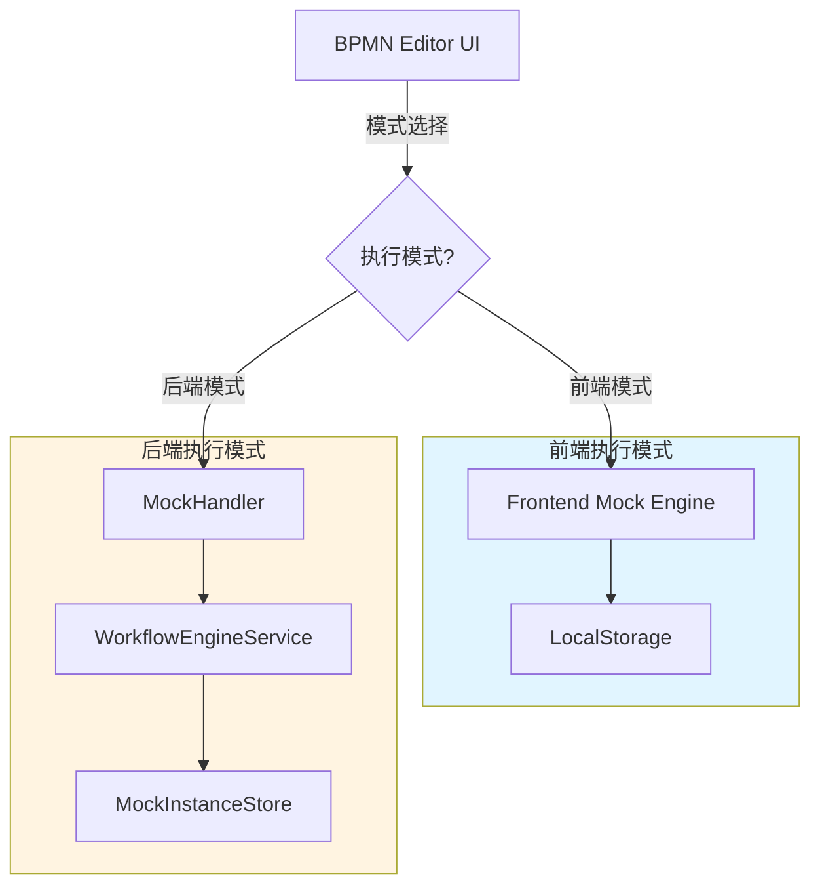
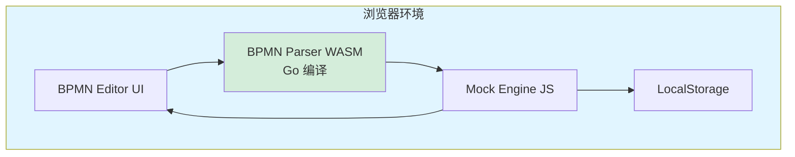
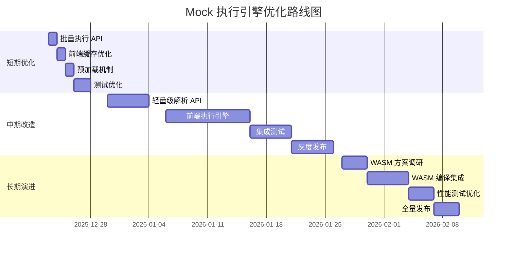

# Mock 执行引擎优化方案

## 背景

当前 Mock 执行引擎的核心目的是**在前端演示基于 Mock 数据的流程运转**，让用户可以：
- 可视化地查看工作流的执行路径
- 调试和验证 BPMN 流程逻辑
- 在无真实服务的情况下演示业务流程

### 当前实现的问题

1. **过度依赖后端**：每次执行都需要调用后端 API，增加了网络延迟和服务器负担
2. **演示受限**：需要后端服务运行才能进行演示，不利于离线演示或客户端独立演示
3. **复杂度高**：后端维护了完整的执行引擎逻辑，但 Mock 场景下这些逻辑可能过于复杂
4. **演示体验**：网络请求可能导致演示卡顿，影响流畅度

### 优化目标

1. **前端自主**：前端能够独立完成流程演示，减少甚至消除后端依赖
2. **演示流畅**：消除网络延迟，提升演示体验
3. **简化架构**：根据演示需求，简化不必要的复杂逻辑
4. **灵活切换**：支持在演示模式和真实执行模式之间切换

---

## 方案一：纯前端 Mock 执行引擎

### 概述

在前端实现完整的 BPMN 解析和执行引擎，完全不依赖后端服务。所有 Mock 执行都在浏览器中完成。

### 架构设计



### 核心组件

#### 1. BPMN Parser (JavaScript/TypeScript)

```typescript
// client/src/services/bpmn/BpmnParser.ts
export class BpmnParser {
  /**
   * 解析 BPMN XML 为工作流定义
   */
  parseBPMN(bpmnXml: string): WorkflowDefinition {
    const parser = new DOMParser()
    const xmlDoc = parser.parseFromString(bpmnXml, 'text/xml')

    return {
      nodes: this.extractNodes(xmlDoc),
      sequenceFlows: this.extractSequenceFlows(xmlDoc),
      startEvents: this.extractStartEvents(xmlDoc),
      endEvents: this.extractEndEvents(xmlDoc)
    }
  }

  private extractNodes(xmlDoc: Document): Map<string, Node> {
    // 提取所有节点：ServiceTask, UserTask, Gateway 等
  }

  private extractSequenceFlows(xmlDoc: Document): Map<string, SequenceFlow> {
    // 提取所有连线
  }
}
```

#### 2. Mock Execution Engine (JavaScript/TypeScript)

```typescript
// client/src/services/bpmn/MockEngine.ts
export class MockExecutionEngine {
  private parser: BpmnParser
  private mockDataStore: MockDataStore

  /**
   * 执行工作流
   */
  async executeWorkflow(
    bpmnXml: string,
    mockConfig: MockConfig,
    initialVariables: Record<string, any>
  ): Promise<ExecutionResult> {
    // 1. 解析 BPMN
    const workflow = this.parser.parseBPMN(bpmnXml)

    // 2. 创建执行实例
    const instance = this.createInstance(workflow, initialVariables)

    // 3. 从起始节点开始执行
    const startNodeId = workflow.startEvents[0]
    await this.executeFromNode(workflow, instance, startNodeId, mockConfig)

    return {
      instanceId: instance.id,
      currentNodeIds: instance.currentNodeIds,
      status: instance.status,
      variables: instance.variables
    }
  }

  /**
   * 单步执行
   */
  async stepExecution(
    instanceId: string,
    mockConfig: MockConfig
  ): Promise<ExecutionResult> {
    const instance = this.getInstanceFromStorage(instanceId)
    const workflow = this.parser.parseBPMN(instance.bpmnXml)

    const currentNodeId = instance.currentNodeIds[0]
    await this.executeNode(workflow, instance, currentNodeId, mockConfig)

    this.saveInstanceToStorage(instance)

    return {
      instanceId: instance.id,
      currentNodeIds: instance.currentNodeIds,
      status: instance.status,
      variables: instance.variables
    }
  }

  /**
   * 执行单个节点
   */
  private async executeNode(
    workflow: WorkflowDefinition,
    instance: WorkflowInstance,
    nodeId: string,
    mockConfig: MockConfig
  ): Promise<void> {
    const node = workflow.nodes.get(nodeId)

    switch (node.type) {
      case 'startEvent':
        // 直接推进到下一个节点
        this.advanceToNextNode(workflow, instance, nodeId)
        break

      case 'serviceTask':
        // 使用 Mock 数据
        const mockData = mockConfig.nodeMockData?.[nodeId]
        if (mockData) {
          instance.variables = { ...instance.variables, ...mockData.body }
        }

        // 模拟延迟
        if (mockConfig.nodeConfigs?.[nodeId]?.delay) {
          await this.delay(mockConfig.nodeConfigs[nodeId].delay)
        }

        this.advanceToNextNode(workflow, instance, nodeId)
        break

      case 'exclusiveGateway':
        // 评估条件表达式，选择分支
        const selectedFlow = this.evaluateGateway(workflow, instance, node)
        instance.currentNodeIds = [selectedFlow.targetNodeId]
        break

      case 'endEvent':
        instance.status = 'completed'
        instance.currentNodeIds = []
        break
    }
  }

  /**
   * 条件表达式求值
   */
  private evaluateGateway(
    workflow: WorkflowDefinition,
    instance: WorkflowInstance,
    gateway: Node
  ): SequenceFlow {
    // 简单的条件求值逻辑
    for (const flowId of gateway.outgoingFlowIds) {
      const flow = workflow.sequenceFlows.get(flowId)
      if (this.evaluateCondition(flow.condition, instance.variables)) {
        return flow
      }
    }
    // 默认分支
    return workflow.sequenceFlows.get(gateway.outgoingFlowIds[0])
  }

  /**
   * 推进到下一个节点
   */
  private advanceToNextNode(
    workflow: WorkflowDefinition,
    instance: WorkflowInstance,
    currentNodeId: string
  ): void {
    const node = workflow.nodes.get(currentNodeId)
    if (node.outgoingFlowIds.length > 0) {
      const flow = workflow.sequenceFlows.get(node.outgoingFlowIds[0])
      instance.currentNodeIds = [flow.targetNodeId]
    }
  }

  /**
   * 延迟函数
   */
  private delay(ms: number): Promise<void> {
    return new Promise(resolve => setTimeout(resolve, ms))
  }

  /**
   * 本地存储
   */
  private saveInstanceToStorage(instance: WorkflowInstance): void {
    localStorage.setItem(`mock-instance-${instance.id}`, JSON.stringify(instance))
  }

  private getInstanceFromStorage(instanceId: string): WorkflowInstance {
    const data = localStorage.getItem(`mock-instance-${instanceId}`)
    return data ? JSON.parse(data) : null
  }
}
```

#### 3. 集成到现有组件

```vue
<!-- client/src/components/MockControlPanel.vue -->
<script setup lang="ts">
import { ref } from 'vue'
import { MockExecutionEngine } from '@/services/bpmn/MockEngine'
import { BpmnParser } from '@/services/bpmn/BpmnParser'

const mockEngine = new MockExecutionEngine(new BpmnParser())
const executionResult = ref<ExecutionResult | null>(null)

// 执行工作流
async function executeWorkflow() {
  const bpmnXml = getCurrentBpmnXml() // 从编辑器获取
  const mockConfig = getMockConfig()

  executionResult.value = await mockEngine.executeWorkflow(
    bpmnXml,
    mockConfig,
    { userId: '123', amount: 1000 }
  )

  // 高亮当前节点
  highlightNodes(executionResult.value.currentNodeIds)
}

// 单步执行
async function stepExecution() {
  if (!executionResult.value) return

  executionResult.value = await mockEngine.stepExecution(
    executionResult.value.instanceId,
    getMockConfig()
  )

  highlightNodes(executionResult.value.currentNodeIds)
}
</script>
```

### 优点

1. **完全离线**：无需后端服务，可以在任何环境下演示
2. **零延迟**：所有计算都在本地完成，响应极快
3. **简单部署**：前端是纯静态资源，部署极其简单
4. **客户端演示**：可以打包为独立的演示程序，方便客户演示
5. **成本低**：无需服务器资源

### 缺点

1. **功能受限**：复杂的条件表达式可能难以在 JavaScript 中实现
2. **维护双份代码**：后端已有 Go 实现的解析器，前端需要重新实现
3. **一致性问题**：前端和后端的解析逻辑可能不一致
4. **浏览器限制**：受限于浏览器性能和存储空间

### 实现复杂度

- **开发工作量**：⭐⭐⭐⭐ (高) - 需要完整实现 BPMN 解析和执行引擎
- **维护成本**：⭐⭐⭐ (中) - 需要与后端实现保持同步
- **测试成本**：⭐⭐⭐⭐ (高) - 需要全面测试各种 BPMN 场景

### 适用场景

- 需要离线演示的场景
- 客户现场演示
- 简单的工作流演示
- 不需要复杂条件表达式的场景

---

## 方案二：前端为主 + 轻量后端

### 概述

前端实现执行引擎，后端仅提供 BPMN 解析服务。执行逻辑在前端完成，但利用后端的成熟解析能力。

### 架构设计



### 核心改动

#### 1. 后端仅提供解析 API

```go
// server/internal/handlers/workflow.go
// 新增轻量级解析接口
func (h *WorkflowHandler) ParseBPMN(c *gin.Context) {
    var req struct {
        BpmnXml string `json:"bpmnXml"`
    }

    if err := c.ShouldBindJSON(&req); err != nil {
        c.JSON(http.StatusBadRequest, models.NewErrorResponse(
            models.ErrInvalidRequest,
            err.Error(),
        ))
        return
    }

    // 解析 BPMN
    wd, err := parser.ParseBPMN(req.BpmnXml)
    if err != nil {
        c.JSON(http.StatusBadRequest, models.NewErrorResponse(
            models.ErrInvalidRequest,
            err.Error(),
        ))
        return
    }

    // 返回工作流定义（不执行）
    c.JSON(http.StatusOK, models.NewSuccessResponse(wd))
}
```

#### 2. 前端执行引擎（简化版）

```typescript
// client/src/services/bpmn/HybridMockEngine.ts
export class HybridMockEngine {
  /**
   * 执行工作流
   */
  async executeWorkflow(
    bpmnXml: string,
    mockConfig: MockConfig,
    initialVariables: Record<string, any>
  ): Promise<ExecutionResult> {
    // 1. 调用后端解析 BPMN（一次性）
    const workflow = await this.parseBPMNViaAPI(bpmnXml)

    // 2. 本地缓存工作流定义
    this.cacheWorkflow(workflow)

    // 3. 在前端执行
    const instance = this.createInstance(workflow, initialVariables)
    await this.executeFromNode(workflow, instance, workflow.startEvents[0], mockConfig)

    return this.buildResult(instance)
  }

  /**
   * 调用后端解析 API
   */
  private async parseBPMNViaAPI(bpmnXml: string): Promise<WorkflowDefinition> {
    const response = await fetch('/api/workflows/parse', {
      method: 'POST',
      headers: { 'Content-Type': 'application/json' },
      body: JSON.stringify({ bpmnXml })
    })

    const result = await response.json()
    return result.data
  }

  /**
   * 缓存工作流定义
   */
  private cacheWorkflow(workflow: WorkflowDefinition): void {
    sessionStorage.setItem(
      `workflow-${workflow.id}`,
      JSON.stringify(workflow)
    )
  }

  // 其他执行逻辑与方案一相同...
}
```

### 优点

1. **利用现有能力**：复用后端成熟的 BPMN 解析逻辑
2. **快速执行**：解析一次后，所有执行都在前端完成
3. **一致性好**：解析逻辑由后端统一提供，保证一致性
4. **易于实现**：前端只需实现执行逻辑，无需处理复杂的 XML 解析

### 缺点

1. **首次依赖后端**：第一次解析仍需调用后端
2. **部分离线**：完全离线场景下无法使用
3. **仍需前端引擎**：需要实现前端执行引擎

### 实现复杂度

- **开发工作量**：⭐⭐⭐ (中) - 需要实现前端执行引擎，但无需解析器
- **维护成本**：⭐⭐ (低) - 解析逻辑由后端统一维护
- **测试成本**：⭐⭐⭐ (中) - 主要测试前端执行逻辑

### 适用场景

- 在线演示场景
- 需要保证解析一致性
- 快速迭代的场景

---

## 方案三：可切换的双模式执行

### 概述

保留当前后端执行能力，同时在前端实现轻量级执行引擎。根据场景自动或手动切换执行模式。

### 架构设计



### 核心实现

#### 1. 统一的执行接口

```typescript
// client/src/services/bpmn/UnifiedMockService.ts
export enum ExecutionMode {
  FRONTEND = 'frontend',  // 前端执行
  BACKEND = 'backend'     // 后端执行
}

export class UnifiedMockService {
  private frontendEngine: FrontendMockEngine
  private backendService: BackendMockService
  private mode: ExecutionMode

  constructor() {
    this.frontendEngine = new FrontendMockEngine()
    this.backendService = new BackendMockService()
    this.mode = this.detectMode()
  }

  /**
   * 自动检测执行模式
   */
  private detectMode(): ExecutionMode {
    // 检查后端是否可用
    const isBackendAvailable = this.checkBackendHealth()

    // 检查是否为演示模式
    const isDemoMode = window.location.search.includes('demo=true')

    if (isDemoMode || !isBackendAvailable) {
      return ExecutionMode.FRONTEND
    }

    return ExecutionMode.BACKEND
  }

  /**
   * 手动切换模式
   */
  setMode(mode: ExecutionMode): void {
    this.mode = mode
    console.log(`切换到 ${mode} 执行模式`)
  }

  /**
   * 执行工作流（自动路由）
   */
  async executeWorkflow(
    bpmnXml: string,
    mockConfig: MockConfig,
    initialVariables: Record<string, any>
  ): Promise<ExecutionResult> {
    if (this.mode === ExecutionMode.FRONTEND) {
      return this.frontendEngine.executeWorkflow(bpmnXml, mockConfig, initialVariables)
    } else {
      return this.backendService.executeWorkflow(bpmnXml, mockConfig, initialVariables)
    }
  }

  /**
   * 单步执行（自动路由）
   */
  async stepExecution(instanceId: string, mockConfig: MockConfig): Promise<ExecutionResult> {
    if (this.mode === ExecutionMode.FRONTEND) {
      return this.frontendEngine.stepExecution(instanceId, mockConfig)
    } else {
      return this.backendService.stepExecution(instanceId, mockConfig)
    }
  }

  /**
   * 检查后端健康状态
   */
  private async checkBackendHealth(): Promise<boolean> {
    try {
      const response = await fetch('/api/health', { timeout: 1000 })
      return response.ok
    } catch {
      return false
    }
  }
}
```

#### 2. UI 模式切换

```vue
<!-- client/src/components/MockControlPanel.vue -->
<template>
  <div class="mock-control-panel">
    <div class="mode-selector">
      <label>执行模式：</label>
      <select v-model="executionMode" @change="onModeChange">
        <option value="frontend">前端模式（快速演示）</option>
        <option value="backend">后端模式（完整功能）</option>
        <option value="auto">自动选择</option>
      </select>
      <span class="mode-indicator" :class="currentMode">
        {{ currentModeLabel }}
      </span>
    </div>

    <!-- 其他控制按钮 -->
  </div>
</template>

<script setup lang="ts">
import { ref, computed } from 'vue'
import { UnifiedMockService, ExecutionMode } from '@/services/bpmn/UnifiedMockService'

const mockService = new UnifiedMockService()
const executionMode = ref<'frontend' | 'backend' | 'auto'>('auto')

const currentMode = computed(() => mockService.getCurrentMode())
const currentModeLabel = computed(() => {
  return currentMode.value === ExecutionMode.FRONTEND
    ? '前端执行中'
    : '后端执行中'
})

function onModeChange() {
  if (executionMode.value !== 'auto') {
    mockService.setMode(executionMode.value as ExecutionMode)
  }
}
</script>
```

### 优点

1. **灵活性高**：可根据场景选择最合适的执行方式
2. **向下兼容**：保留现有后端能力，不影响现有功能
3. **渐进迁移**：可以逐步完善前端引擎，平滑过渡
4. **最佳体验**：在线时用后端（功能完整），离线时用前端（快速演示）
5. **易于调试**：可以对比两种模式的执行结果，验证一致性

### 缺点

1. **维护成本高**：需要维护两套执行逻辑
2. **代码冗余**：前后端都有执行引擎代码
3. **复杂度增加**：需要管理模式切换逻辑

### 实现复杂度

- **开发工作量**：⭐⭐⭐⭐ (高) - 需要实现前端引擎 + 双模式管理
- **维护成本**：⭐⭐⭐⭐ (高) - 需要保持两套引擎的一致性
- **测试成本**：⭐⭐⭐⭐⭐ (很高) - 需要测试两种模式及切换逻辑

### 适用场景

- 需要兼顾在线和离线场景
- 希望渐进式迁移
- 对灵活性要求高的场景

---

## 方案四：当前方案优化（最小改动）

### 概述

保持当前架构不变，通过优化交互方式、增加缓存、减少请求次数来提升 Mock 执行体验。

### 优化点

#### 1. 批量执行 API

```go
// server/internal/handlers/mock.go
// 新增批量执行接口，减少请求次数
func (h *MockHandler) BatchExecute(c *gin.Context) {
    var req struct {
        WorkflowId       string                              `json:"workflowId"`
        Steps            int                                 `json:"steps"` // 执行步数，-1 表示执行到结束
        InitialVariables map[string]interface{}              `json:"initialVariables"`
        NodeMockData     map[string]*services.NodeMockData   `json:"nodeMockData"`
    }

    // 执行多步，一次返回所有中间状态
    var executionHistory []ExecuteResult

    for i := 0; i < req.Steps || req.Steps == -1; i++ {
        result := executeNextStep(...)
        executionHistory = append(executionHistory, result)

        if result.EngineResponse.Status == "completed" {
            break
        }
    }

    c.JSON(http.StatusOK, models.NewSuccessResponse(executionHistory))
}
```

#### 2. 前端缓存优化

```typescript
// client/src/services/mockService.ts
export class OptimizedMockService {
  private workflowCache = new Map<string, WorkflowDefinition>()
  private instanceCache = new Map<string, MockInstance>()

  /**
   * 批量执行并缓存结果
   */
  async executeWorkflowBatch(
    workflowId: string,
    steps: number,
    request: ExecuteMockRequest
  ): Promise<ExecutionResult[]> {
    const response = await fetch(`/api/workflows/${workflowId}/mock/batch`, {
      method: 'POST',
      headers: { 'Content-Type': 'application/json' },
      body: JSON.stringify({ ...request, steps })
    })

    const result = await response.json()
    const history = result.data

    // 缓存最终状态
    const finalState = history[history.length - 1]
    this.instanceCache.set(finalState.engineResponse.instanceId, finalState)

    return history
  }

  /**
   * 带缓存的实例查询
   */
  async getInstance(instanceId: string): Promise<MockInstance> {
    // 先查缓存
    if (this.instanceCache.has(instanceId)) {
      return this.instanceCache.get(instanceId)!
    }

    // 缓存未命中，查询后端
    const instance = await this.fetchInstanceFromBackend(instanceId)
    this.instanceCache.set(instanceId, instance)

    return instance
  }
}
```

#### 3. WebSocket 实时推送

```typescript
// client/src/services/mockWebSocket.ts
export class MockWebSocketService {
  private ws: WebSocket | null = null

  connect(workflowId: string): void {
    this.ws = new WebSocket(`ws://localhost:3000/ws/mock/${workflowId}`)

    this.ws.onmessage = (event) => {
      const update = JSON.parse(event.data)
      // 实时更新 UI
      this.emitUpdate(update)
    }
  }

  /**
   * 执行工作流（WebSocket 模式）
   */
  executeWorkflow(request: ExecuteMockRequest): void {
    this.ws?.send(JSON.stringify({
      action: 'execute',
      data: request
    }))
  }
}
```

#### 4. 预加载和预热

```typescript
// client/src/services/mockPreloader.ts
export class MockPreloader {
  /**
   * 预加载工作流定义
   */
  async preloadWorkflow(workflowId: string): Promise<void> {
    // 后台加载并缓存
    const workflow = await workflowService.getWorkflow(workflowId)
    const parsed = await this.parseAndCache(workflow.bpmnXml)

    console.log('工作流已预加载:', workflowId)
  }

  /**
   * 预热 Mock 数据
   */
  async warmupMockData(workflowId: string): Promise<void> {
    const configs = await mockService.getConfigs(workflowId)
    configs.forEach(config => this.cacheMockConfig(config))
  }
}
```

### 优点

1. **改动最小**：基于现有架构优化，风险低
2. **快速见效**：优化点明确，可以快速实施
3. **向下兼容**：完全兼容现有 API 和功能
4. **稳定性高**：利用成熟的后端能力

### 缺点

1. **仍依赖后端**：无法实现完全离线演示
2. **优化有限**：网络延迟问题无法完全消除
3. **扩展性受限**：架构限制了进一步优化空间

### 实现复杂度

- **开发工作量**：⭐⭐ (低) - 基于现有代码优化
- **维护成本**：⭐ (很低) - 不改变核心架构
- **测试成本**：⭐⭐ (低) - 主要测试新增的优化功能

### 适用场景

- 短期内快速改善体验
- 不希望大规模重构
- 后端服务稳定可用的场景

---

## 方案五：WebAssembly 方案（创新方案）

### 概述

将 Go 编写的 BPMN 解析器编译为 WebAssembly，在浏览器中运行。前端使用 WASM 解析器 + JavaScript 执行引擎。

### 架构设计



### 核心实现

#### 1. 编译 Go 解析器为 WASM

```go
// server/cmd/wasm/main.go
// +build js,wasm

package main

import (
    "syscall/js"
    "github.com/bpmn-explorer/server/internal/parser"
)

func main() {
    // 暴露解析函数给 JavaScript
    js.Global().Set("parseBPMN", js.FuncOf(parseBPMNWrapper))

    // 保持程序运行
    select {}
}

func parseBPMNWrapper(this js.Value, args []js.Value) interface{} {
    if len(args) != 1 {
        return map[string]interface{}{
            "error": "invalid arguments",
        }
    }

    bpmnXml := args[0].String()

    // 使用现有的解析器
    wd, err := parser.ParseBPMN(bpmnXml)
    if err != nil {
        return map[string]interface{}{
            "error": err.Error(),
        }
    }

    // 转换为 JavaScript 对象
    return map[string]interface{}{
        "nodes":         convertNodes(wd.Nodes),
        "sequenceFlows": convertSequenceFlows(wd.SequenceFlows),
        "startEvents":   wd.StartEvents,
        "endEvents":     wd.EndEvents,
    }
}
```

#### 2. 编译命令

```bash
# Makefile
wasm:
    GOOS=js GOARCH=wasm go build -o client/public/bpmn-parser.wasm server/cmd/wasm/main.go
    cp $(shell go env GOROOT)/misc/wasm/wasm_exec.js client/public/
```

#### 3. 前端加载 WASM

```typescript
// client/src/services/bpmn/WasmParser.ts
export class WasmBpmnParser {
  private go: any
  private ready: Promise<void>

  constructor() {
    this.ready = this.init()
  }

  private async init(): Promise<void> {
    // 加载 wasm_exec.js
    await this.loadScript('/wasm_exec.js')

    // 实例化 Go
    this.go = new (window as any).Go()

    // 加载 WASM 模块
    const response = await fetch('/bpmn-parser.wasm')
    const buffer = await response.arrayBuffer()
    const result = await WebAssembly.instantiate(buffer, this.go.importObject)

    // 运行 WASM
    this.go.run(result.instance)
  }

  /**
   * 解析 BPMN XML
   */
  async parseBPMN(bpmnXml: string): Promise<WorkflowDefinition> {
    await this.ready

    // 调用 WASM 函数
    const result = (window as any).parseBPMN(bpmnXml)

    if (result.error) {
      throw new Error(result.error)
    }

    return result as WorkflowDefinition
  }

  private loadScript(src: string): Promise<void> {
    return new Promise((resolve, reject) => {
      const script = document.createElement('script')
      script.src = src
      script.onload = () => resolve()
      script.onerror = reject
      document.head.appendChild(script)
    })
  }
}
```

#### 4. 集成使用

```typescript
// client/src/services/bpmn/WasmMockEngine.ts
export class WasmMockEngine {
  private parser: WasmBpmnParser

  constructor() {
    this.parser = new WasmBpmnParser()
  }

  async executeWorkflow(
    bpmnXml: string,
    mockConfig: MockConfig,
    initialVariables: Record<string, any>
  ): Promise<ExecutionResult> {
    // 使用 WASM 解析器
    const workflow = await this.parser.parseBPMN(bpmnXml)

    // JavaScript 执行引擎
    const instance = this.createInstance(workflow, initialVariables)
    await this.executeFromNode(workflow, instance, workflow.startEvents[0], mockConfig)

    return this.buildResult(instance)
  }
}
```

### 优点

1. **复用后端代码**：直接使用 Go 解析器，无需重写
2. **性能优异**：WASM 执行效率接近原生代码
3. **一致性保证**：前后端使用相同的解析逻辑
4. **离线可用**：WASM 打包到前端资源中
5. **技术前沿**：采用现代 Web 技术

### 缺点

1. **浏览器兼容性**：需要浏览器支持 WebAssembly
2. **WASM 体积**：Go 编译的 WASM 文件可能较大（1-2MB）
3. **调试困难**：WASM 调试不如 JavaScript 方便
4. **学习曲线**：团队需要了解 WASM 相关知识

### 实现复杂度

- **开发工作量**：⭐⭐⭐ (中) - 需要配置 WASM 编译和集成
- **维护成本**：⭐⭐ (低) - 解析器与后端共享代码
- **测试成本**：⭐⭐⭐ (中) - 需要测试 WASM 加载和执行

### 适用场景

- 希望复用后端代码
- 对性能要求高
- 需要离线能力
- 团队愿意尝试新技术

---

## 方案对比总结

| 维度 | 方案一<br/>纯前端 | 方案二<br/>前端+轻量后端 | 方案三<br/>双模式 | 方案四<br/>优化当前 | 方案五<br/>WASM |
|------|:---:|:---:|:---:|:---:|:---:|
| **离线能力** | ⭐⭐⭐⭐⭐ | ⭐⭐⭐ | ⭐⭐⭐⭐ | ⭐ | ⭐⭐⭐⭐⭐ |
| **执行性能** | ⭐⭐⭐⭐ | ⭐⭐⭐⭐ | ⭐⭐⭐⭐ | ⭐⭐⭐ | ⭐⭐⭐⭐⭐ |
| **开发成本** | ⭐⭐ | ⭐⭐⭐ | ⭐ | ⭐⭐⭐⭐ | ⭐⭐⭐ |
| **维护成本** | ⭐⭐⭐ | ⭐⭐⭐⭐ | ⭐⭐ | ⭐⭐⭐⭐⭐ | ⭐⭐⭐⭐ |
| **功能完整性** | ⭐⭐⭐ | ⭐⭐⭐ | ⭐⭐⭐⭐⭐ | ⭐⭐⭐⭐⭐ | ⭐⭐⭐⭐ |
| **代码复用** | ⭐⭐ | ⭐⭐⭐ | ⭐⭐ | ⭐⭐⭐⭐⭐ | ⭐⭐⭐⭐⭐ |
| **部署简单** | ⭐⭐⭐⭐⭐ | ⭐⭐⭐⭐ | ⭐⭐⭐ | ⭐⭐⭐⭐ | ⭐⭐⭐⭐ |
| **演示体验** | ⭐⭐⭐⭐⭐ | ⭐⭐⭐⭐ | ⭐⭐⭐⭐⭐ | ⭐⭐⭐ | ⭐⭐⭐⭐⭐ |

---

## 推荐方案

### 短期方案：方案四（当前方案优化）

**理由**：
- 风险最低，改动最小
- 快速见效，立即改善用户体验
- 不影响现有功能和架构

**实施步骤**：
1. 周一：实现批量执行 API
2. 周二：添加前端缓存优化
3. 周三：实现预加载机制
4. 周四：测试和优化
5. 周五：发布上线

### 中期方案：方案二（前端为主 + 轻量后端）

**理由**：
- 平衡了性能和实现成本
- 利用现有后端解析能力
- 为完全前端化打基础

**实施步骤**：
1. 第 1-2 周：实现轻量级解析 API
2. 第 3-4 周：实现前端执行引擎
3. 第 5 周：集成测试
4. 第 6 周：灰度发布

### 长期方案：方案五（WebAssembly）或方案三（双模式）

**理由**：
- WASM 方案技术前沿，性能最优，代码复用度高
- 双模式方案灵活性最高，可以渐进式迁移

**选择建议**：
- 如果团队技术实力强，选择 **WASM 方案**
- 如果希望稳妥推进，选择 **双模式方案**

---

## 实施路线图



---

## 技术风险评估

| 方案 | 主要风险 | 风险等级 | 缓解措施 |
|------|---------|:-------:|---------|
| 方案一 | 前后端逻辑不一致 | 🟡 中 | 建立测试用例库，双向验证 |
| 方案二 | 首次加载依赖后端 | 🟢 低 | 提供加载提示，缓存优化 |
| 方案三 | 维护两套引擎 | 🔴 高 | 抽象公共接口，自动化测试 |
| 方案四 | 优化效果有限 | 🟢 低 | 持续监控性能指标 |
| 方案五 | WASM 体积大 | 🟡 中 | 启用 gzip 压缩，懒加载 |

---

## 总结

根据 Mock 执行引擎的核心目的（**前端演示流程运转**），推荐采用以下组合策略：

1. **立即实施**：方案四（当前方案优化）
   - 快速改善用户体验
   - 降低网络请求延迟
   - 风险可控

2. **中期目标**：方案二（前端为主 + 轻量后端）
   - 大幅提升演示流畅度
   - 减少后端依赖
   - 为离线演示打基础

3. **长期愿景**：方案五（WebAssembly）
   - 实现完全离线演示
   - 保证前后端一致性
   - 最优性能体验

这种渐进式演进策略可以在不影响现有功能的前提下，逐步提升 Mock 执行的性能和用户体验。
