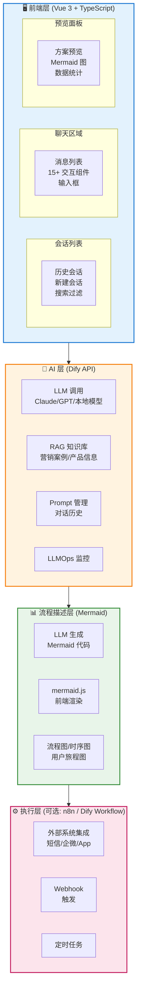
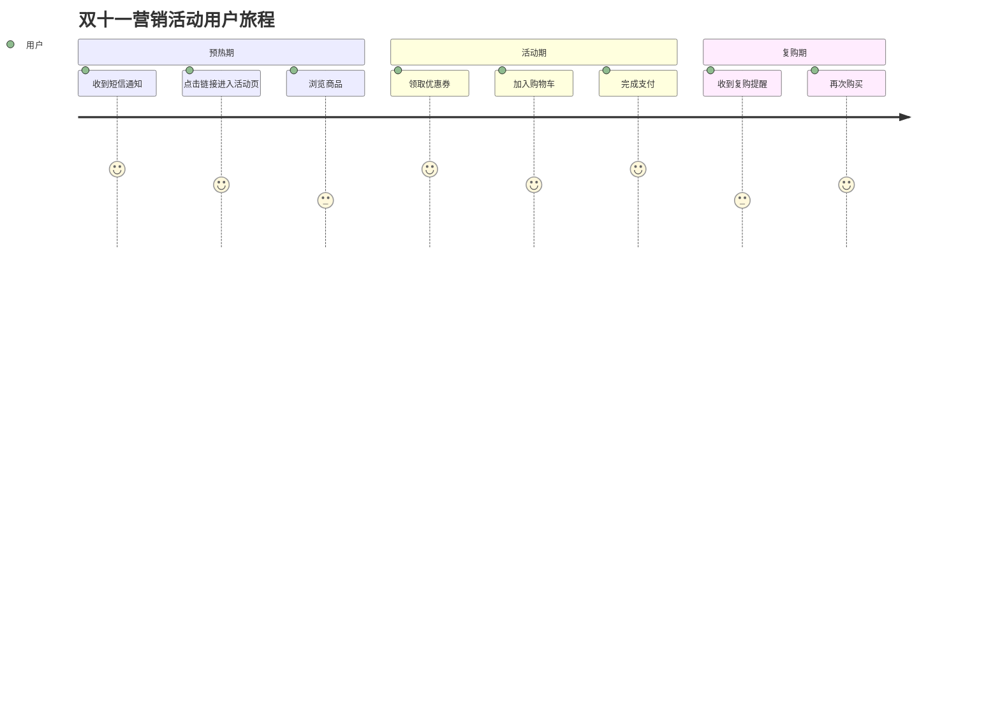
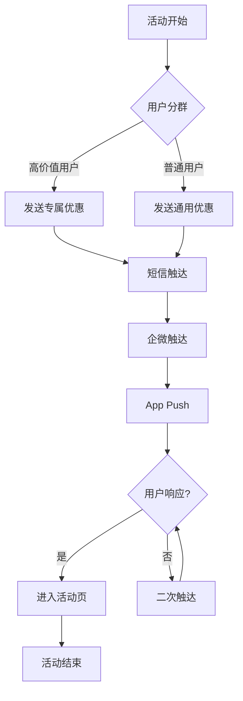

# 营销智能体平台技术选型报告

**生成日期**: 2025-12-26
**项目**: 自动化营销智能体平台
**版本**: v2.0（已更新：流程描述不限于 BPMN 标准）

---

## 一、项目需求概述

基于 `openspec/changes/add-marketing-agent-chat-page/proposal.md` 的需求分析：

### 1.1 核心功能需求

| 需求维度 | 具体内容 |
|---------|---------|
| **AI/LLM 能力** | 全程 LLM 驱动对话、意图解析、方案生成、文案创作 |
| **对话流程** | 11 步复杂对话流程状态管理 |
| **自定义 UI** | 三栏布局（会话列表 + 聊天区 + 预览面板） |
| **交互组件** | 15+ 专用组件（表单、选择器、图表等） |
| **流程图** | 流程描述和可视化（不限于 BPMN 标准） |
| **外部集成** | WorkflowEngine、低代码平台、短信、企微、App |

### 1.2 关键约束条件

- ✅ 流程描述不限于 BPMN 标准，Mermaid/自定义 JSON 等均可
- ✅ 优先考虑开发效率和轻量化
- ✅ UI 必须高度可定制

---

## 二、最终推荐方案

### 🏆 推荐：Dify API + 自定义前端 (Vue) + Mermaid + n8n（可选）



**架构说明：**

| 层级 | 技术 | 职责 |
|------|------|------|
| **前端层** | Vue 3 + TypeScript | 三栏布局、15+ 交互组件、用户交互 |
| **AI 层** | Dify API | LLM 调用、RAG 知识库、Prompt 管理 |
| **流程描述层** | Mermaid | LLM 生成流程图、前端渲染 |
| **执行层** | n8n / Dify Workflow | 外部系统集成、任务调度 |

### 推荐理由

| 维度 | 评价 |
|------|------|
| **UI 灵活性** | ⭐⭐⭐⭐⭐ 完全自主控制，三栏布局 + 15 组件随意定制 |
| **AI 能力** | ⭐⭐⭐⭐⭐ Dify 提供 RAG、Prompt 管理、多模型支持 |
| **流程描述** | ⭐⭐⭐⭐ Mermaid 轻量、LLM 原生支持、渲染简单 |
| **执行能力** | ⭐⭐⭐⭐ n8n 400+ 集成 或 Dify Workflow |
| **开发量** | ⭐⭐⭐⭐ 中等，约 3-4 人月 |
| **运维复杂度** | ⭐⭐⭐ 中等，Dify + 可选 n8n |

---

## 三、流程描述方案对比

由于不限于 BPMN 标准，以下是可选的流程描述方案：

### 3.1 方案对比

| 方案 | 描述 | LLM 生成 | 可视化 | 可执行 | 推荐度 |
|------|------|----------|--------|--------|--------|
| **Mermaid** | 文本描述语言 | ⭐⭐⭐⭐⭐ | ⭐⭐⭐⭐ | ❌ | ⭐⭐⭐⭐⭐ |
| **Dify Workflow** | 可视化 AI 工作流 | ⭐⭐⭐ | ⭐⭐⭐⭐⭐ | ⭐⭐⭐⭐ | ⭐⭐⭐⭐ |
| **n8n JSON** | 工作流 JSON 格式 | ⭐⭐⭐ | ⭐⭐⭐⭐ | ⭐⭐⭐⭐⭐ | ⭐⭐⭐ |
| **自定义 JSON** | 自定义流程 Schema | ⭐⭐⭐⭐ | ⭐⭐⭐ | ⭐⭐⭐ | ⭐⭐⭐ |
| **BPMN XML** | 国际标准 | ⭐⭐ | ⭐⭐⭐⭐⭐ | ⭐⭐⭐⭐⭐ | ⭐⭐ |

### 3.2 推荐：Mermaid

**为什么选择 Mermaid：**

1. **LLM 原生支持**：所有主流 LLM 都能高质量生成 Mermaid 代码
2. **轻量集成**：前端只需 `mermaid` 一个库
3. **多图表类型**：流程图、时序图、用户旅程图、甘特图等
4. **可读性强**：文本格式，便于版本控制和人工审阅
5. **零学习成本**：团队无需学习新工具

**Mermaid 示例 - 用户旅程图：**



**Mermaid 示例 - 执行流程图：**



---

## 四、候选方案详细评估

### 4.1 方案一：纯 Dify

**架构：**
```
Dify Platform (全托管)
├── Chatbot/Agent 应用
├── Workflow 工作流
├── RAG 知识库
└── 内置 UI
```

**评估：**

| 维度 | 评分 | 说明 |
|------|------|------|
| UI 灵活性 | ⭐⭐ | 聊天界面固定，无法三栏布局 |
| AI 能力 | ⭐⭐⭐⭐⭐ | 核心优势 |
| 流程描述 | ⭐⭐⭐⭐ | Workflow 功能完善 |
| 执行能力 | ⭐⭐⭐ | 有限的外部集成 |
| 开发量 | ⭐⭐⭐⭐⭐ | 最小 |

**优点：**
- 开箱即用，开发量最小
- AI 能力最强（RAG、多模型、LLMOps）
- 内置 Workflow 可视化编排

**缺点：**
- **UI 不可定制**，无法实现三栏布局
- 无法嵌入 15 个自定义交互组件
- 11 步对话流程难以精确控制

**结论：** 不适合本项目（UI 需求无法满足）

**推荐度：** ⭐⭐⭐ (3/5)

---

### 4.2 方案二：纯 FlowGram

**架构：**
```
FlowGram Framework
├── Canvas System (可定制画布)
├── Form Engine (表单引擎)
├── Variable System (变量系统)
└── Node Library (节点库)
```

**评估：**

| 维度 | 评分 | 说明 |
|------|------|------|
| UI 灵活性 | ⭐⭐⭐⭐ | 高度可定制 |
| AI 能力 | ⭐⭐⭐ | 内置 LLM 节点，无 RAG |
| 流程描述 | ⭐⭐⭐⭐ | 原生支持 |
| 执行能力 | ⭐⭐⭐ | 需扩展开发 |
| 开发量 | ⭐⭐⭐ | 中等 |

**优点：**
- 高度可定制的画布和表单引擎
- 内置 AI/LLM 节点
- MIT 开源，无商业限制
- 字节跳动出品

**缺点：**
- **React 技术栈**，与 Vue 团队有学习成本
- 无内置 RAG/知识库能力
- 生态不成熟，文档有限
- 需要额外对接外部系统

**结论：** 可选，但需要切换技术栈

**推荐度：** ⭐⭐⭐⭐ (4/5)

---

### 4.3 方案三：纯 n8n

**架构：**
```
n8n Platform
├── Trigger Nodes (触发器)
├── Action Nodes (400+ 集成)
├── Code Nodes (JS/Python)
└── AI Nodes (OpenAI 等)
```

**评估：**

| 维度 | 评分 | 说明 |
|------|------|------|
| UI 灵活性 | ⭐ | 几乎不可定制 |
| AI 能力 | ⭐⭐ | 通过节点集成 |
| 流程描述 | ⭐⭐⭐⭐ | 可视化工作流 |
| 执行能力 | ⭐⭐⭐⭐⭐ | 400+ 集成 |
| 开发量 | ⭐⭐⭐⭐⭐ | 最小 |

**优点：**
- 400+ 预置集成（短信、企微、HTTP 等）
- 成熟稳定
- 强大的触发器和调度

**缺点：**
- **UI 完全不可定制**
- 不适合对话式交互场景
- Sustainable Use License 商业限制

**结论：** 不适合作为主平台，可作为执行引擎

**推荐度：** ⭐⭐ (2/5) 作为主平台 | ⭐⭐⭐⭐ (4/5) 作为执行引擎

---

### 4.4 方案四：Dify API + 自定义前端 + Mermaid（推荐）

**架构：**
```
┌─────────────────────────────────────┐
│  自定义前端 (Vue 3)                 │
│  • 三栏布局                         │
│  • 15+ 交互组件                     │
│  • Mermaid 渲染                     │
├─────────────────────────────────────┤
│  Dify API                           │
│  • LLM 调用                         │
│  • RAG 知识库                       │
│  • Prompt 管理                      │
├─────────────────────────────────────┤
│  执行层 (可选)                      │
│  • n8n (外部集成)                   │
│  • 或 Dify Workflow                 │
│  • 或 自建简易调度                  │
└─────────────────────────────────────┘
```

**评估：**

| 维度 | 评分 | 说明 |
|------|------|------|
| UI 灵活性 | ⭐⭐⭐⭐⭐ | 完全自主控制 |
| AI 能力 | ⭐⭐⭐⭐⭐ | Dify 提供 |
| 流程描述 | ⭐⭐⭐⭐ | Mermaid 轻量高效 |
| 执行能力 | ⭐⭐⭐⭐ | 可选 n8n |
| 开发量 | ⭐⭐⭐ | 中等 |

**优点：**
- **UI 完全可控**：三栏布局、15 组件随意定制
- **AI 能力强**：Dify 提供 RAG、Prompt 管理、模型切换
- **流程描述轻量**：Mermaid 被 LLM 原生支持
- **技术栈统一**：Vue 3，无需学习新框架
- **执行灵活**：可选 n8n、Dify Workflow 或自建

**缺点：**
- 前端开发量较大（15+ 组件）
- 需要集成多个系统

**结论：** 最佳方案

**推荐度：** ⭐⭐⭐⭐⭐ (5/5)

---

### 4.5 方案五：Dify API + 自定义前端 + n8n

**与方案四的区别：** 用 n8n 替代简易执行层，获得更强的集成能力

**架构：**
```
┌─────────────────────────────────────┐
│  自定义前端 (Vue 3)                 │
├─────────────────────────────────────┤
│  Dify API (AI 能力)                 │
├─────────────────────────────────────┤
│  n8n (执行引擎)                     │
│  • 400+ 预置集成                    │
│  • Webhook 触发                     │
│  • 定时任务                         │
└─────────────────────────────────────┘
```

**评估：**

| 维度 | 评分 | 说明 |
|------|------|------|
| UI 灵活性 | ⭐⭐⭐⭐⭐ | 完全自主控制 |
| AI 能力 | ⭐⭐⭐⭐⭐ | Dify 提供 |
| 流程描述 | ⭐⭐⭐⭐ | Mermaid + n8n |
| 执行能力 | ⭐⭐⭐⭐⭐ | n8n 400+ 集成 |
| 开发量 | ⭐⭐⭐ | 中等偏大 |

**优点：**
- 继承方案四所有优点
- 执行能力大幅增强（400+ 集成开箱即用）
- 短信、企微、App 集成无需开发

**缺点：**
- 多一个系统需要维护
- n8n 有商业许可限制

**结论：** 如果外部集成复杂度高，推荐此方案

**推荐度：** ⭐⭐⭐⭐ (4.5/5)

---

## 五、方案对比总结

### 5.1 功能维度对比

| 方案 | UI 灵活性 | AI 能力 | 流程描述 | 执行能力 | 开发量 |
|------|-----------|---------|----------|----------|--------|
| 纯 Dify | ⭐⭐ | ⭐⭐⭐⭐⭐ | ⭐⭐⭐⭐ | ⭐⭐⭐ | 最小 |
| 纯 FlowGram | ⭐⭐⭐⭐ | ⭐⭐⭐ | ⭐⭐⭐⭐ | ⭐⭐⭐ | 中等 |
| 纯 n8n | ⭐ | ⭐⭐ | ⭐⭐⭐⭐ | ⭐⭐⭐⭐⭐ | 最小 |
| **Dify + Vue + Mermaid** | ⭐⭐⭐⭐⭐ | ⭐⭐⭐⭐⭐ | ⭐⭐⭐⭐ | ⭐⭐⭐ | 中等 |
| Dify + Vue + n8n | ⭐⭐⭐⭐⭐ | ⭐⭐⭐⭐⭐ | ⭐⭐⭐⭐ | ⭐⭐⭐⭐⭐ | 中等偏大 |

### 5.2 推荐度排名

| 排名 | 方案 | 推荐度 | 适合场景 |
|------|------|--------|----------|
| 1 | **Dify API + Vue + Mermaid** | ⭐⭐⭐⭐⭐ | 本项目最佳选择 |
| 2 | Dify API + Vue + n8n | ⭐⭐⭐⭐½ | 外部集成复杂时 |
| 3 | 纯 FlowGram | ⭐⭐⭐⭐ | React 技术栈团队 |
| 4 | 纯 Dify | ⭐⭐⭐ | UI 需求简单时 |
| 5 | 纯 n8n | ⭐⭐ | 仅后台自动化 |

---

## 六、推荐方案详细设计

### 6.1 技术栈选择

| 层级 | 技术选型 | 说明 |
|------|----------|------|
| **前端框架** | Vue 3 + TypeScript | 保持现有技术栈 |
| **UI 组件库** | Element Plus | 快速开发 |
| **流程图渲染** | mermaid.js | 轻量、LLM 友好 |
| **状态管理** | Pinia | Vue 3 官方推荐 |
| **AI 后端** | Dify (Self-hosted) | API 调用方式 |
| **业务后端** | Node.js | 保持现有技术栈 |
| **执行引擎** | n8n（可选） | 外部系统集成 |
| **数据库** | PostgreSQL | 结构化数据存储 |

### 6.2 Dify 集成架构

```
┌─────────────────────────────────────────────────────────────┐
│                        前端 (Vue 3)                         │
│                                                             │
│  用户输入 ──────► 消息组件 ──────► API 调用                 │
│                                       │                     │
│                                       ▼                     │
│  组件渲染 ◄────── 解析响应 ◄────── Dify API                │
│                                                             │
└─────────────────────────────────────────────────────────────┘
                              │
                              ▼
┌─────────────────────────────────────────────────────────────┐
│                     Dify Platform                           │
│                                                             │
│  ┌─────────────┐  ┌─────────────┐  ┌─────────────────────┐  │
│  │ LLM 调用    │  │ RAG 知识库  │  │ Prompt 模板         │  │
│  │             │  │             │  │                     │  │
│  │ • Claude    │  │ • 营销案例  │  │ • 方案生成模板      │  │
│  │ • GPT-4     │  │ • 产品信息  │  │ • 文案生成模板      │  │
│  │ • 本地模型  │  │ • 历史方案  │  │ • 人群分析模板      │  │
│  └─────────────┘  └─────────────┘  └─────────────────────┘  │
│                                                             │
└─────────────────────────────────────────────────────────────┘
```

### 6.3 LLM 响应格式设计

```typescript
// 响应类型枚举
type ResponseType =
  | 'text'                  // 纯文本回复
  | 'plan_form'             // 营销方案表单
  | 'audience_selector'     // 人群选择界面
  | 'audience_recommendation' // 人群推荐详情
  | 'reach_strategy'        // 触达策略 (Mermaid)
  | 'product_config'        // 商品推荐配置
  | 'smart_strategy'        // 智能策略详情
  | 'channel_selector'      // 推广渠道选择
  | 'channel_copy'          // 个性化渠道文案
  | 'flow_chart'            // 执行流程图 (Mermaid)
  | 'campaign_report';      // 活动复盘报告

// LLM 响应结构
interface LLMResponse {
  responseType: ResponseType;
  message: string;          // 对话消息
  data?: Record<string, any>; // 结构化数据
  mermaid?: string;         // Mermaid 代码（如果有）
}

// 示例响应
{
  "responseType": "reach_strategy",
  "message": "根据您选择的高价值用户群体，我生成了以下触达策略：",
  "mermaid": "flowchart TD\n    A[活动开始] --> B{用户分群}\n    B -->|高价值| C[专属优惠]\n    ..."
}
```

### 6.4 前端组件架构

```
src/
├── pages/
│   └── MarketingAgentPage.vue      # 主页面（三栏布局）
│
├── components/
│   ├── marketing/
│   │   ├── ConversationList.vue    # 左侧会话列表
│   │   ├── ChatArea.vue            # 中间聊天区域
│   │   ├── PlanPreview.vue         # 右侧预览面板
│   │   │
│   │   ├── forms/                  # 表单组件
│   │   │   ├── MarketingPlanForm.vue
│   │   │   ├── ProductConfigForm.vue
│   │   │   └── ChannelCopyEditor.vue
│   │   │
│   │   ├── selectors/              # 选择器组件
│   │   │   ├── AudienceSelector.vue
│   │   │   └── ChannelSelector.vue
│   │   │
│   │   ├── displays/               # 展示组件
│   │   │   ├── AudienceRecommendation.vue
│   │   │   ├── SmartStrategyDisplay.vue
│   │   │   └── CampaignReport.vue
│   │   │
│   │   └── charts/                 # 图表组件
│   │       ├── MermaidChart.vue    # 通用 Mermaid 渲染
│   │       ├── ReachStrategyChart.vue
│   │       └── FlowChart.vue
│   │
│   └── common/
│       └── MessageBubble.vue       # 消息气泡
│
├── composables/
│   ├── useConversationFlow.ts      # 11步流程状态管理
│   ├── useMarketingPlanForm.ts     # 表单管理
│   ├── useAudienceSelection.ts     # 人群选择
│   └── useMermaidParser.ts         # Mermaid 解析
│
├── services/
│   ├── difyService.ts              # Dify API 封装
│   ├── marketingAgentService.ts    # 业务逻辑
│   └── marketingPlanApiService.ts  # 方案 CRUD
│
└── types/
    └── marketing.ts                # 类型定义
```

### 6.5 数据流设计

```
用户输入
    │
    ▼
┌─────────────────────────────────────────────────────────────┐
│                    ChatArea.vue                             │
│                                                             │
│  1. 收集用户输入                                            │
│  2. 调用 difyService.sendMessage()                          │
└─────────────────────────────────────────────────────────────┘
    │
    ▼
┌─────────────────────────────────────────────────────────────┐
│                    Dify API                                 │
│                                                             │
│  1. LLM 分析用户意图                                        │
│  2. RAG 检索相关知识                                        │
│  3. 生成结构化响应 (JSON + Mermaid)                         │
└─────────────────────────────────────────────────────────────┘
    │
    ▼
┌─────────────────────────────────────────────────────────────┐
│                    前端响应处理                             │
│                                                             │
│  1. 解析 responseType                                       │
│  2. 动态渲染对应组件                                        │
│  3. 更新 PlanPreview 面板                                   │
│  4. 更新 useConversationFlow 状态                           │
└─────────────────────────────────────────────────────────────┘
    │
    ▼
┌─────────────────────────────────────────────────────────────┐
│                    用户交互                                 │
│                                                             │
│  1. 编辑表单 / 选择选项                                     │
│  2. 点击确认                                                │
│  3. 进入下一步流程                                          │
└─────────────────────────────────────────────────────────────┘
```

### 6.6 执行层选择

根据外部集成复杂度选择：

| 复杂度 | 推荐方案 | 说明 |
|--------|----------|------|
| **低** | Dify Workflow | 简单的 HTTP 调用、消息通知 |
| **中** | 自建调度服务 | 定制化需求、数据安全要求高 |
| **高** | n8n | 大量外部系统、复杂编排逻辑 |

---

## 七、开发里程碑

| 阶段 | 内容 | 预估周期 |
|------|------|----------|
| **Phase 1** | 基础架构搭建 | 1.5 周 |
| | - 前端三栏布局框架 | |
| | - Dify 部署和 API 对接 | |
| | - 基础消息收发 | |
| **Phase 2** | 核心组件开发 | 2.5 周 |
| | - 15 个交互组件 | |
| | - 11 步流程状态管理 | |
| | - Mermaid 图渲染 | |
| **Phase 3** | AI 能力完善 | 1 周 |
| | - Prompt 模板优化 | |
| | - RAG 知识库配置 | |
| | - 响应格式校验 | |
| **Phase 4** | 执行层集成 | 1.5 周 |
| | - 外部系统对接 | |
| | - 活动启动流程 | |
| | - 复盘报告生成 | |
| **Phase 5** | 测试和优化 | 0.5 周 |
| | - 端到端测试 | |
| | - 性能优化 | |

**总计：约 7 周（单人）/ 3-4 周（2人）**

---

## 八、风险与缓解措施

| 风险 | 影响 | 缓解措施 |
|------|------|----------|
| LLM 响应格式不稳定 | 前端解析失败 | 定义严格 JSON Schema，增加容错处理 |
| LLM 响应延迟 | 用户体验差 | 流式输出 + 骨架屏 + 超时重试 |
| Mermaid 语法错误 | 图表渲染失败 | 添加语法校验，降级显示代码 |
| Dify 自托管运维 | 稳定性风险 | Docker Compose + 监控告警 |
| 外部系统集成 | 开发周期延长 | 先用 Mock，逐步对接真实接口 |

---

## 九、结论

### 9.1 最终推荐

**Dify API + 自定义前端 (Vue 3) + Mermaid**

这是满足以下核心需求的最优方案：

| 需求 | 满足情况 |
|------|----------|
| 高度自定义的三栏 UI 布局 | ✅ Vue 3 完全控制 |
| 15+ 专用交互组件 | ✅ 自定义开发 |
| 强大的 AI/RAG 能力 | ✅ Dify 提供 |
| 流程描述和可视化 | ✅ Mermaid 轻量高效 |
| 外部系统集成 | ✅ 可选 n8n 增强 |

### 9.2 与原方案对比

| 维度 | 原方案 (含 BPMN) | 新方案 (Mermaid) |
|------|------------------|------------------|
| 流程标准 | BPMN 2.0 国际标准 | Mermaid 轻量描述 |
| 执行引擎 | Camunda/Flowable | n8n/Dify Workflow |
| 开发量 | 4-5 人月 | 3-4 人月 |
| 运维复杂度 | 高 | 中 |
| 灵活性 | 较低（标准约束） | 高 |

**节省约 30% 开发量，同时满足所有业务需求。**

---

## 十、参考资源

| 工具 | 官网 | 文档 |
|------|------|------|
| Dify | https://dify.ai | https://docs.dify.ai |
| Mermaid | https://mermaid.js.org | https://mermaid.js.org/intro/ |
| n8n | https://n8n.io | https://docs.n8n.io |
| Vue 3 | https://vuejs.org | https://vuejs.org/guide/ |
| Element Plus | https://element-plus.org | https://element-plus.org/zh-CN/ |

---

*报告完成于 2025-12-26*
*版本 v2.0 - 更新流程描述方案*
