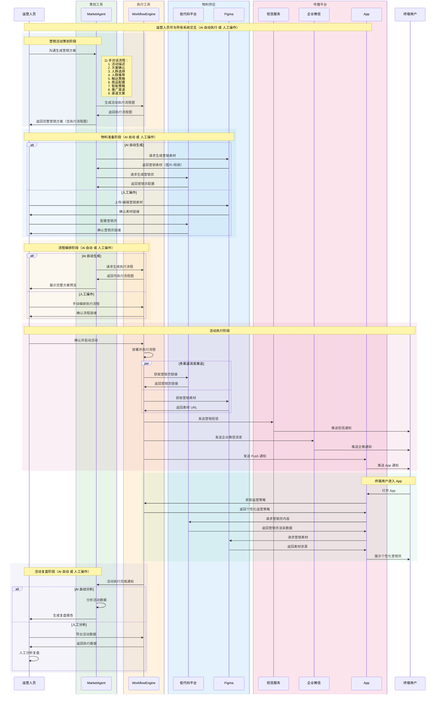

# 变更：添加营销智能体聊天页面

## Why

当前系统中的 `ChatBox.vue` 组件是一个内嵌于编辑器页面的轻量级聊天组件，主要用于辅助 BPMN 编辑。对于营销智能体场景，需要：
1. **更大的交互空间**：全屏页面提供更好的阅读和输入体验
2. **营销方案预览**：右侧面板实时展示 AI 生成的营销方案，便于用户审阅
3. **多会话管理**：左侧面板提供会话列表，支持多个营销项目的独立对话
4. **专业化功能**：针对营销场景的特定工具和提示模板

## What Changes

### 前端变更
- **ADDED**: `MarketingAgentPage.vue` - 营销智能体主页面（三栏布局容器）
- **ADDED**: `MarketingConversationList.vue` - 左侧会话列表组件
- **ADDED**: `MarketingChatArea.vue` - 中间聊天区域组件
- **ADDED**: `MarketingPlanPreview.vue` - 右侧营销方案预览组件（只读展示完整方案）
- **ADDED**: `MarketingPlanForm.vue` - 可交互的营销方案表单组件（嵌入聊天窗口）
- **ADDED**: `AudienceSelector.vue` - 人群选择组件（嵌入聊天窗口）
- **ADDED**: `AudienceRecommendation.vue` - 人群推荐详情组件（嵌入聊天窗口）
- **ADDED**: `MarketingFlowChart.vue` - 营销流程图展示组件（用户旅程图）
- **ADDED**: `ReachStrategyChart.vue` - 触达策略流程图组件（步骤5）
- **ADDED**: `ProductConfigForm.vue` - 商品推荐配置表单组件（步骤6）
- **ADDED**: `SmartStrategyDisplay.vue` - 智能策略展示组件（步骤7）
- **ADDED**: `ChannelSelector.vue` - 推广渠道选择组件（步骤8）
- **ADDED**: `ChannelCopyEditor.vue` - 个性化渠道文案编辑组件（步骤9）
- **ADDED**: `BpmnFlowChart.vue` - BPMN 可执行流程图组件（步骤10）
- **ADDED**: `CampaignReport.vue` - 活动复盘报告组件（步骤11）
- **ADDED**: `useMarketingPlanForm.ts` - 表单生成和管理的封装方法
- **ADDED**: `useAudienceSelection.ts` - 人群选择和推荐的封装方法
- **ADDED**: `useConversationFlow.ts` - 11步对话流程状态管理
- **ADDED**: `useMermaidParser.ts` - Mermaid 代码解析封装方法
- **MODIFIED**: `router/index.ts` - 添加新路由 `/marketing-agent`
- **MODIFIED**: `HomePage.vue` - 添加营销智能体入口

### 依赖库
- **ADDED**: `mermaid` - Mermaid 流程图解析和渲染库，用于解析 MA 回复的 Mermaid 格式流程图

### 后端变更
- **ADDED**: `/api/marketing-plans` - 营销方案 CRUD API
- **ADDED**: `/api/audiences` - 人群数据 API（获取已划分人群列表）
- **ADDED**: `/api/audiences/:id/recommendation` - 人群推荐详情 API
- **ADDED**: 营销方案数据模型（MarketingPlan）
- **ADDED**: 人群数据模型（Audience、AudienceRecommendation）

### 数据模型
营销方案包含以下核心字段：
- **活动主题（title）**：营销活动的名称和主题
- **活动时间（timeline）**：活动的开始和结束时间
- **活动目标（objectives）**：营销活动的目标和 KPI
- **触达渠道（channels）**：营销触达的渠道列表
- **活动人群（targetAudience）**：目标受众定义
- **活动策略（strategies）**：具体的营销策略

### 复用内容
- `chatApiService.ts` - 会话和消息管理 API
- `claudeLlmService.ts` - Claude API 调用（用于处理用户输入消息）
- `utils/markdown.ts` - Markdown 渲染
- `BpmnEditor` - 现有 AI 画流程图能力，用于生成营销方案执行流程图
- `bpmnAiService.ts` - BPMN AI 生成服务

### LLM 处理流程
用户输入的所有消息都必须经过 LLM 处理后再生成对应的交互组件：

1. **消息输入** → LLM 分析用户意图和内容
2. **LLM 响应** → 返回结构化数据（JSON 格式）
3. **前端解析** → 根据响应类型渲染对应组件

#### LLM 响应格式示例
```json
{
  "responseType": "plan_form",
  "data": {
    "title": "双十一大促销活动",
    "timeline": { "startDate": "2024-11-01", "endDate": "2024-11-11" },
    "objectives": "提升品牌知名度，增加销售额30%",
    "channels": ["wechat_official", "douyin"],
    "targetAudience": "18-35岁年轻用户",
    "strategies": "前期预热 + 限时优惠 + 会员专属"
  },
  "message": "好的，我已根据您的需求生成了初步方案，请确认或修改："
}
```

#### 响应类型枚举
- `plan_form` - 营销方案表单
- `audience_selector` - 人群选择界面
- `audience_recommendation` - 人群推荐详情
- `reach_strategy` - 触达策略流程图（Mermaid 格式）
- `product_config` - 商品推荐配置
- `smart_strategy` - 智能策略详情
- `channel_selector` - 推广渠道选择
- `channel_copy` - 个性化渠道文案
- `bpmn_flow` - BPMN 可执行流程图
- `campaign_report` - 活动复盘报告

## Impact

- **受影响的规范**：新增 `marketing-agent-ui` 规范能力领域
- **受影响的代码**：
  - 前端：新增 15 个 Vue 组件，3 个 composables，修改路由和首页
  - 后端：新增营销方案 API 端点和数据模型
- **数据库**：新增 `marketing_plans` 表
- **外部依赖**：
  - WorkflowEngine：生成和执行 BPMN 流程
  - 低代码平台：生成和托管营销页
  - 短信服务：发送营销短信
  - 企业微信：发送企微消息
  - App：推送通知和展示营销页

### 交互流程

#### 交互时序图



#### 流程步骤详解

##### 营销活动策划阶段

1. **活动描述输入**：运营人员在聊天区域输入活动描述
   - 用户消息发送至 LLM 进行分析
   - LLM 解析活动需求，返回结构化方案数据
   - MA 根据 LLM 响应渲染方案确认表单（活动主题、时间、目标等）
   - MA 更新右侧预览面板

2. **方案确认**：运营人员编辑表单后点击"确定"提交
   - MA 回复人群选择界面
   - 展示已划分好的人群列表及筛选条件
   - 提供"新建人群"选项

3. **人群选择**：运营人员选择目标人群后点击"确定"
   - MA 回复人群推荐详情
   - 包含：人群价值分层标签、画像指标标签、转化概率、大盘占比、人群规模

4. **人群推荐确认**：运营人员编辑标签后点击"确定"
   - LLM 根据人群特征生成触达策略
   - MA 回复触达策略流程图（Mermaid 格式用户旅程图）
   - 使用 Mermaid 解析库渲染流程图

5. **触达策略确认**：运营人员确认触达策略后点击"确定"
   - MA 回复商品推荐配置表单
   - 包含：推荐商品、优惠券、权益配置等

6. **商品配置确认**：运营人员配置商品后点击"确定"
   - LLM 基于人群特征和商品配置生成智能策略
   - MA 回复智能策略详情（个性化推荐规则）

7. **智能策略确认**：运营人员确认智能策略后点击"确定"
   - MA 回复推广渠道选择界面
   - 包含：微信公众号、微信小程序、抖音、小红书、短信、邮件、APP Push 等渠道

8. **推广渠道确认**：运营人员选择渠道后点击"确定"
   - LLM 针对不同渠道生成适配的营销文案
   - MA 回复个性化渠道文案

9. **渠道文案确认**：运营人员确认文案后点击"确定"
   - MA 调用低代码平台生成营销页
   - MA 调用现有 AI 画流程图能力生成 BPMN 可执行流程图
   - 在右侧预览面板嵌入 BPMN 画布展示完整流程图
   - 回复完整的 BPMN 流程图（含营销页配置）

##### 活动执行阶段

10. **活动启动**：运营人员确认 BPMN 流程后启动活动
    - WorkflowEngine 部署并执行 BPMN 流程
    - WorkflowEngine 从低代码平台获取营销页链接
    - 多渠道消息推送（含营销页链接）：
      - 短信服务：发送营销短信
      - 企业微信：发送企微消息
      - App：发送 Push 通知
    - 终端用户进入 App 时：
      - App 从 WorkflowEngine 获取运营策略
      - App 从低代码平台请求营销页内容
      - App 展示个性化营销页（优惠券、商品推荐等）

##### 活动复盘阶段

11. **活动复盘**：活动执行结束后
    - WorkflowEngine 通知 MA 活动执行完成
    - LLM 分析活动数据，生成洞察和建议
    - MA 自动生成活动复盘和分析报告
    - 包含：执行效果、转化数据、渠道表现、AI 洞察、优化建议

### 系统架构

#### 参与者说明

| 参与者 | 说明 |
|-------|------|
| 运营人员 | 使用营销智能体的运营用户，负责策划和启动营销活动 |
| MarketAgent (MA) | 营销智能体，负责对话交互、调用 LLM 处理用户消息、方案生成、流程编排 |
| WorkflowEngine (WE) | 工作流引擎，负责生成和执行 BPMN 流程 |
| 低代码平台 (LCP) | 低代码平台，负责生成和托管营销页 |
| 短信服务 | 短信推送服务，负责发送营销短信 |
| 企业微信 | 企微消息服务，负责发送企微通知 |
| App | 移动应用端，负责 Push 通知和展示营销页 |
| 终端用户 | 营销活动的目标受众，接收营销信息的用户 |

### 风险与缓解

| 风险 | 缓解措施 |
|-----|---------|
| 与现有 ChatBox 功能重复 | 提取共享逻辑到 composable，两者复用 |
| 营销方案格式不确定 | 定义标准 JSON Schema，LLM 输出遵循该格式 |
| 表单字段复杂 | 封装 `useMarketingPlanForm` composable 统一管理 |
| 11 步流程复杂 | 封装 `useConversationFlow` composable 统一管理状态 |
| 外部系统依赖 | 使用 Mock 数据进行开发，预留真实 API 接口 |
| 低代码平台集成 | 定义标准接口规范，支持异步生成营销页 |
| LLM 响应格式不稳定 | 定义严格的响应 Schema，增加格式校验和容错处理 |
| Mermaid 解析失败 | 添加解析错误处理，降级显示原始代码 |
| BPMN 生成失败 | 复用现有 AI 画流程图能力，确保稳定性 |
