# 架构文档

## 系统架构演进

### 当前架构（本次变更前）

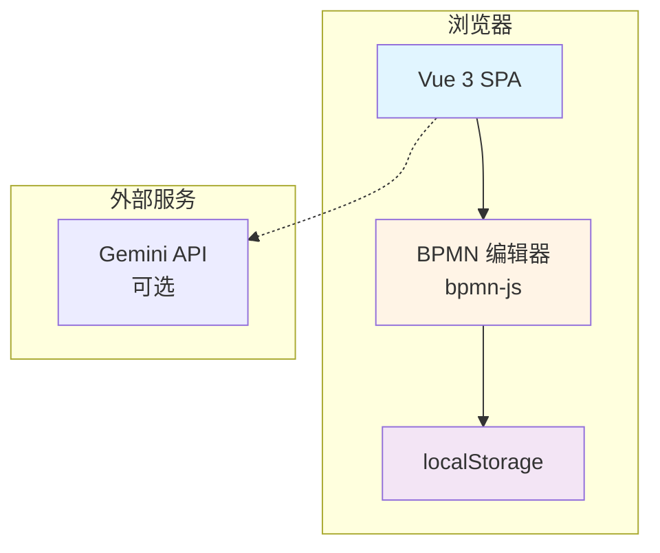

**局限性**:
- 仅客户端，无后端
- 除 localStorage 外没有数据持久化
- 无用户管理或身份验证
- 仅限于技术工作流建模
- 缺少业务上下文（生命周期阶段、细分、触发器）

---

### 目标架构（第 1 阶段后）

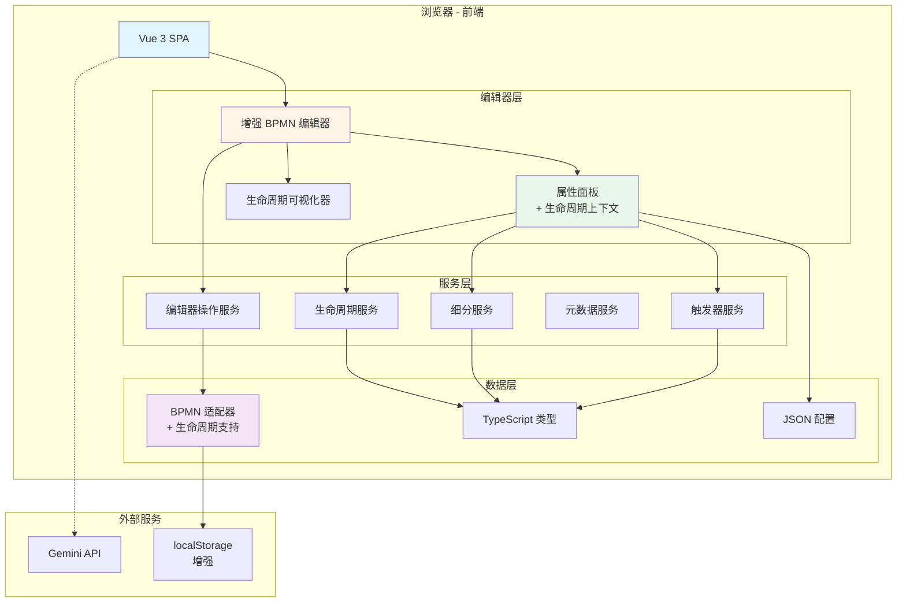

**改进**:
- 结构化的生命周期操作服务层
- 具有生命周期上下文的丰富类型系统
- 配置驱动的 UI 组件
- 具有业务元数据的增强数据模型
- 为未来后端集成奠定基础

---

## 组件架构

### 前端组件层次结构

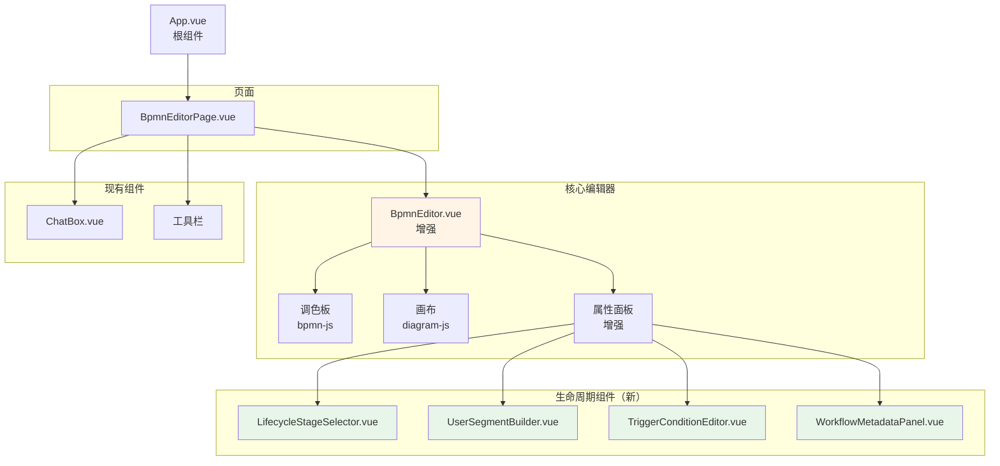

---

### 服务层架构

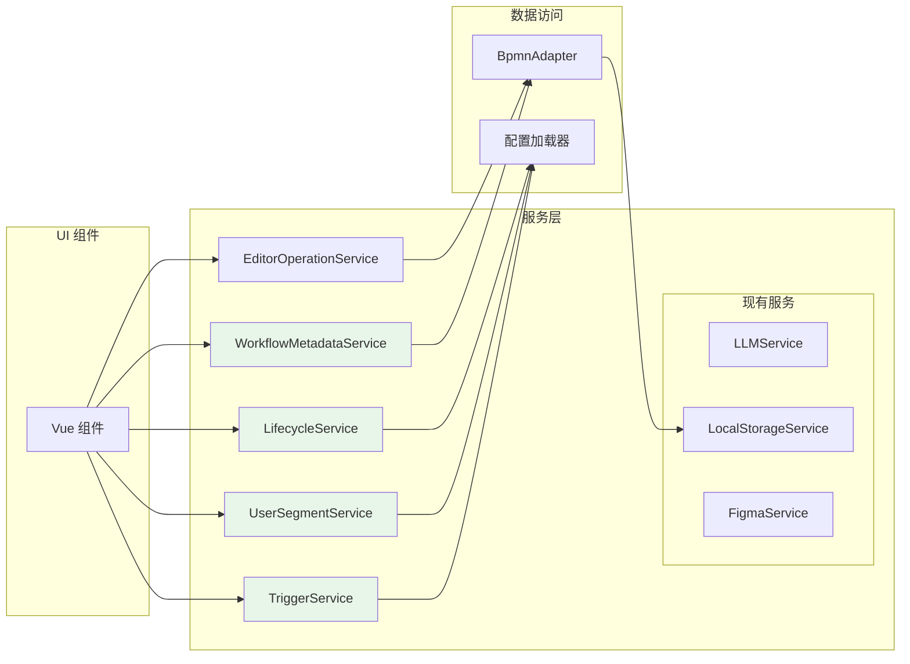

**服务职责**:

| 服务 | 职责 | 关键方法 |
|---------|---------------|-------------|
| **LifecycleService** | 管理生命周期阶段 | `getStages()`, `assignStage()`, `getStageConfig()` |
| **UserSegmentService** | 管理用户细分 | `createSegment()`, `evaluateSegment()`, `getTemplates()` |
| **TriggerService** | 管理工作流触发器 | `createTrigger()`, `validateTrigger()`, `getTriggerTypes()` |
| **WorkflowMetadataService** | 管理工作流元数据 | `setMetadata()`, `getMetadata()`, `updateMetrics()` |
| **EditorOperationService** | 编辑器操作 | `createNode()`, `createFlow()`, `updateNode()` |

---

## 数据流架构

### 工作流生命周期数据流

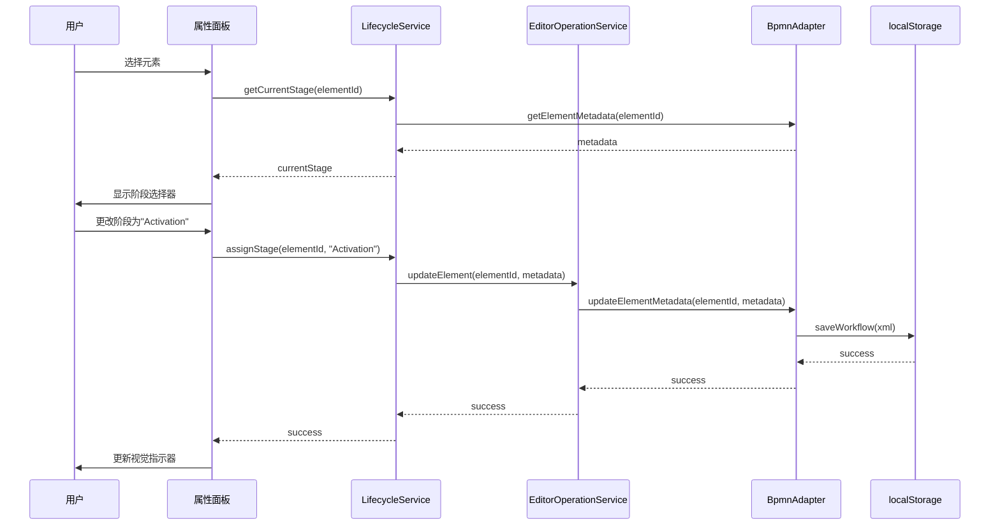

---

### 细分评估流程

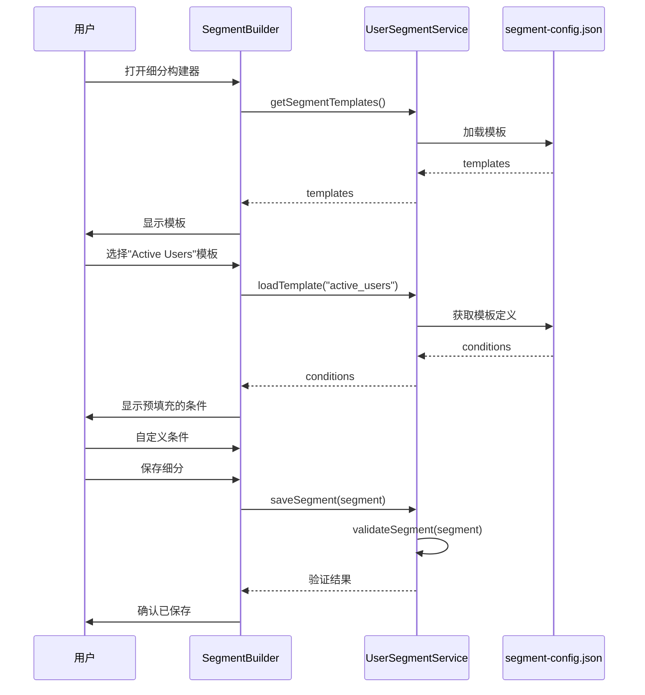

---

## 数据模型架构

### 核心类型系统

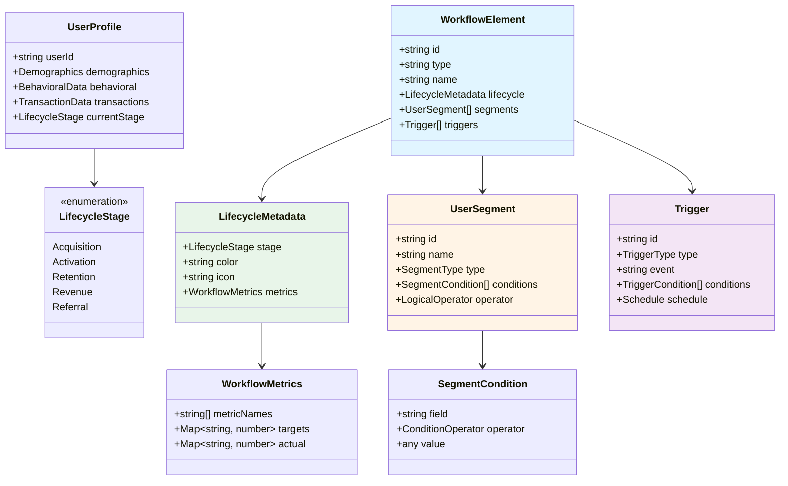

---

### XML 架构扩展

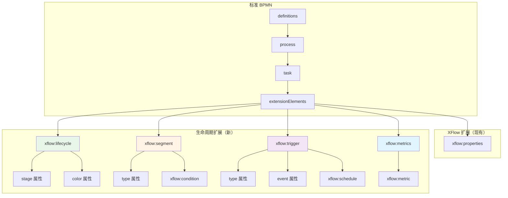

**示例 XML**:
```xml
<bpmn:task id="Task_1" name="Onboarding Tutorial">
  <bpmn:extensionElements>
    <xflow:lifecycle stage="Activation" color="#4caf50" />
    <xflow:segment type="demographic">
      <xflow:condition field="age" operator="between" value="18,35" />
      <xflow:condition field="country" operator="in" value="US,CA,UK" />
    </xflow:segment>
    <xflow:trigger type="event" event="user_signup" />
    <xflow:metrics>
      <xflow:metric name="completion_rate" target="0.75" />
      <xflow:metric name="time_to_complete" target="300" unit="seconds" />
    </xflow:metrics>
  </bpmn:extensionElements>
</bpmn:task>
```

---

## 集成架构（未来阶段）

### 第 2 阶段：后端集成

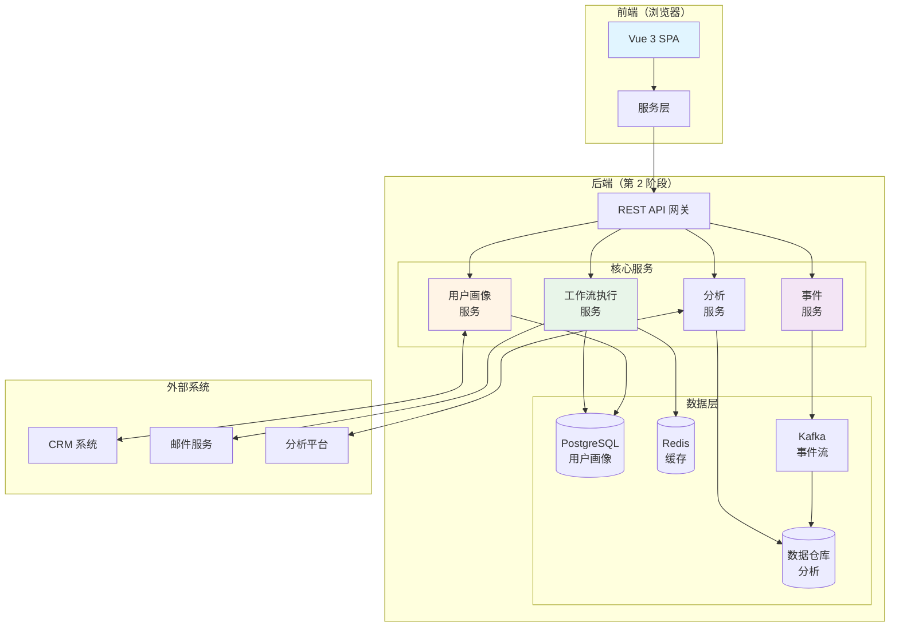

---

### 多阶段路线图

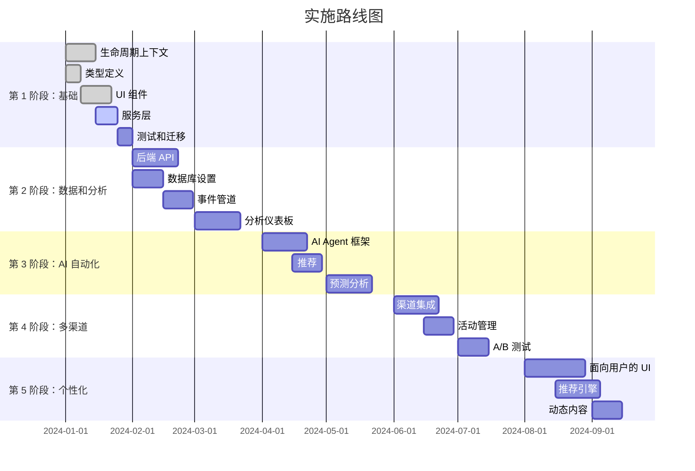

---

## 部署架构（未来）

### 生产部署（第 2 阶段+）

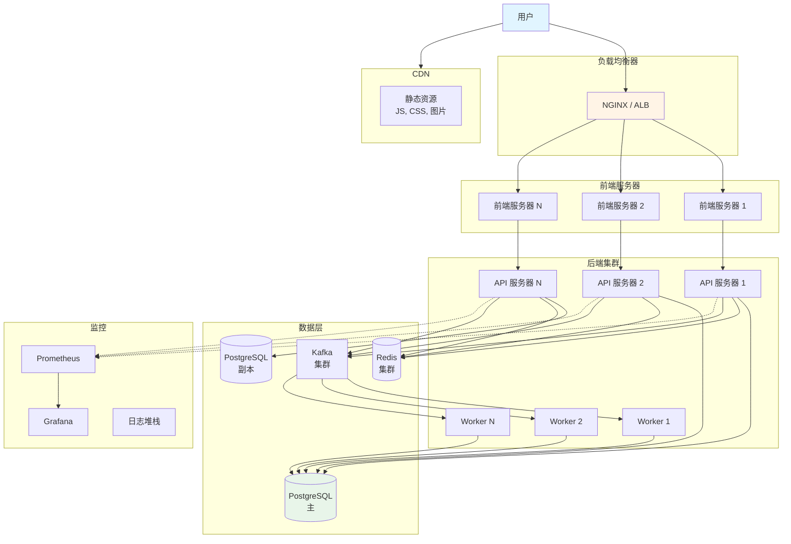

---

## 安全架构（第 2 阶段+）

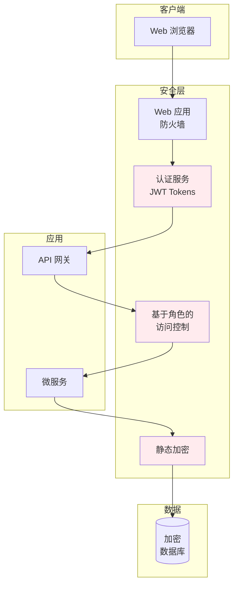

**安全措施**:
- ✅ 基于 JWT 的身份验证
- ✅ 基于角色的访问控制（管理员、操作员、分析师）
- ✅ 静态数据加密（AES-256）
- ✅ 传输中数据使用 TLS 1.3
- ✅ API 速率限制
- ✅ PII 数据脱敏
- ✅ 审计日志
- ✅ GDPR 合规（同意管理、删除权）

---

## 性能考虑

### 可扩展性目标（第 2 阶段+）

| 指标 | 目标 | 策略 |
|--------|--------|----------|
| **并发用户** | 10,000+ | 水平扩展、负载均衡 |
| **工作流执行/秒** | 1,000+ | 异步处理、消息队列 |
| **API 响应时间** | < 200ms (p95) | 缓存、CDN、数据库优化 |
| **事件摄取** | 100,000/秒 | Kafka 流、批处理 |
| **仪表板加载时间** | < 2秒 | 预聚合、延迟加载 |
| **工作流文件大小** | < 5MB | 压缩、增量加载 |

### 优化策略

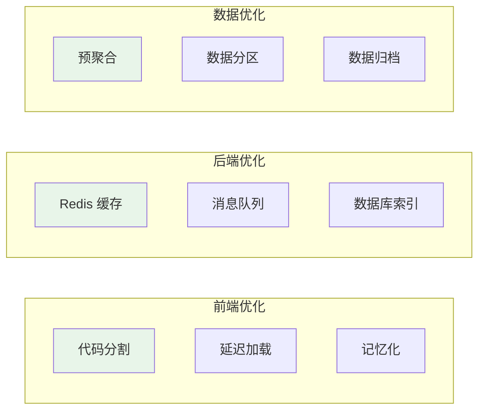

---

## 监控和可观测性（第 2 阶段+）

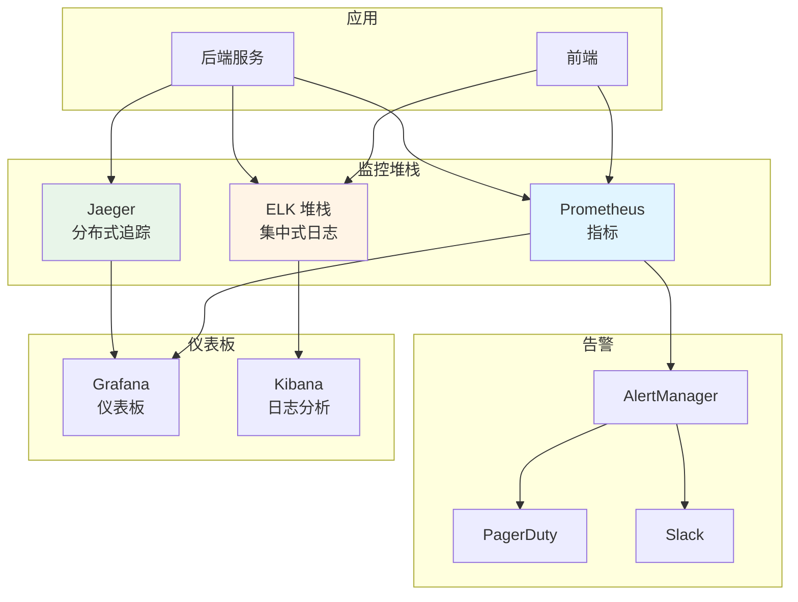

**关键指标跟踪**:
- 应用：请求率、错误率、延迟（p50/p95/p99）
- 业务：工作流执行、用户转化、生命周期进展
- 基础设施：CPU、内存、磁盘 I/O、网络
- 用户体验：页面加载时间、交互时间、Core Web Vitals

---

此架构文档提供了从当前状态到所有未来阶段的系统演进的全面视图。所有图表均使用 Mermaid 格式，可以在任何支持 Mermaid 的 markdown 查看器中渲染（GitHub、GitLab、VS Code 等）。
