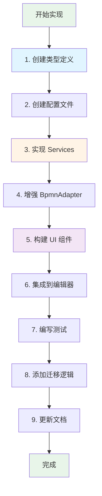
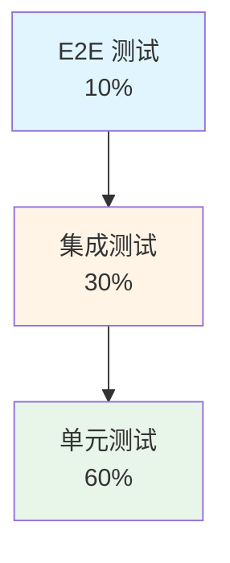

# 实现指南

本指南提供实现用户生命周期运营基础的分步说明。

## 快速开始

### 前置条件
- Node.js v20.19.1
- npm
- 熟悉 Vue 3, TypeScript, bpmn-js

### 设置
```bash
cd /data/mm64/simonsliu/xflow/bpmn-explorer/client
npm install
npm run dev
```

---

## 实现流程图



---

## Phase 1: 类型定义 (Tasks 1.1-1.6)

### 文件结构
```
src/types/
├── lifecycle.ts         (NEW)
├── segments.ts          (NEW)
├── triggers.ts          (NEW)
├── metrics.ts           (NEW)
└── index.ts             (MODIFY - export new types)
```

### 实现步骤

#### 1.1 定义生命周期阶段枚举

**文件**: `src/types/lifecycle.ts`

```typescript
/**
 * AARRR Lifecycle Stages (Pirate Metrics)
 */
export enum LifecycleStage {
  /** User Acquisition - Getting users to the platform */
  Acquisition = 'Acquisition',

  /** User Activation - First-time user experience */
  Activation = 'Activation',

  /** User Retention - Ongoing engagement */
  Retention = 'Retention',

  /** Revenue Generation - Monetization */
  Revenue = 'Revenue',

  /** Referral & Viral Growth - User advocacy */
  Referral = 'Referral'
}

/**
 * Lifecycle stage configuration for UI display
 */
export interface LifecycleStageConfig {
  stage: LifecycleStage
  label: string
  description: string
  color: string
  icon: string
  order: number
}

/**
 * Lifecycle metadata attached to workflow elements
 */
export interface LifecycleMetadata {
  stage: LifecycleStage
  color?: string
  icon?: string
  description?: string
  version: string // Format version for future compatibility
}
```

#### 1.2 创建用户分段类型

**文件**: `src/types/segments.ts`

```typescript
/**
 * User segment types
 */
export enum SegmentType {
  Demographic = 'demographic',
  Behavioral = 'behavioral',
  Lifecycle = 'lifecycle',
  Value = 'value'
}

/**
 * Logical operators for combining conditions
 */
export enum LogicalOperator {
  AND = 'AND',
  OR = 'OR'
}

/**
 * Condition operators for segment rules
 */
export enum ConditionOperator {
  Equals = 'equals',
  NotEquals = 'not_equals',
  GreaterThan = 'greater_than',
  LessThan = 'less_than',
  GreaterThanOrEqual = 'gte',
  LessThanOrEqual = 'lte',
  Between = 'between',
  Contains = 'contains',
  In = 'in',
  NotIn = 'not_in'
}

/**
 * Segment condition definition
 */
export interface SegmentCondition {
  field: string
  operator: ConditionOperator
  value: string | number | boolean | string[] | number[]
}

/**
 * User segment definition
 */
export interface UserSegment {
  id: string
  name: string
  description?: string
  type: SegmentType
  conditions: SegmentCondition[]
  operator: LogicalOperator
  isTemplate?: boolean
  createdAt?: Date
  updatedAt?: Date
}

/**
 * Segment template for quick setup
 */
export interface SegmentTemplate {
  id: string
  name: string
  description: string
  type: SegmentType
  icon: string
  conditions: SegmentCondition[]
  operator: LogicalOperator
  tags: string[]
}
```

#### 1.3 定义触发器类型

**文件**: `src/types/triggers.ts`

```typescript
/**
 * Trigger types for workflow execution
 */
export enum TriggerType {
  Scheduled = 'scheduled',
  Event = 'event',
  Threshold = 'threshold',
  Manual = 'manual'
}

/**
 * Standard event types
 */
export enum EventType {
  // User events
  UserSignup = 'user.signup',
  UserLogin = 'user.login',
  UserLogout = 'user.logout',
  ProfileUpdate = 'user.profile_update',

  // Engagement events
  PageView = 'engagement.page_view',
  FeatureClick = 'engagement.feature_click',
  SessionStart = 'engagement.session_start',
  SessionEnd = 'engagement.session_end',

  // Transaction events
  PurchaseComplete = 'transaction.purchase_complete',
  CartAdd = 'transaction.cart_add',
  CheckoutStart = 'transaction.checkout_start',
  Refund = 'transaction.refund',

  // Milestone events
  MilestoneReached = 'milestone.reached',

  // Custom
  Custom = 'custom'
}

/**
 * Schedule configuration for time-based triggers
 */
export interface Schedule {
  type: 'cron' | 'interval' | 'delay' | 'time_window'
  expression?: string // Cron expression
  interval?: number // Milliseconds
  delay?: number // Milliseconds
  startTime?: string // ISO 8601
  endTime?: string // ISO 8601
  timezone?: string
}

/**
 * Trigger condition for evaluation
 */
export interface TriggerCondition {
  field: string
  operator: ConditionOperator
  value: any
}

/**
 * Workflow trigger definition
 */
export interface Trigger {
  id: string
  name: string
  type: TriggerType
  description?: string

  // Event-based
  event?: EventType | string
  eventFilters?: TriggerCondition[]

  // Schedule-based
  schedule?: Schedule

  // Threshold-based
  thresholds?: TriggerCondition[]

  // Metadata
  enabled: boolean
  createdAt?: Date
  updatedAt?: Date
}
```

#### 1.4 创建工作流元数据架构

**文件**: `src/types/metrics.ts`

```typescript
/**
 * Workflow purpose categories
 */
export enum WorkflowPurpose {
  Onboarding = 'Onboarding',
  Engagement = 'Engagement',
  Conversion = 'Conversion',
  Retention = 'Retention',
  Winback = 'Winback'
}

/**
 * Standard metric names
 */
export enum MetricName {
  ConversionRate = 'conversion_rate',
  EngagementRate = 'engagement_rate',
  CompletionRate = 'completion_rate',
  RevenueGenerated = 'revenue_generated',
  UserActivationCount = 'user_activation_count',
  ChurnRate = 'churn_rate',
  TimeToConversion = 'time_to_conversion',
  ClickThroughRate = 'click_through_rate'
}

/**
 * Metric definition with target value
 */
export interface WorkflowMetric {
  name: MetricName | string
  displayName: string
  target?: number
  actual?: number
  unit?: string // '%', 'seconds', 'count', '$'
  description?: string
}

/**
 * Workflow metadata
 */
export interface WorkflowMetadata {
  id: string
  name: string
  description?: string
  purpose: WorkflowPurpose
  owner?: string
  tags: string[]
  metrics: WorkflowMetric[]

  // Versioning
  version: string
  createdAt: Date
  updatedAt: Date
  createdBy?: string
  updatedBy?: string

  // Status
  status: 'draft' | 'active' | 'paused' | 'archived'
}
```

#### 1.5 定义用户配置文件结构

**文件**: `src/types/userProfile.ts`

```typescript
/**
 * User demographics
 */
export interface Demographics {
  age?: number
  dateOfBirth?: string
  gender?: 'male' | 'female' | 'other' | 'prefer_not_to_say'
  country?: string
  city?: string
  timezone?: string
  language?: string
  deviceType?: 'desktop' | 'mobile' | 'tablet'
}

/**
 * User behavioral data
 */
export interface BehavioralData {
  sessionCount: number
  lastSessionDate?: Date
  totalSessionDuration: number // seconds
  featureUsageMap: Record<string, number> // feature -> usage count
  engagementScore: number // 0-100
  activityRecency: number // days since last activity
  activityFrequency: number // sessions per week
}

/**
 * User transaction data
 */
export interface TransactionData {
  totalPurchases: number
  totalRevenue: number
  averageOrderValue: number
  lastPurchaseDate?: Date
  subscriptionTier?: string
  customerLifetimeValue: number
  purchaseFrequency: number // purchases per month
}

/**
 * Complete user profile
 */
export interface UserProfile {
  userId: string
  email: string
  name?: string
  signupDate: Date
  accountStatus: 'active' | 'suspended' | 'deleted'
  currentLifecycleStage: LifecycleStage

  demographics: Demographics
  behavioral: BehavioralData
  transactions: TransactionData

  // Privacy
  consentGiven: boolean
  consentDate?: Date

  // Metadata
  createdAt: Date
  updatedAt: Date
}
```

#### 1.6 创建事件数据类型

**文件**: `src/types/events.ts`

```typescript
/**
 * Standard event schema
 */
export interface UserEvent {
  eventId: string
  userId: string
  sessionId: string
  eventType: EventType | string
  timestamp: Date

  // Optional fields
  eventProperties?: Record<string, any>
  deviceInfo?: DeviceInfo
  location?: LocationInfo
  referrer?: string
}

/**
 * Device information
 */
export interface DeviceInfo {
  type: 'desktop' | 'mobile' | 'tablet'
  os: string
  browser: string
  screenResolution: string
}

/**
 * Location information
 */
export interface LocationInfo {
  country: string
  city?: string
  region?: string
  latitude?: number
  longitude?: number
}

/**
 * Workflow execution context
 */
export interface WorkflowExecutionContext {
  workflowId: string
  instanceId: string
  userId: string
  currentStep: string
  status: 'running' | 'paused' | 'completed' | 'failed' | 'cancelled'
  startTime: Date
  endTime?: Date

  // Execution data
  variables: Record<string, any>
  intermediateResults: Record<string, any>

  // Error tracking
  errors: ExecutionError[]
  retryCount: number
  maxRetries: number
}

/**
 * Execution error
 */
export interface ExecutionError {
  errorType: string
  errorMessage: string
  failedStep: string
  stackTrace?: string
  timestamp: Date
}
```

#### 更新 Index

**文件**: `src/types/index.ts` (追加到现有内容)

```typescript
// Lifecycle types
export * from './lifecycle'
export * from './segments'
export * from './triggers'
export * from './metrics'
export * from './userProfile'
export * from './events'
```

---

## Phase 2: 配置文件 (Tasks 6.1-6.3)

### 文件结构
```
src/config/
├── lifecycle-stages.json    (NEW)
├── user-segments.json       (NEW)
└── trigger-templates.json   (NEW)
```

### 6.1 创建生命周期阶段配置

**文件**: `src/config/lifecycle-stages.json`

```json
{
  "version": "1.0",
  "stages": [
    {
      "stage": "Acquisition",
      "label": "Acquisition",
      "description": "Attracting and acquiring new users through various channels",
      "color": "#2196F3",
      "icon": "🎯",
      "order": 1,
      "examples": [
        "Landing page visits",
        "Signup campaigns",
        "Referral tracking",
        "Ad campaigns"
      ],
      "metrics": [
        "visitor_count",
        "signup_rate",
        "cost_per_acquisition",
        "channel_attribution"
      ]
    },
    {
      "stage": "Activation",
      "label": "Activation",
      "description": "Delivering first-time user experience and demonstrating value",
      "color": "#4CAF50",
      "icon": "✨",
      "order": 2,
      "examples": [
        "Onboarding tutorials",
        "First transaction",
        "Profile setup",
        "Feature discovery"
      ],
      "metrics": [
        "onboarding_completion_rate",
        "time_to_first_value",
        "feature_adoption_rate",
        "activation_rate"
      ]
    },
    {
      "stage": "Retention",
      "label": "Retention",
      "description": "Keeping users engaged and building habits",
      "color": "#FFC107",
      "icon": "🔄",
      "order": 3,
      "examples": [
        "Re-engagement emails",
        "Push notifications",
        "Content recommendations",
        "Habit formation"
      ],
      "metrics": [
        "daily_active_users",
        "weekly_active_users",
        "churn_rate",
        "engagement_score",
        "session_frequency"
      ]
    },
    {
      "stage": "Revenue",
      "label": "Revenue",
      "description": "Converting users into paying customers",
      "color": "#9C27B0",
      "icon": "💰",
      "order": 4,
      "examples": [
        "Upsell campaigns",
        "Premium upgrades",
        "Purchase reminders",
        "Subscription management"
      ],
      "metrics": [
        "conversion_rate",
        "average_order_value",
        "customer_lifetime_value",
        "revenue_per_user",
        "subscription_rate"
      ]
    },
    {
      "stage": "Referral",
      "label": "Referral",
      "description": "Encouraging users to refer others and become advocates",
      "color": "#FF5722",
      "icon": "🚀",
      "order": 5,
      "examples": [
        "Referral program",
        "Social sharing",
        "Incentive delivery",
        "Ambassador programs"
      ],
      "metrics": [
        "referral_rate",
        "viral_coefficient",
        "shares_per_user",
        "referral_conversion_rate"
      ]
    }
  ]
}
```

### 6.2 创建用户分段配置

**文件**: `src/config/user-segments.json`

(由于长度限制,此文件保持原样,JSON 配置通常不需要翻译)

### 6.3 创建触发器模板配置

**文件**: `src/config/trigger-templates.json`

(由于长度限制,此文件保持原样,JSON 配置通常不需要翻译)

---

## 测试策略

### 测试金字塔



### 测试覆盖率矩阵

| 组件 | 单元 | 集成 | E2E | 优先级 |
|-----------|------|-------------|-----|----------|
| 类型定义 | ✅ | N/A | N/A | 高 |
| Services | ✅ | ✅ | ❌ | 高 |
| BpmnAdapter | ✅ | ✅ | ❌ | 关键 |
| UI 组件 | ✅ | ✅ | ✅ | 中等 |
| 迁移逻辑 | ✅ | ✅ | ✅ | 关键 |

---

本实现指南提供了实际的分步说明和完整的代码示例。按照此结构继续执行 `tasks.md` 中的后续阶段。
