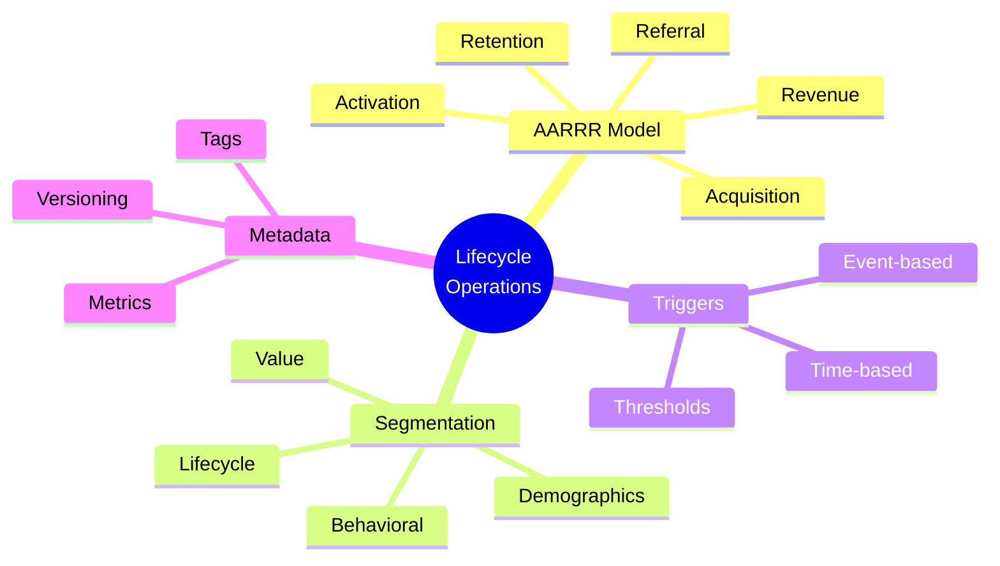
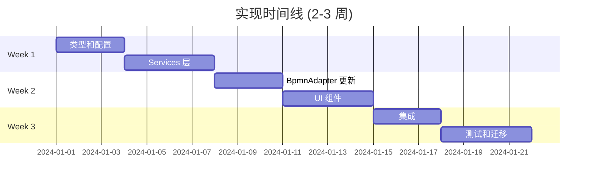

# 快速参考卡

## 📋 变更摘要

| 属性 | 值 |
|----------|-------|
| **Change ID** | add-lifecycle-operations-foundation |
| **Phase** | 1 of 5 |
| **Status** | ✅ 已验证, 准备实现 |
| **估计工作量** | 2-3 周 |
| **破坏性更改** | 是 (带迁移) |

---

## 🎯 关键功能



---

## 📁 创建的文件 (20 个新文件)

### 类型定义 (6 files)
- `src/types/lifecycle.ts` - AARRR 阶段
- `src/types/segments.ts` - 用户分段
- `src/types/triggers.ts` - 工作流触发器
- `src/types/metrics.ts` - 成功指标
- `src/types/userProfile.ts` - 用户数据模型
- `src/types/events.ts` - 事件架构

### 配置 (3 files)
- `src/config/lifecycle-stages.json` - 5 AARRR 阶段
- `src/config/user-segments.json` - 10 分段模板
- `src/config/trigger-templates.json` - 8 触发器模板

### Services (4 files)
- `src/services/lifecycleService.ts`
- `src/services/userSegmentService.ts`
- `src/services/triggerService.ts`
- `src/services/workflowMetadataService.ts`

### UI 组件 (4 files)
- `src/components/LifecycleStageSelector.vue`
- `src/components/UserSegmentBuilder.vue`
- `src/components/TriggerConditionEditor.vue`
- `src/components/WorkflowMetadataPanel.vue`

### 文档 (3 files)
- `openspec/changes/.../ARCHITECTURE.md` (此变更)
- `openspec/changes/.../IMPLEMENTATION_GUIDE.md`
- `openspec/changes/.../QUICK_REFERENCE.md`

---

## 🔧 修改的文件 (8 files)

- `src/types/index.ts` - 导出新类型
- `src/extensions/xflow/xflowExtension.json` - 添加生命周期字段
- `src/extensions/xflow/XFlowPropertiesProvider.ts` - 生命周期属性
- `src/extensions/xflow/XFlowRenderer.ts` - 视觉指示器
- `src/extensions/xflow/BpmnAdapter/BpmnAdapter.ts` - 迁移逻辑
- `src/extensions/xflow/BpmnAdapter/elementMapping.json` - 生命周期元数据
- `src/components/BpmnEditor.vue` - 集成新组件
- `README.md` - 记录生命周期功能

---

## 🎨 AARRR 配色方案

| 阶段 | 颜色 | 图标 | Hex |
|-------|-------|------|-----|
| **Acquisition** | 蓝色 | 🎯 | `#2196F3` |
| **Activation** | 绿色 | ✨ | `#4CAF50` |
| **Retention** | 黄色 | 🔄 | `#FFC107` |
| **Revenue** | 紫色 | 💰 | `#9C27B0` |
| **Referral** | 橙色 | 🚀 | `#FF5722` |

---

## 📊 分段模板

| 模板 | 类型 | 图标 | 用途 |
|----------|------|------|----------|
| New Users | Lifecycle | 🆕 | 入职活动 |
| Active Users | Behavioral | ⚡ | 留存工作流 |
| At-Risk Users | Behavioral | ⚠️ | 挽回活动 |
| VIP Customers | Value | 👑 | 高级优惠 |
| Dormant Users | Lifecycle | 😴 | 重新激活 |
| Young Professionals | Demographic | 💼 | 定向营销 |
| Mobile Users | Behavioral | 📱 | Mobile-first UX |
| Trial Users | Lifecycle | 🎫 | 转化活动 |
| Power Users | Behavioral | ⚙️ | 倡导计划 |
| Churned Users | Lifecycle | ❌ | 分析 |

---

## ⚡ 触发器类型

### 基于事件
- `user.signup` - 新用户注册
- `transaction.purchase_complete` - 购买完成
- `milestone.reached` - 用户里程碑
- `transaction.cart_add` - 添加到购物车

### 基于时间
- **Cron**: `0 9 * * *` (每天上午 9 点)
- **Interval**: 每 N 毫秒
- **Delay**: 事件后 N 时间
- **Time Window**: 开始/结束时间之间

### 基于阈值
- 参与度分数 < 40
- 不活跃天数 > 30
- 购买金额 > 100
- 会话数 < 5

---

## 🔑 关键 TypeScript 类型

### Lifecycle
```typescript
enum LifecycleStage {
  Acquisition, Activation, Retention, Revenue, Referral
}

interface LifecycleMetadata {
  stage: LifecycleStage
  color?: string
  version: string
}
```

### Segments
```typescript
interface UserSegment {
  id: string
  name: string
  type: SegmentType
  conditions: SegmentCondition[]
  operator: LogicalOperator
}
```

### Triggers
```typescript
interface Trigger {
  id: string
  type: TriggerType
  event?: EventType
  schedule?: Schedule
  thresholds?: TriggerCondition[]
}
```

---

## 🎯 XML Schema Extension

### 之前 (Standard BPMN)
```xml
<bpmn:task id="Task_1" name="Onboarding">
  <bpmn:extensionElements />
</bpmn:task>
```

### 之后 (With Lifecycle)
```xml
<bpmn:task id="Task_1" name="Onboarding">
  <bpmn:extensionElements>
    <xflow:lifecycle stage="Activation" color="#4CAF50" />
    <xflow:segment type="demographic">
      <xflow:condition field="age" operator="between" value="18,35" />
    </xflow:segment>
    <xflow:trigger type="event" event="user_signup" />
    <xflow:metrics>
      <xflow:metric name="completion_rate" target="0.75" />
    </xflow:metrics>
  </bpmn:extensionElements>
</bpmn:task>
```

---

## 🧪 测试清单

### 单元测试
- [ ] 生命周期类型定义
- [ ] Segment service 逻辑
- [ ] Trigger 验证
- [ ] BpmnAdapter 转换

### 集成测试
- [ ] Service 层集成
- [ ] Properties panel 数据流
- [ ] Adapter with lifecycle metadata
- [ ] 组件通信

### E2E 测试
- [ ] 使用生命周期阶段创建工作流
- [ ] 为元素分配分段
- [ ] 配置触发器
- [ ] 迁移现有工作流
- [ ] 保存和重新加载工作流

---

## 📈 成功指标

### 技术
- ✅ 迁移后所有现有工作流加载
- ✅ XML 大小增加 < 20%
- ✅ Properties panel 渲染 < 100ms
- ✅ 测试覆盖率 > 80%
- ✅ 零 TypeScript 错误

### 产品 (发布后)
- 🎯 50%+ 工作流使用生命周期标记 (30 天)
- 🎯 30%+ 工作流使用分段 (30 天)
- 🎯 < 5 支持工单/月
- 🎯 90%+ 用户满意度

---

## ⚠️ 破坏性更改和迁移

### 什么会中断
1. XFlow extension format (新的必需字段)
2. Workflow XML schema (lifecycle namespace)

### 迁移策略
✅ **自动** - BpmnAdapter 在加载时迁移
- 基于元素类型分配默认阶段
- 无需用户操作
- 向后兼容

### 默认阶段映射
| 元素类型 | 默认阶段 |
|--------------|---------------|
| StartEvent | Acquisition |
| UserTask (early) | Activation |
| UserTask (late) | Retention |
| ServiceTask | Retention |
| Gateway | Retention |
| EndEvent | Referral |

---

## 🚀 实现顺序



---

## 🔗 快速链接

### 文档
- `proposal.md` - 包含理由的完整提案
- `tasks.md` - 54 个实现任务
- `design.md` - 技术设计决策
- `ARCHITECTURE.md` - 系统架构图
- `IMPLEMENTATION_GUIDE.md` - 分步指南

### Specs
- `specs/workflow-editor/spec.md` - 7 需求, 21 场景
- `specs/user-lifecycle/spec.md` - 5 需求, 17 场景
- `specs/data-integration/spec.md` - 5 需求, 18 场景

### 命令
```bash
# 查看变更
openspec show add-lifecycle-operations-foundation

# 验证
openspec validate add-lifecycle-operations-foundation --strict

# 归档 (实现后)
openspec archive add-lifecycle-operations-foundation --yes
```

---

## 💡 关键设计决策

| 决策 | 选择 | 原因 |
|----------|--------|-----|
| **Namespace** | 扩展 XFlow | 最小化 adapter 更改 |
| **Data Model** | TypeScript-first | 类型安全, IDE 支持 |
| **UI Config** | JSON-driven | 灵活, 无代码更改 |
| **Migration** | 自动 | 零用户摩擦 |
| **Properties** | 扩展 panel | 一致的 UX |

---

## 🎓 学习资源

### AARRR Framework
- Acquisition: 将用户引入平台
- Activation: 首次用户体验
- Retention: 持续参与
- Revenue: 变现
- Referral: 病毒式增长

### 用户分段
- **Demographic**: 他们是谁 (年龄, 位置)
- **Behavioral**: 他们做什么 (会话, 功能)
- **Lifecycle**: 他们在哪里 (新, 活跃, 流失)
- **Value**: 他们值多少 (LTV, 购买)

### 工作流触发器
- **Scheduled**: 基于时间的执行
- **Event**: 基于用户操作
- **Threshold**: 基于数据条件
- **Manual**: 操作员发起

---

## 📞 支持

### 获取帮助
- 查看 `IMPLEMENTATION_GUIDE.md` 了解详细步骤
- 查看 `ARCHITECTURE.md` 了解系统设计
- 参考 `design.md` 了解技术决策
- 阅读 `tasks.md` 了解实现清单

### 常见问题
1. **TypeScript 错误**: 确保在 `index.ts` 中导出所有类型
2. **XML 解析失败**: 使用 BpmnAdapter 测试验证 XML 格式
3. **迁移不工作**: 检查默认阶段映射逻辑
4. **Properties panel 空白**: 验证组件注册

---

**版本**: 1.0
**最后更新**: 2024-12-18
**状态**: ✅ 准备实现
