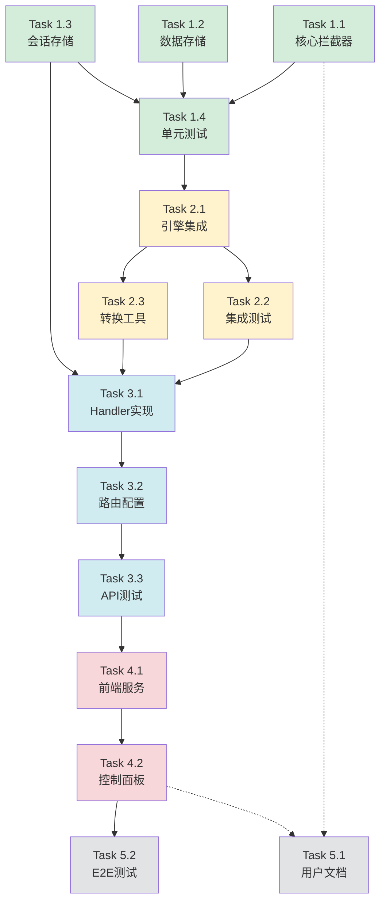

# 实施任务清单

本变更的实施任务清单,按照优先级和依赖关系排列。

---

## Phase 1: 核心拦截器框架 (2天)

### Task 1.1: 实现核心拦截器 (6小时)

**文件**: `server/internal/interceptor/interceptor.go`

**任务**:
- [x] 定义 `InterceptMode` 类型和常量
  - `InterceptModeDisabled`
  - `InterceptModeEnabled`
  - `InterceptModeRecord`
- [x] 定义 `InterceptSession` 数据结构
  - `ID string`
  - `InstanceID string`
  - `Mode InterceptMode`
  - `DataStore *InterceptDataStore`
  - `ExecutionLog []ExecutionLogEntry`
  - `CreatedAt time.Time`
- [x] 定义 `ExecutionLogEntry` 数据结构
  - `Timestamp time.Time`
  - `Operation string`
  - `Input interface{}`
  - `Output interface{}`
  - `IsMocked bool`
  - `Error string`
- [x] 实现 `Intercept[T]()` 泛型函数
  - 获取 Context 中的 Session
  - 根据 Mode 执行不同逻辑
  - Disabled 模式: 直接执行真实函数
  - Record 模式: 执行真实函数并记录结果
  - Enabled 模式: 优先返回 Mock 数据,降级到真实函数
- [x] 实现 Context 辅助函数
  - `WithInterceptSession(ctx, session) context.Context`
  - `GetInterceptSession(ctx) *InterceptSession`
  - `IsInterceptMode(ctx) bool`
- [x] 实现 `LogExecution()` 方法
  - 记录执行日志到 Session

**验收标准**:
- 所有函数签名正确
- 泛型函数编译通过
- Context 传递正确
- 模式切换逻辑正确

---

### Task 1.2: 实现 Mock 数据存储 (4小时)

**文件**: `server/internal/interceptor/data_store.go`

**任务**:
- [x] 定义 `InterceptDataStore` 结构体
  - `data map[string]interface{}`
  - `mu sync.RWMutex`
- [x] 实现 `NewInterceptDataStore()` 构造函数
- [x] 实现 `Set(key, value)` 方法
  - 加写锁
  - 存储数据
- [x] 实现 `Get(key)` 方法
  - 加读锁
  - 返回数据和存在标志
- [x] 实现 `SetBatch(data)` 方法
  - 批量设置 Mock 数据
- [x] 实现 `Clear()` 方法
  - 清空所有数据
- [x] 实现 `LoadFromJSON(jsonData)` 方法
  - 从 JSON 字符串加载数据
- [x] 实现 `ExportToJSON()` 方法
  - 导出为 JSON 字符串
- [x] 实现 `GetAll()` 方法
  - 返回所有数据的副本(用于调试)

**验收标准**:
- 线程安全(读写锁正确使用)
- JSON 序列化/反序列化正确
- 所有方法都有单元测试

---

### Task 1.3: 实现会话存储 (4小时)

**文件**: `server/internal/interceptor/session_store.go`

**任务**:
- [x] 定义 `SessionStore` 接口
  - `Set(id, session)`
  - `Get(id) (*InterceptSession, error)`
  - `Delete(id)`
  - `Exists(id) bool`
- [x] 实现内存版本 `MemorySessionStore`
  - `sessions map[string]*InterceptSession`
  - `mu sync.RWMutex`
- [x] 实现所有接口方法
  - 线程安全
  - 错误处理
- [x] (可选) 实现 Redis 版本 `RedisSessionStore`
  - 用于生产环境

**验收标准**:
- 接口定义清晰
- 内存实现线程安全
- 所有方法有单元测试
- (可选) Redis 实现可用

---

### Task 1.4: 单元测试 (4小时)

**文件**: `server/internal/interceptor/*_test.go`

**任务**:
- [x] 测试 `Intercept[T]()` 函数
  - 测试 Disabled 模式
  - 测试 Enabled 模式(有 Mock 数据)
  - 测试 Enabled 模式(无 Mock 数据,降级)
  - 测试 Record 模式
  - 测试类型转换错误
- [x] 测试 `InterceptDataStore`
  - 测试 Set/Get
  - 测试并发访问
  - 测试 JSON 序列化
  - 测试批量设置
- [x] 测试 `SessionStore`
  - 测试 CRUD 操作
  - 测试并发访问
  - 测试错误场景
- [x] 测试 Context 辅助函数
  - 测试 Session 传递
  - 测试 Session 获取

**验收标准**:
- 测试覆盖率 > 80%
- 所有测试通过
- 并发测试通过

---

## Phase 2: 引擎集成拦截器 (3天)

### Task 2.1: 在 WorkflowEngineService 中集成拦截器 (1天)

**文件**: `server/internal/services/workflow_engine.go`

**任务**:
- [x] 导入 `interceptor` 包
- [x] 在 `ExecuteFromNode()` 中使用 `Intercept()` 包装数据访问
  - **GetWorkflowInstance**:
    ```go
    instance, err := interceptor.Intercept(ctx,
        fmt.Sprintf("GetInstance:%s", instanceId),
        func(ctx context.Context) (*models.WorkflowInstance, error) {
            // 检查是否为 Mock 实例
            session := interceptor.GetInterceptSession(ctx)
            if session != nil && session.InstanceID == instanceId {
                if s.mockInstanceSvc.MockInstanceExists(instanceId) {
                    mockInstance, err := s.mockInstanceSvc.GetMockInstance(ctx, instanceId)
                    if err != nil {
                        return nil, err
                    }
                    return ConvertMockInstanceToWorkflowInstance(mockInstance), nil
                }
            }
            // 真实实例
            return s.instanceSvc.GetWorkflowInstanceByID(ctx, instanceId)
        },
    )
    ```
  - **GetWorkflow**:
    ```go
    workflow, err := interceptor.Intercept(ctx,
        fmt.Sprintf("GetWorkflow:%s", instance.WorkflowId),
        func(ctx context.Context) (*models.Workflow, error) {
            return s.workflowSvc.GetWorkflowByID(ctx, instance.WorkflowId)
        },
    )
    ```
  - **ServiceTask 调用**:
    ```go
    response, err := interceptor.Intercept(ctx,
        fmt.Sprintf("ServiceTask:%s", node.Id),
        func(ctx context.Context) (*BusinessResponse, error) {
            return s.callRealService(ctx, node, instance, businessParams)
        },
    )
    ```
  - **UserTask 创建**:
    ```go
    response, err := interceptor.Intercept(ctx,
        fmt.Sprintf("UserTask:%s", node.Id),
        func(ctx context.Context) (*BusinessResponse, error) {
            // 创建用户任务记录
            taskId := fmt.Sprintf("task-%s-%d", node.Id, time.Now().UnixNano())
            return &BusinessResponse{
                StatusCode: 200,
                Body: map[string]interface{}{
                    "taskId": taskId,
                    "status": "pending",
                },
            }, nil
        },
    )
    ```
  - **IntermediateCatchEvent**:
    ```go
    response, err := interceptor.Intercept(ctx,
        fmt.Sprintf("CatchEvent:%s", node.Id),
        func(ctx context.Context) (*BusinessResponse, error) {
            eventType := node.Config["eventType"].(string)
            // 注册事件监听器
            return &BusinessResponse{
                StatusCode: 200,
                Body: map[string]interface{}{
                    "eventType": eventType,
                    "status": "waiting",
                },
            }, nil
        },
    )
    ```
  - **EventBasedGateway**:
    ```go
    response, err := interceptor.Intercept(ctx,
        fmt.Sprintf("EventGateway:%s", node.Id),
        func(ctx context.Context) (*BusinessResponse, error) {
            return &BusinessResponse{
                StatusCode: 200,
                Body: map[string]interface{}{
                    "status": "waiting",
                    "events": node.Config["events"],
                },
            }, nil
        },
    )
    ```
  - **UpdateInstance**:
    ```go
    err = interceptor.Intercept(ctx,
        fmt.Sprintf("UpdateInstance:%s", instance.Id),
        func(ctx context.Context) error {
            session := interceptor.GetInterceptSession(ctx)
            if session != nil && session.InstanceID == instance.Id {
                // Mock 实例
                if s.mockInstanceSvc.MockInstanceExists(instance.Id) {
                    mockInstance := ConvertWorkflowInstanceToMockInstance(instance)
                    _, err := s.mockInstanceSvc.UpdateMockInstance(
                        ctx, instance.Id, instance.Status,
                        instance.CurrentNodeIds, instance.Variables,
                    )
                    return err
                }
            }
            // 真实实例
            return s.instanceSvc.UpdateWorkflowInstance(ctx, instance)
        },
    )
    ```
- [x] 保持 `shouldAutoAdvance()` 机制不变
  - 确保 UserTask、EventBasedGateway、IntermediateCatchEvent 返回 false
  - 其他节点返回 true

**验收标准**:
- 所有数据访问点都被 `Intercept()` 包装
- 拦截器模式正确工作
- `shouldAutoAdvance()` 逻辑不变
- Mock 实例和真实实例都能正确执行

---

### Task 2.2: 集成测试 (1天)

**文件**: `server/internal/services/workflow_engine_test.go`

**任务**:
- [x] 测试拦截器 Disabled 模式下的执行
  - 验证使用真实数据访问
- [x] 测试拦截器 Enabled 模式下的执行
  - 提供 Mock 数据
  - 验证使用 Mock 数据
  - 验证执行日志记录
- [x] 测试 Record 模式
  - 执行真实函数
  - 验证数据被记录到 DataStore
- [x] 测试停留点机制
  - UserTask 停留
  - EventBasedGateway 停留
  - IntermediateCatchEvent 停留
  - ServiceTask 自动推进
- [x] 测试降级策略
  - Mock 数据不存在时降级到真实函数

**验收标准**:
- 所有模式测试通过
- 停留点机制正确
- 降级策略正确
- 执行日志完整

---

### Task 2.3: 转换工具函数 (半天)

**文件**: `server/internal/services/workflow_engine.go`

**任务**:
- [x] 实现 `ConvertMockInstanceToWorkflowInstance()`
  - 从 MockInstance 转换为 WorkflowInstance
- [x] 实现 `ConvertWorkflowInstanceToMockInstance()`
  - 从 WorkflowInstance 转换为 MockInstance
- [x] 添加单元测试

**验收标准**:
- 转换函数正确
- 数据不丢失
- 测试覆盖转换逻辑

---

## Phase 3: HTTP API 实现 (2天)

### Task 3.1: 实现拦截器 Handler (1天)

**文件**: `server/internal/handlers/interceptor.go`

**任务**:
- [x] 定义 `InterceptorHandler` 结构体
  - `engineService *services.WorkflowEngineService`
  - `mockInstanceSvc *services.MockInstanceService`
  - `workflowSvc *services.WorkflowService`
  - `sessionStore interceptor.SessionStore`
  - `logger *zerolog.Logger`
- [x] 实现 `ExecuteIntercept()` 处理器
  - **端点**: `POST /api/interceptor/workflows/:workflowId/execute`
  - 解析请求参数(startNodeId, initialVariables, mockData, bpmnXml)
  - 保存 BPMN XML(如果提供)
  - 查找起始节点
  - 创建 Mock 实例
  - 创建 InterceptSession
  - 加载 Mock 数据到 DataStore
  - 保存 Session
  - 返回初始状态(不执行)
- [x] 实现 `TriggerNode()` 处理器
  - **端点**: `POST /api/interceptor/instances/:instanceId/trigger`
  - 解析请求参数(nodeId, businessParams)
  - 获取 Session
  - 创建带有 Session 的 Context
  - 调用 `ExecuteFromNode()`
  - 保存更新后的 Session
  - 返回执行结果和日志
- [x] 实现 `GetInterceptSession()` 处理器
  - **端点**: `GET /api/interceptor/sessions/:sessionId`
  - 获取 Session 信息
  - 返回 Session 数据
- [x] 实现 `GetExecutionLog()` 处理器
  - **端点**: `GET /api/interceptor/sessions/:sessionId/log`
  - 获取执行日志
  - 返回日志数组
- [x] 实现 `ResetIntercept()` 处理器
  - **端点**: `POST /api/interceptor/sessions/:sessionId/reset`
  - 删除 Mock 实例
  - 删除 Session
  - 返回成功消息

**验收标准**:
- 所有端点实现正确
- 请求验证正确
- 错误处理完整
- 返回数据格式正确

---

### Task 3.2: 配置路由 (半天)

**文件**: `server/internal/routes/routes.go`

**任务**:
- [x] 添加拦截器路由组
  ```go
  interceptor := api.Group("/interceptor")
  {
      interceptor.POST("/workflows/:workflowId/execute",
          deps.InterceptorHandler.ExecuteIntercept)
      interceptor.POST("/instances/:instanceId/trigger",
          deps.InterceptorHandler.TriggerNode)
      interceptor.GET("/sessions/:sessionId",
          deps.InterceptorHandler.GetInterceptSession)
      interceptor.GET("/sessions/:sessionId/log",
          deps.InterceptorHandler.GetExecutionLog)
      interceptor.POST("/sessions/:sessionId/reset",
          deps.InterceptorHandler.ResetIntercept)
  }
  ```
- [x] 在 Dependencies 中添加 InterceptorHandler
- [x] 在初始化函数中创建 InterceptorHandler 实例

**验收标准**:
- 路由配置正确
- 依赖注入正确
- 服务器启动成功

---

### Task 3.3: API 测试 (半天)

**文件**: `server/internal/handlers/interceptor_test.go`

**任务**:
- [x] 测试 `ExecuteIntercept` 端点
  - 测试成功场景
  - 测试参数验证
  - 测试 BPMN XML 解析
- [x] 测试 `TriggerNode` 端点
  - 测试成功触发
  - 测试 Session 不存在
  - 测试执行错误
- [x] 测试其他端点
  - GetInterceptSession
  - GetExecutionLog
  - ResetIntercept

**验收标准**:
- 所有端点测试通过
- 边界情况覆盖
- 错误场景测试

---

## Phase 4: 前端集成 (3天)

### Task 4.1: 实现前端拦截器服务 (1天)

**文件**: `client/src/services/interceptorService.ts`

**任务**:
- [x] 定义 TypeScript 接口
  - `InterceptSession`
  - `TriggerNodeRequest`
  - `TriggerNodeResult`
  - `ExecutionLogEntry`
  - `InitializeInterceptRequest`
- [x] 实现 `InterceptorService` 类
  - `initializeIntercept(workflowId, mockData, initialVariables, bpmnXml)`
  - `triggerNode(sessionId, instanceId, request)`
  - `getSession(sessionId)`
  - `getExecutionLog(sessionId)`
  - `resetExecution(sessionId)`
- [x] 错误处理
  - 网络错误
  - 响应解析错误
  - 业务错误

**验收标准**:
- 所有方法实现正确
- TypeScript 类型正确
- 错误处理完整

---

### Task 4.2: 实现拦截器控制面板 (2天)

**文件**: `client/src/components/InterceptorControlPanel.vue`

**任务**:
- [x] 实现 Session 信息显示
  - Session ID
  - Instance ID
  - Status
  - Current Node IDs
- [x] 实现 Mock 数据配置编辑器
  - JSON 编辑器
  - 配置示例
  - 配置验证
- [x] 实现控制按钮
  - 初始化拦截执行
  - 触发下一步
  - 查看/隐藏日志
  - 重置
- [x] 实现当前节点信息显示
  - 节点 ID
  - 节点类型
  - 是否自动推进
- [x] 实现 UserTask 表单
  - 动态表单字段
  - 表单数据收集
  - 完成任务按钮
- [x] 实现 EventBasedGateway 事件选择
  - 事件列表
  - 事件触发按钮
- [x] 实现执行日志面板
  - 日志条目列表
  - Mock/Real 标识
  - 时间戳
  - 操作名称
  - 输入/输出数据
  - 错误信息
- [x] 集成到 BpmnEditorPage
  - 添加面板到编辑器页面
  - 节点高亮联动
  - 状态同步

**验收标准**:
- 所有 UI 组件正确显示
- 用户交互流畅
- 节点高亮正确
- 执行日志完整
- UserTask 表单可用
- 事件触发正确

---

## Phase 5: 文档和测试 (可选,与其他阶段并行)

### Task 5.1: 编写用户文档 (半天)

**文件**: `docs/INTERCEPTOR_USER_GUIDE.md`

**任务**:
- [x] 介绍拦截器框架
- [x] 使用场景说明
- [x] API 文档
- [x] 前端使用指南
- [x] Mock 数据配置示例
- [x] 常见问题解答

**验收标准**:
- 文档清晰易懂
- 示例代码完整
- 覆盖主要使用场景

---

### Task 5.2: E2E 测试 (1天)

**文件**: `client/tests/e2e/interceptor.spec.ts`

**任务**:
- [x] 测试完整拦截执行流程
  - 初始化拦截
  - 触发节点
  - 查看日志
  - 重置
- [x] 测试 UserTask 流程
  - 停留在 UserTask
  - 填写表单
  - 完成任务
  - 继续执行
- [x] 测试 EventBasedGateway 流程
  - 停留在网关
  - 选择事件
  - 触发事件
  - 继续执行
- [x] 测试执行日志
  - 记录正确
  - Mock/Real 标识正确

**验收标准**:
- 所有 E2E 测试通过
- 覆盖主要用户流程
- 测试稳定可靠

---

## 任务依赖关系



**图例**:
- 绿色 (Phase 1): 核心框架
- 黄色 (Phase 2): 引擎集成
- 蓝色 (Phase 3): HTTP API
- 红色 (Phase 4): 前端集成
- 灰色 (Phase 5): 文档和测试

---

## 里程碑

| 里程碑 | 完成时间 | 交付物 |
|--------|---------|--------|
| **M1: 核心框架完成** | Day 2 | 拦截器核心代码、数据存储、会话管理、单元测试 |
| **M2: 引擎集成完成** | Day 5 | 引擎集成代码、集成测试、转换工具 |
| **M3: API 完成** | Day 7 | HTTP Handler、路由配置、API 测试 |
| **M4: 前端完成** | Day 10 | 前端服务、控制面板、E2E 测试 |
| **M5: 文档完成** | Day 10 | 用户文档、开发文档 |

---

## 验收标准汇总

### 代码质量
- [x] 所有代码通过 golangci-lint 检查
- [x] 单元测试覆盖率 > 80%
- [x] 集成测试覆盖核心流程
- [x] E2E 测试覆盖主要用户场景

### 功能完整性
- [x] 拦截器三种模式正常工作
- [x] 所有数据访问点被拦截
- [x] 停留点机制正确(UserTask、EventBasedGateway 等)
- [x] 执行日志完整记录
- [x] 前端控制面板功能完整

### 性能
- [x] 拦截器开销 < 1% (基准测试验证)
- [x] Mock 数据查询 O(1) 复杂度
- [x] 并发访问安全

### 文档
- [x] 用户文档完整
- [x] API 文档完整
- [x] 代码注释清晰

---

## 风险缓解

| 风险 | 缓解措施 |
|------|---------|
| 性能影响 | 进行基准测试,确保开销 < 1% |
| 兼容性问题 | 保留旧 API,提供迁移文档 |
| 复杂度增加 | 详细文档,示例代码,充分测试 |
| 泛型兼容性 | 使用 Go 1.18+ 版本,避免过度复杂的泛型 |
