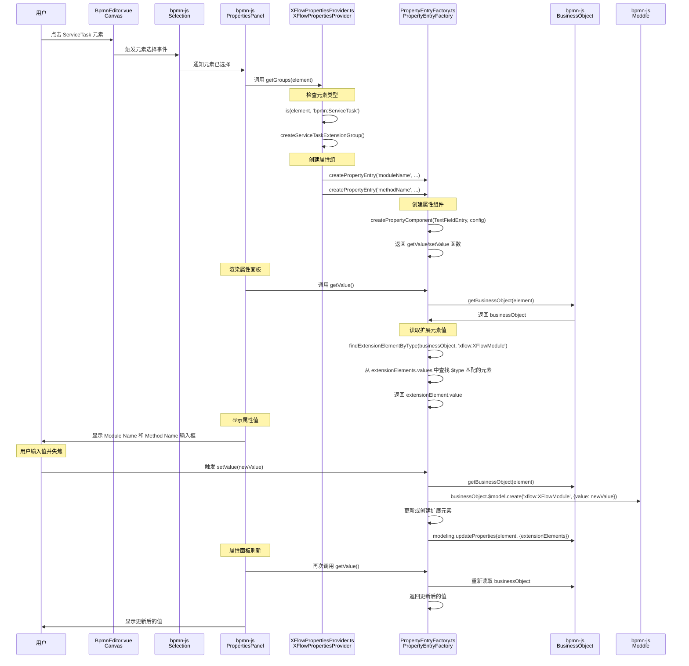

# 属性面板加载流程

## Mermaid 序列图

## 关键数据流

### 1. 元素选择阶段
- **触发**: 用户点击 ServiceTask 元素
- **处理**: bpmn-js 的 Selection 服务检测到选择变化
- **通知**: PropertiesPanel 服务收到选择事件

### 2. 属性组创建阶段
- **调用**: PropertiesPanel 调用所有注册的 Provider 的 `getGroups(element)` 方法
- **检查**: XFlowPropertiesProvider 检查元素类型是否为 `bpmn:ServiceTask`
- **创建**: 创建 ServiceTask 扩展属性组，包含 Module Name 和 Method Name 两个属性

### 3. 属性组件创建阶段
- **工厂**: PropertyEntryFactory 创建 TextFieldEntry 组件
- **配置**: 每个属性配置包含 `elementType` 和 `propertyPath`
- **函数**: 返回 `getValue` 和 `setValue` 函数

### 4. 数据读取阶段
- **获取**: `getValue()` 通过 `getBusinessObject(element)` 获取业务对象
- **查找**: 根据 `elementType` 在 `extensionElements.values` 中查找匹配的扩展元素
- **返回**: 返回扩展元素的 `value` 属性

### 5. 数据写入阶段
- **触发**: 用户输入值并失焦时触发 `setValue(newValue)`
- **创建**: 如果扩展元素不存在，使用 moddle 创建新的扩展元素
- **更新**: 更新扩展元素的值并调用 `modeling.updateProperties` 保存

### 6. 面板刷新阶段
- **通知**: modeling 服务触发属性面板刷新
- **重读**: 属性面板重新调用 `getValue()` 读取最新值
- **显示**: 显示更新后的属性值

## 问题分析

根据这个流程，属性编辑框失焦再激活不显示刚刚输入的值的问题可能出现在：

1. **setValue 阶段**: 扩展元素创建或更新失败
2. **面板刷新阶段**: modeling.updateProperties 没有正确触发面板刷新
3. **getValue 阶段**: 重新读取时没有找到正确的扩展元素

建议检查：
- `modeling.updateProperties` 是否正确更新了 businessObject
- 扩展元素的 `$type` 是否正确设置
- 属性面板是否正确监听了模型变化事件
